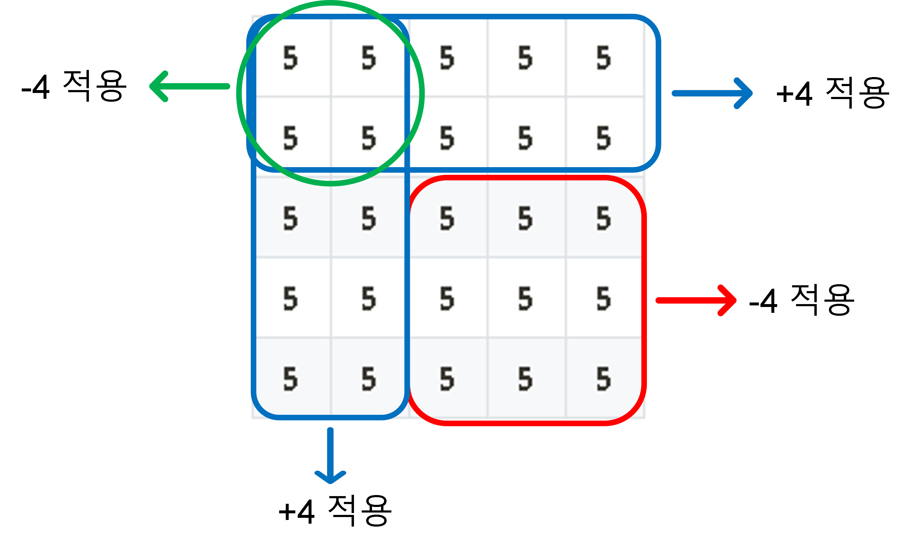
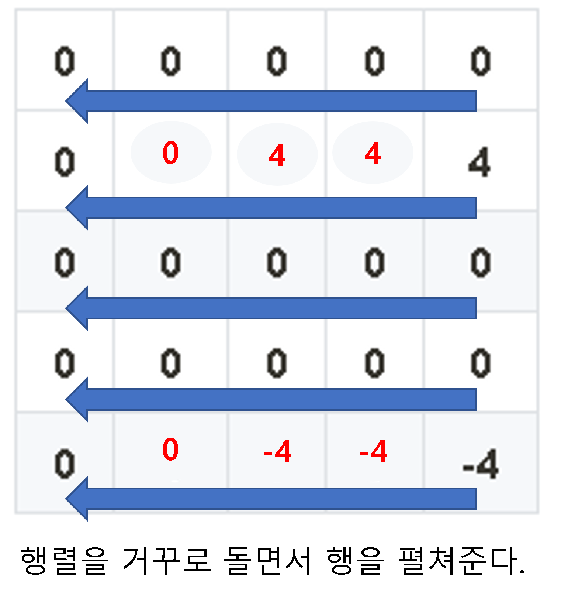
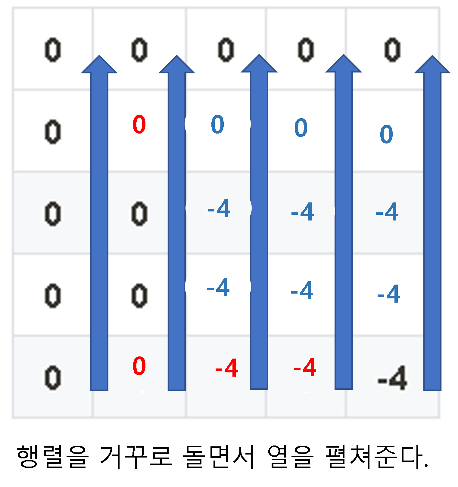

# Kakao Blind 2022 - 파괴되지 않은 건물 <span style = "color:gold" >Level Ⅲ</span>

<br><br>

[Kakao Blind 2022 - 파괴되지 않은 건물](https://school.programmers.co.kr/learn/challenges)

<br><br>

## 문제

<br><br>

2차원 배열에서 특정 구간에 덧셈, 뺄셈을 진행하고 이를 효율적으로 시간 단축하는 문제입니다.

<br><br>

---

<br><br>

## 입력

<br><br>

$$1 <= R <= 100, 1 <= C <= 100, 1 <= K <= 100$$

<br><br>

---

<br><br>

## 출력

<br><br>

단순히 더하고 빼는 연산을 $$O(N^2)$$ 에 해결하더라도 정확도는 쉽게 100% 맞출 수 있습니다. 하지만, 이 문제는 효율성 문제로 시간 복잡도를 줄여야 합니다.

<br><br>

---

<br><br>

## 🍺 How to Solve?

<br><br>

### 🔥 Key Point

<br>

어떻게 하면 구간에 대해서 더하고, 빼는 연산을 매번 하지 않고 한 번에 할 수 있을까??

<br>

#### 🎯 2차원 배열에서 누적합을 이용한다.

<br><br>

| **5** | **5** | **5** | **5** | **5** |
| :---: | :---: | :---: | :---: | :---: |
| **5** | **5** | **5** | **5** | **5** |
| **5** | **5** | **5** | **5** | **5** |
| **5** | **5** | **5** | **5** | **5** |
| **5** | **5** | **5** | **5** | **5** |

<br>

위 상황에서 (3,3) 부터 (5,5) 까지 -4 만큼 적용한다면?

<br><br>



<br><br>

모든 구간에 적용할 필요 없이 각 사각형의 오른쪽 아래 끝 좌표에만 기록을 한다면
<br>
(0,0) 부터 해당 구간까지에는 x만큼 적용하겠다는 의미를 갖게 된다.

<br><br>

### 💥 여기까지는 쉽게 접근할 수 있습니다. 하지만 중요한 것은 누적시켜놨던 <span style="color:red">누적합을 어떻게 다시 펼쳐서 적용하는가 입니다.</span>

<br><br>

| **0** | **0**  | **0** | **0** | **0**  |
| :---: | :----: | :---: | :---: | :----: |
| **0** | **-4** | **0** | **0** | **4**  |
| **0** | **0**  | **0** | **0** | **0**  |
| **0** | **0**  | **0** | **0** | **0**  |
| **0** | **4**  | **0** | **0** | **-4** |

<br><br>

2차원 배열의 누적합 상태가 위와 같다고 한다. <Br>
다음과 같은 방식으로 해결할 수 있다. <br>
<br>

#### 행렬을 끝에서부터 row를 기준으로 행을 펼쳐주고 그 다음 행렬 끝에서부터 열을 펼쳐준다.

<br>
당연히 말로 해서는 이해가 되지 않는다.  <br>

그림으로 확인하자.

<br><br>



<br><br>

N번 row부터 matrix[r][c-1] += matrix[r][c-1 + 1]; 진행하면서 행을 펼쳐준다.

<br><br>



<br><br>

마찬가지로 M열부터 matrix[r-1][c] += matrix[r-1 + 1][c]; 진행하면서 열을 펼쳐준다.

<br><br>

### ✨ **Java Code**

```java
public class KakaoBlind_2022_파괴되지않은건물 {
	static int N, M, K;
	static int[][] temp;
	public static void main(String[] args) {
		int[][] board = {{5,5,5,5,5},{5,5,5,5,5},{5,5,5,5,5},{5,5,5,5,5}};
		int[][] skill = {{1,0,0,3,4,4},{1,2,0,2,3,2},{2,1,0,3,1,2},{1,0,1,3,3,1}};

		N = board.length;
		M = board[0].length;
		K = skill.length;

		int[][] record = new int[N][M];

		// 공격 / 회복 누적
		for (int[] sk : skill) {
			int r1 = sk[1], c1 = sk[2], r2 = sk[3], c2 = sk[4], degree = sk[5] * (sk[0] == 1 ? -1 : 1);
			record[r2][c2] += degree;
			if(isValid(r1-1, c2)) {
				record[r1-1][c2] -= degree;
			}

			if(isValid(r2, c1-1)) {
				record[r2][c1-1] -= degree;
			}

			if(isValid(r1-1, c1-1)) {
				record[r1-1][c1-1] += degree;
			}
		}

		// 누적 데미지 펼쳐주기 - 행
		for (int i = N-1; i >= 0; i--) {
			for (int j = M-2; j >= 0; j--) {
				record[i][j] += record[i][j+1];
			}
		}
		// 누적 데미지 펼쳐주기 - 열
		for (int i = M-1; i >=0; i--) {
			for (int j = N-2; j >= 0; j--) {
				record[j][i] += record[j+1][i];
			}
		}

		// 계산
		int cnt = 0;
		for (int i = 0; i < N; i++) {
			for (int j = 0; j < M; j++) {
				if(board[i][j] + record[i][j] >0) cnt++;
			}
		}

		System.out.println(cnt);
	}
	static boolean isValid(int x, int y) {
		return !(x<0 || x>= N || y < 0 || y >=M);
	}

}

```

## 💥 끝!!

<br>

✨ 잘못된 부분은 많은 조언 및 지적 부탁드립니다. - JunHyxxn

<br>
