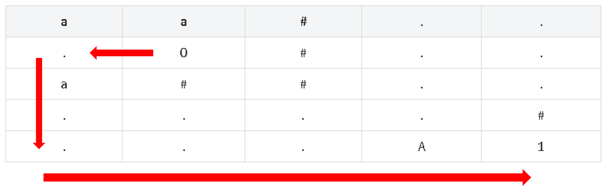
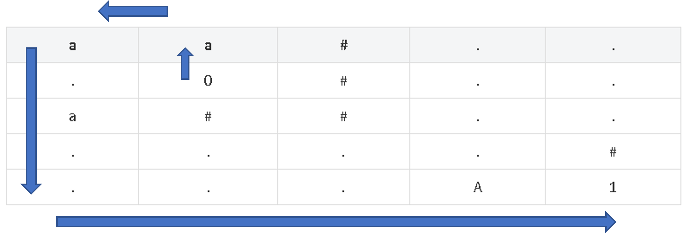

# BOJ 1194 - 달이 차오른다, 가자. <span style='color:Gold'>Gold-Ⅰ</span>

<br><br>

**이 문제는 BOJ 문제입니다. 문제 출처 : [달이 차오른다, 가자.](https://www.acmicpc.net/problem/1194)**

<br><br>

## 문제

<br><br>

지금 민식이가 계획한 여행은 달이 맨 처음 뜨기 시작할 때 부터, 준비했던 여행길이다. 하지만, 매번 달이 차오를 때마다 민식이는 어쩔 수 없는 현실의 벽 앞에서 다짐을 포기하고 말았다.

<br>

민식이는 매번 자신의 다짐을 말하려고 노력했지만, 말을 하면 아무도 못 알아들을 것만 같아서, 지레 겁먹고 벙어리가 되어버렸다. 결국 민식이는 모두 잠든 새벽 네시 반쯤 홀로 일어나, 창 밖에 떠있는 달을 보았다.

<br>

하루밖에 남지 않았다. 달은 내일이면 다 차오른다. 이번이 마지막기회다. 이걸 놓치면 영영 못간다.

<br>

영식이는 민식이가 오늘도 여태것처럼 그냥 잠 들어버려서 못 갈지도 모른다고 생각했다. 하지만 그러기엔 민식이의 눈에는 저기 뜬 달이 너무나 떨렸다.

<br>

민식이는 지금 미로 속에 있다. 미로는 직사각형 모양이고, 여행길을 떠나기 위해 미로를 탈출하려고 한다. 미로는 다음과 같이 구성되어져있다.

<br><br>

1️⃣ 빈 칸: 언제나 이동할 수 있다. ('.')  
<br>

2️⃣ 벽: 절대 이동할 수 없다. ('#')  
<br>

3️⃣ 열쇠: 언제나 이동할 수 있다. 이 곳에 처음 들어가면 열쇠를 집는다. ('a', 'b', 'c', 'd', 'e', 'f')  
<br>

4️⃣ 문: 대응하는 열쇠가 있을 때만 이동할 수 있다. ('A', 'B', 'C', 'D', 'E', 'F')  
<br>

5️⃣ 민식이의 현재 위치: 빈 곳이고, 민식이가 현재 서 있는 곳이다. ('0')  
<br>

6️⃣ 출구: 달이 차오르기 때문에, 민식이가 가야하는 곳이다. 이 곳에 오면 미로를 탈출한다. ('1')  
<br>

<br>
달이 차오르는 기회를 놓치지 않기 위해서, 미로를 탈출하려고 한다. 한 번의 움직임은 현재 위치에서 수평이나 수직으로 한 칸 이동하는 것이다.
<br>
민식이가 미로를 탈출하는데 걸리는 이동 횟수의 최솟값을 구하는 프로그램을 작성하시오.

<br><br>

## 입력

<br><br>

첫째 줄에 미로의 세로 크기 N과 가로 크기 M이 주어진다. (1 ≤ N, M ≤ 50) 둘째 줄부터 N개의 줄에 미로의 모양이 주어진다. 같은 타입의 열쇠가 여러 개 있을 수 있고, 문도 마찬가지이다. 그리고, 문에 대응하는 열쇠가 없을 수도 있다. '0'은 한 개, '1'은 적어도 한 개 있다. 열쇠는 여러 번 사용할 수 있다.

<br><br>

## 출력

<br><br>

첫째 줄에 민식이가 미로를 탈출하는데 드는 이동 횟수의 최솟값을 출력한다. 만약 민식이가 미로를 탈출 할 수 없으면, -1을 출력한다.

<br><br>

## 💥 How to Solve?

<br><br>

우선 기본적으로 흔히 접할 수 있는 미로 문제와 같다. 미로 길찾기 + 열쇠 문제다.  
<br>

열쇠와 문은 a ~ f로 6가지가 존재한다. 이를 Bit 연산을 이용해 해결할 것이다.

<br>

'a' ~ 'f'와 'A' ~ 'F'의 아스키 코드 값을 이용한다. 값이 헷갈린다면 Python 에서는 ord() 함수를 통해 확인할 수 있다.

<br>

'A' ~ 'F' : 65 ~ 70 <br>

'a' ~ 'f' : 97 ~ 102 <br>

<br>

### 🔥 Point

<br>
 
🌟 현재 내가 가진 열쇠를 비트로 표현한다. 예를 들어 내가 현재 a, d, f 열쇠를 갖고 있다면?? <br>

| **f** | **e** | **d** | **c** | **b** | **a** |
| :---: | :---: | :---: | :---: | :---: | :---: |
|  32   |  16   |   8   |   4   |   2   |   1   |

<br>
위 값에 따라서 101001 = 41 이 된다.

<br><br>

🌟 두 번째 핵심은, visited 체크이다.

단순히 row x col 2차원 배열로 visited 검사를 하게 된다면, 키를 획득하고 돌아오지 못하는 문제가 발생한다.

<br>

**예를 들어, f0.F..1 와 같은 상태라면 0에서 왼쪽으로 가 열쇠 f를 획득하고 다시 돌아오지 못한다.**

<br>

처음에는 이를 해결하기 위해 열쇠를 획득하면 visited 배열과 queue를 초기화시켰다. 하지만 이 또한 아래와 같은 문제가 발생한다.

<br>

|  a  |  a  |  #  |  .  |  .  |
| :-: | :-: | :-: | :-: | :-: |
|  .  |  0  |  #  |  .  |  .  |
|  a  |  #  |  #  |  .  |  .  |
|  .  |  .  |  .  |  .  |  #  |
|  .  |  .  |  .  |  A  |  1  |

<br>

아래와 같은 경로를 통해 이동해야 한다.

<br>

## Correct Path



<br>

하지만 (1,1)에서 시작해 바로 위인 (0, 1)로 이동해 visited와 queue가 초기화 되기 때문에, 위 경로가 최적임에도 queue가 새롭게 계속 쌓여나가 아래와 같은 경로가 진행된다.

<br>

## Wrong Path



<br>

visited만 초기화하면 이상한 경로가 진행되기 때문에 queue와 visited를 동시에 초기화했지만, 이는 잘못된 로직이다.
<br>

💥 따라서, 다른 방법으로 접근이 필요한데, visited 검사를 위해 3가지 값을 이용하는 것이다.

**row, col, keys** 를 이용하면 된다.  
즉, 현재 열쇠 상태에 따라 경로를 달리 가져간다면 위 문제들이 해결되면서, 최적의 경로를 찾을 수 있다.

<br><br>

### 🔥 Rule

<br><br>

1️⃣ : 'a'~'f' (열쇠) 만날 경우 => 방문해 열쇠를 제거해주고, 현재 key 상태를 update해준다.

```python
nxt_key = now_key | (1 << ord(miro[nx][ny]) - 97)
```

위의 비트 연산을 통해 상태를 기록할 수 있다.

<br>

2️⃣ : 'A'~'F' (문) 만날 경우 => 현재 내가 가진 열쇠 상태와 문을 통해 통과 가능한지 판단한다.

```python
if now_key & 1<<(ord(miro[nx][ny])-65) != 0:
```

위의 식을 통해 현재 key 상태와 문이 해당하는 비트의 &연산이 0이 아니라면 열쇠를 갖고 있음을 의미한다.  
<br>

3️⃣ : '.' or '1' 을 만나게 되면 visited 체크하고 이동하면 된다.  
<br>

위의 규칙으로 이동하다 현재 위치가 '1'이면 이동 횟수를 return 시켜 종료시키면 된다.

<br><br>

### ✨ Python Code

<br><br>

```python
"""
문제 출처 : https://www.acmicpc.net/problem/1194
'a'~'f' :  97~102
"A"~"F" : 65~70
"""

from collections import deque


d = [[0,1], [1,0], [0,-1], [-1,0]]
N, M = map(int, input().split())
miro = [list(map(str, input())) for _ in range(N)]
start = None
flag = False
for i in range(N):
    if flag: break
    for j in range(M):
        if miro[i][j] == '0':
            start = (i, j)
            miro[i][j] = '.'
            flag = True
            break


def BFS(now, keys):
    """
    now  : (x, y) = loc
    keys : 0 => 미로판 지나며 키 획득할때마다 update

    1. 'a'~'f' => 방문 & keys update
    2. '.' or '1' => 방문
    3. 'A'~'F' => keys & door != 0 이라면 문 통과 가능. 이때만 방문한다.

    ㄴ> '1'  => 탈출 성공

    visited 검사를 n x m x keys 를 통해 계산한다.
    """
    queue = deque()
    queue.append((now, keys, 0))
    visited = [[[False]*(1<<6) for _ in range(M)] for _ in range(N)]
    visited[now[0]][now[1]][0] = True
    while queue:
        loc, now_key, cnt =  queue.popleft()
        x, y = loc
        if miro[x][y] == '1':
            return cnt
        for i in range(4):
            dx, dy = d[i]
            nx, ny = x+dx, y+dy
            if (nx<0 or nx>=N) or (ny<0 or ny>=M) or visited[nx][ny][now_key] or miro[nx][ny]=="#": continue
            if 97<= ord(miro[nx][ny]) <= 102: ## key 발견
                nxt_key = now_key | (1<<(ord(miro[nx][ny]) - 97))
                queue.append(((nx,ny),nxt_key, cnt+1))
                visited[nx][ny][nxt_key] = True
            elif miro[nx][ny] == '.' or miro[nx][ny] == '1':
                visited[nx][ny][now_key] = True
                queue.append(((nx, ny), now_key, cnt+1))
            elif 65<= ord(miro[nx][ny]) <= 70:
                if now_key & 1<<(ord(miro[nx][ny])-65) != 0:
                    visited[nx][ny][now_key] = True
                    queue.append(((nx, ny), now_key, cnt+1))


    return -1

print(BFS(start, 0))

```

<br><br>

## 💥끝!!

<br>

✨ 잘못된 부분은 많은 조언 및 지적 부탁드립니다. - JunHyxxn

<br>
