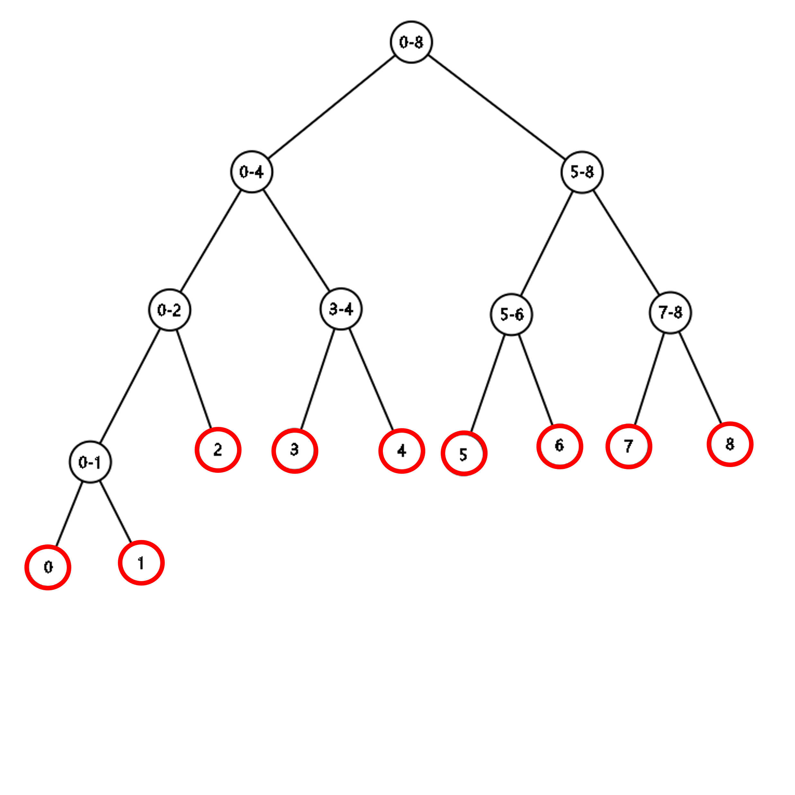
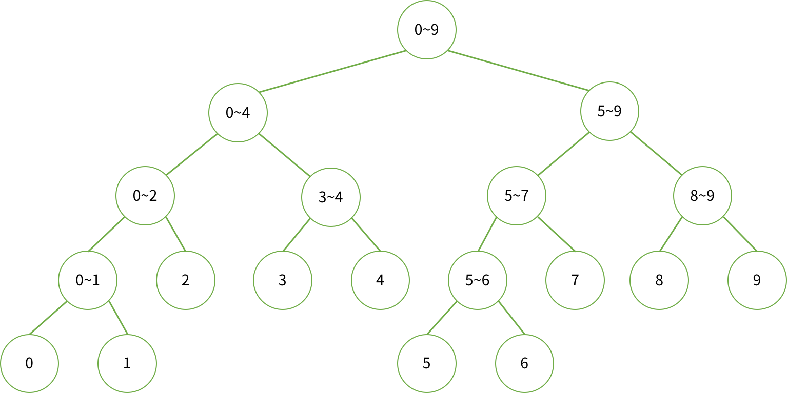
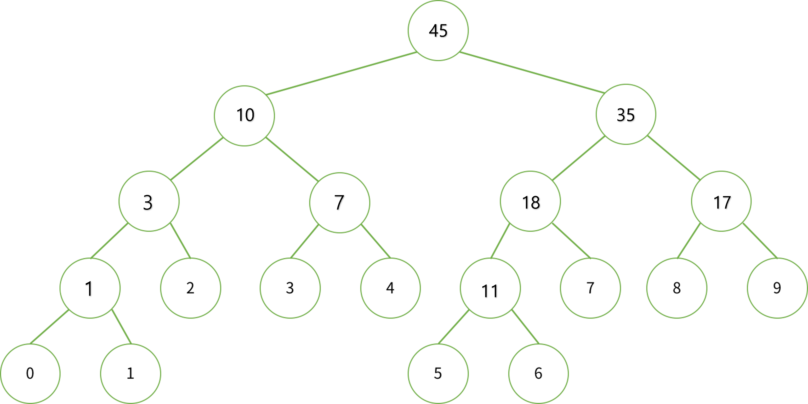
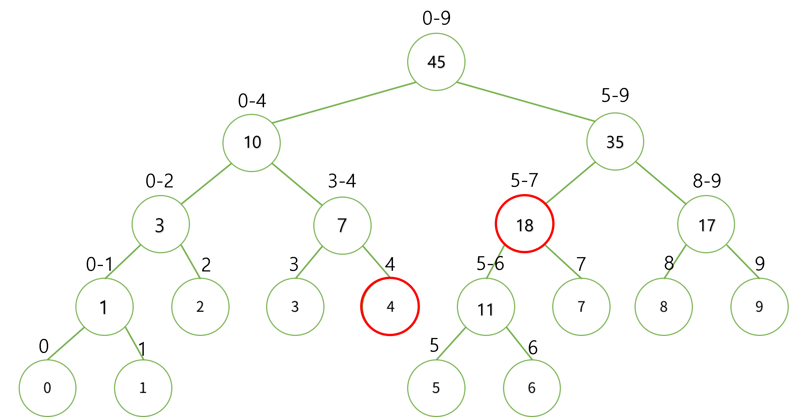
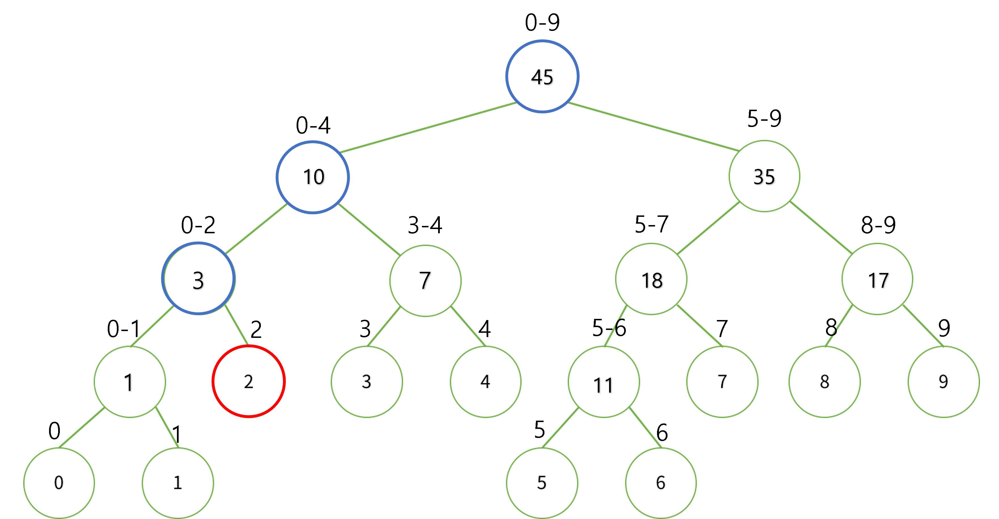
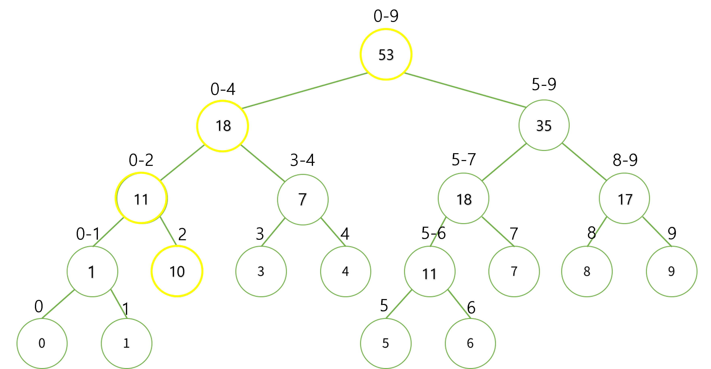

# 문제 풀이에 앞서 Segment Tree에 대한 설명과 어떤 상황에 왜 사용하기 좋은지 먼저 설명하도록 한다.

<br>
<br>

[baekjoon](https://www.acmicpc.net/blog/view/9)님이 작성하신 글을 보고 정리한 내용입니다.

<br>
<br>

## ✨ Segment Tree 왜 사용할까?

<br>

## 구간 합과 변경을 반복 한다면?

### 1)구간 left, right가 주어질 때, $$S = A[l] + A[l+1] + A[l+2] + ... + A[r]$$

### S의 값을 구하라.

### 2) i번째 수를 변경하라. $$A[i] = v$$

### 위의 1), 2) 과정을 반복한다면 $$O(NM)$$

> **loop 문을 통해 1) 식을 해결할 경우.**
>
> > S를 구하기 위해서 O(N) Time.  
> > 값을 변경하기 위해서 O(1) Time
> >
> > > 총 M번이 반복된다면 O(NM) Time.

> **DP를 이용해 해결할 경우**
>
> > S를 구하기 위해서는 O(1) Time
> >
> > > ex) l = 2, r = 5, then S = DP[5] - DP[1] 로 O(1) time 해결 가능하다.
> > > 값을 변경하게 된다면 DP도 갱신이 되어야 한다. 따라서 O(N) Time
> > > 총 M번 반복시 O(NM) Time.

<br><br>

### 이렇듯 loop문이나 DP로 해결하게 된다면 O(NM) Time 소요된다. 시간 단축을 위해서 적합한 구조가 Segment Tree 이다.

<br>
<br>

---

<br>
<br>

## ✨ Segment Tree 구조 및 특징

Segment Tree는 leaf node를 제외한 모든 노드는 항상 2개의 자식을 갖는 <span style="color:blue">**Full Binary Tree**</span> 형태이다.



위 그림에서 <span style = "color:red">빨간 노드는 leaf node</span>를 의미하고 **leaf node에는 실제 배열의 값**이 들어간다.  
검은색 노드는 **internal node** 를 의미하고 문제에 따라 자식 노드들의 합, 자식 노드들의 최솟값, 최댓값으로 설정할 수 있다. 위 그림에서 0-1, 0-4 등의 값은 해당 노드가 포함하고 있는 노드의 **Intervals** 를 의미한다.
<br><br>

### 1. Tree의 높이

Full Binary Tree이기 때문에 높이는 $$┌log_2 N┐$$ 가 된다.

<br>
<br>

### 2. Tree 배열의 크기

**Full Binary Tree** 라고 할 때, Tree를 표현하기 위해 배열의 크기가 얼마나 필요할 지 알아본다.

- leaf node : 높이 $$┌log_2 N┐$$ 이기 때문에 $$2^{┌log_2 N┐}$$ 이 된다.
- internal node : leaf node 보다 하나 적은 $$2^{┌log_2 N┐} - 1$$ 이 된다.

### 따라서 총 node의 합은 $$2^{┌log_2 N┐+1} - 1$$ 이 된다. Tree 배열은 1번 노드부터 시작하기 때문에 배열의 크기를 $$2^{┌log_2 N┐+1}$$ 로 설정하면 된다.

<br><br>

### 3. 자식 노드 표현

Segment Tree는 leaf node를 제외한 모든 노드가 2개의 자식을 갖는다.  
Left Child : $$2 * index$$
Right Child : $$2 * index + 1 $$

<br><br>

---

<br><br>

## ✨ Segment Tree Initialize

Tree의 특징에 대해 알아봤고, 이제 실제로 트리를 만들어 본다.  
Arr = [0, 1, 2, 3, 4, 5, 6, 7, 8, 9] 을 이용해 Segment Tree를 만든다.  
이 예제에서는 구간 합으로 생성한다. 최솟값과 최댓값의 경우 덧셈 연산 대신에 자식들간의 최솟값과 최댓값을 비교해 저장하는 방식으로 해결할 수 있다.
<br><br>

- Key Point
  - Arr의 start, end 인덱스에서 시작해 반으로 나눠가며 재귀 호출을 진행한다.
  - Leaf node에는 Arr 배열의 수 자체를 담는다.
  - Internal node에는 자식 노드들의 합을 담는다.  
     <br><br>

  
<br><br>
start = 0, end = 9 로 시작해 중간인 mid = 4 로 나눠 왼쪽 오른쪽 진행한다.  
start == end 지점까지 도달한다면 leaf node에 도달하게 된다.  
이 때, 해당 leaf node에는 Arr[start] 값을 넣어준다. Tree의 index는 왼쪽 재귀 호출 시 $$2*node$$ 오른쪽 재귀 호출 시 $$2*node + 1$$이 된다.
<br><br>

Internal node는 자식 노드들의 합이 된다. 이를 그림으로 표현하면 다음과 같아진다.


<br><br>
트리의 노드 번호를 그림으로 표현하면 다음과 같다.
<br><br>

<br><br>

### 🌟 **Python Code**

```python
def init(nums, tree, node, start, end):
    if start == end:
        tree[node] = nums[start]
        return tree[node]

    mid = (start+end)//2
    l_sum = init(nums, tree, node*2, start, mid)
    r_sum = init(nums, tree, 2*node + 1, mid+1, end)

    tree[node] = l_sum + r_sum
    return tree[node]
```

<br><br>

---

## ✨ Segment Tree Query

<br><br>

Tree가 만들어 졌다면 Tree를 통해 구간 합을 조회하는 쿼리를 작성한다.

<br><br>

Arr = [0, 1, 2, 3, 4, 5, 6, 7, 8, 9] 이면서  
구간 4 - 7 번째 수의 합을 구한다면 찾아야 할 노드는 아래 그림과 같다.  
( left = 4, right = 7, start = 0, end = n-1 )

<br><br>



<br><br>

위와 같은 노드를 탐색하는 과정에서 3가지 경우의 수가 발생한다.

1️⃣ ( start - end ) 구간이 ( left - right ) 구간과 겹치지 않는 경우.

- 이 경우 더이상 탐색할 필요가 없다.

```python
if left > end or right < start:
```

<br><br>

2️⃣ ( left - right ) 구간이 ( start - end ) 구간을 완전히 포함하는 경우.

- 이 경우 해당 노드를 반환하면서 탐색을 종료하면 된다.

```python
if left<= start and end <= right:
```

<br><br>

3️⃣ ( start - end ) 구간이 ( left - right ) 구간을 완전히 포함하거나 겹치는 경우

- 이 경우 추가 탐색이 필요하다.
- 왼쪽과 오른쪽 자식을 나눠 재귀 호출한다.
  <br><br>

### 🌟 **Python Code**

```python
def query(tree, node, start, end, left, right):
    if left > end or right < start:
        return 0
    elif left <= start and end <= right:
        return tree[node]

    mid = (start + end) // 2
    l_sum = query(tree, node*2, start, mid, left, right)
    r_sum = query(tree, node*2 + 1 , mid + 1 , end, left, right)
    return l_sum + r_sum
```

<br><br>

## ✨ Segment Tree Update

<br><br>
특정 노드의 값이 변경되었다면 Tree 또한 update한다.

<br><br>
Arr 배열의 2번째 수를 10으로 변경한다면?  
Tree 에서 아래 그림의 빨간 노드가 변경되고 파란 노드들은 그 영향을 받게 된다.

<br><br>
빨간 노드의 값은 기존에 2에서 10으로 변경된다. 기존 값과의 차이만큼 그 상위 노드들에 모두 영향을 미치게 된다. 이를 Tree에 반영해야 한다.  
아래 그림의 노란색 노드는 기존의 값과의 차이인 diff(10-2) 만큼 적용한 노드들이다.
<br><br>


<br><br>

변경이 필요한 leaf node까지 탐색하면서 변경을 진행한다.  
leaf node까지 이동하는 과정에서 해당 노드가 leaf node 정보를 포함하고 있다면 diff를 더해주고 그렇지 않다면 종료시킨다.

위 과정에서 한 레벨당 두개의 노드만 탐색하게 된다.
따라서 한 번 Update 하는데 필요한 Time Complexity는 $$O({log_2 N})$$ 이다.
<br><br>

### 🌟 **Python Code**

```python
def update(tree, node, index, diff, start, end):
    if index < start or index > end:
        return
    tree[node] += diff
    if start != end:
        mid = (start+end)//2
        update(tree, node*2, index, diff, start, mid)
        update(tree, node*2+1, index, diff, mid+1, end)
```

<br><br>

## 💥 결과적으로 트리를 만들고, M번 조회하고, M번 변경하는데 $$O(M * {log_2 N})$$ 가 되며 loop문과 DP보다 효율적으로 수행할 수 있게 된다.

<br><br>
✨ 잘못된 부분은 많은 조언 및 지적 부탁드립니다. - JunHyxxn

<br>
