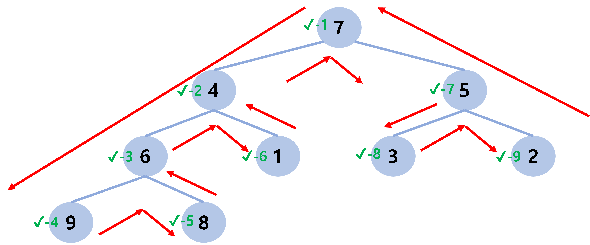
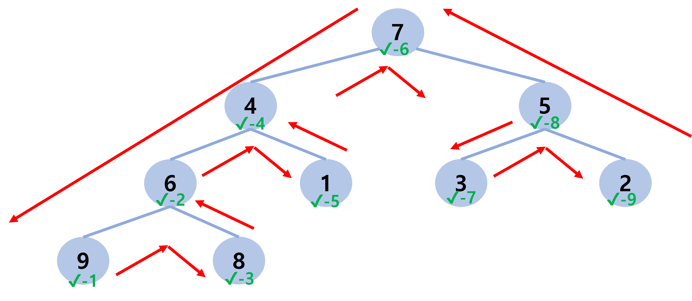
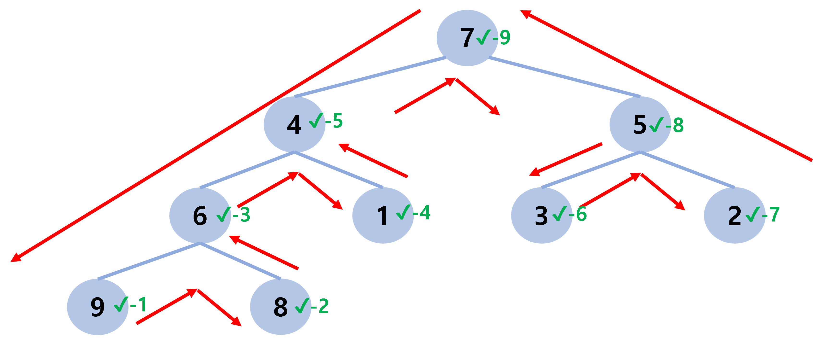
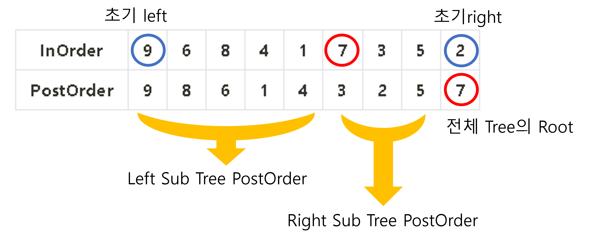
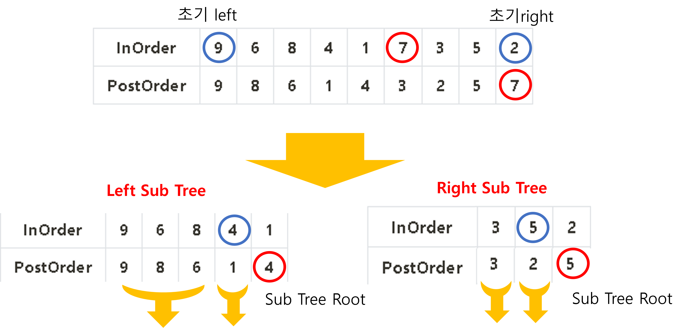

# BOJ 2263 - 트리의 순회 <span style = "color:gold" >Gold Ⅱ</span>

<br><br>

[BOJ 2263 - 트리의 순회](https://www.acmicpc.net/problem/2263)

<br><br>

## 문제

<br><br>

n개의 정점을 갖는 이진 트리의 정점에 1부터 n까지의 번호가 중복 없이 매겨져 있다. 이와 같은 이진 트리의 인오더와 포스트오더가 주어졌을 때, 프리오더를 구하는 프로그램을 작성하시오.

<br><br>

---

<br><br>

## 입력

<br><br>

첫째 줄에 n(1 ≤ n ≤ 100,000)이 주어진다. 다음 줄에는 인오더를 나타내는 n개의 자연수가 주어지고, 그 다음 줄에는 같은 식으로 포스트오더가 주어진다.

<br><br>

---

<br><br>

## 출력

<br><br>

첫째 줄에 프리오더를 출력한다.

<br><br>

---

<br><br>

### ✨ PreOrder, PostOrder, InOrder란?

<br><br>

전위 순회, 후위 순회, 중위 순회이다.  
이는 Tree에서의 traversal인데, 전위는 노드 왼쪽에서 방문하고, 중위는 노드 아래에서 만나고, 후위는 노드 오른쪽에서 만난다.  
<br>

이를 그림으로 보면 이해하기 쉽다.

<br>

### 1️⃣ PreOrder Traversal

<br><br>



<br><br>

### 2️⃣ InOrder Traversal

<br><br>



<br><br>

### 1️⃣ PostOrder Traversal

<br><br>



<br><br>

## 위 Tree에서의 순서

<b>

|  **_InOrder_**  | **_9_** | **_6_** | **_8_** | **_4_** | **_1_** | **_7_** | **_3_** | **_5_** | **_2_** |
| :-------------: | :-----: | :-----: | ------- | ------- | ------- | ------- | ------- | ------- | ------- |
| **_PostOrder_** | **_9_** | **_8_** | **_6_** | **_1_** | **_4_** | **_3_** | **_2_** | **_5_** | **_7_** |

<br><br>

## How to Solve?

<br><br>

### 💥 PostOrder의 특징과 InOrder의 특징을 활용하자!

<br>

PostOrder 순서의 경우 Root 노드를 맨 마지막에 방문하는 것을 알 수 있습니다.  
<br>
InOrder 순서의 경우 Root 노드를 기준으로 왼쪽은 Left SubTree가 되고, 오른쪽은 Right Sub Tree 가 됩니다.  
<br>

이 두 사실을 활용해서 Left SubTree 와 Right SubTree로 분할하며 해결한다면 해결할 수 있습니다.

<br><br>



<br>

위 그림과 같이 post order에서 현재 Tree에서 Root를 뽑아내고 InOrder 정보를 통해 왼쪽 서브 트리의 노드 개수, 오른쪽 서브 트리의 노드 개수를 구한다.  
<br>

<span style="color:red">**우리는 PreOrder Traversal**</span>을 할 것이기 때문에 왼쪽 서브 트리부터 재귀적으로 다시 나누면서 자기 자신의 노드만 남을 때 까지 진행한다.  
<br>

### 💥 종합적으로 그림으로 살펴보겠습니다.

<br><br>



<br>

위 그림과 같이 진행하면서 자기 자신 노드만 남을 떄까지 진행합니다.  
<br>

또한, 현재 Tree에서 PostOrder 정보를 통해 얻은 Root 는 바로 출력에 추가시켜준다면 왼쪽 서브 트리로 divide하면서 진행하기 때문에 자연스럽게 PreOrder Traversal을 진행할 수 있습니다.

<br><br>

### ✨ **Java Code**

```java
package com.day0809;

import java.io.BufferedReader;
import java.io.IOException;
import java.io.InputStreamReader;
import java.util.ArrayList;
import java.util.List;
import java.util.StringTokenizer;

public class BOJ_2263 {
	static List<Integer> inOrder; // in-order traversal
	static StringBuilder sb;
	// Left Sub Tree & Right Sub Tree 분리한다.
	static void solve(int inLeft, int inRight, List<Integer> post) {
		// inLeft > inRight 시 종료
		if (inLeft > inRight ) return;
		if (inLeft == inRight) { // 왼쪽으로 쭉 가다가 하나만 남았다면 더 이상 왼쪽으로 갈 자식이 없다 -> 출력 후 종료
			sb.append(post.get(0) + " ");
			return;
		}

		// 현재 Sub Tree 중 Root는 post 에서 마지막에 방문된 노드이다.
		int subRoot = post.get(post.size() -1 );
		// 서브트리의 root는 바로 방문 -> 출력한다.
		sb.append(subRoot + " ");
		// in-order traversal 에서 방문된 순서를 찾아서 그 index를 기준으로 왼쪽은 Left Sub Tree - 오른쪽은 Right Sub Tree
		int idx = inOrder.indexOf(subRoot);
		solve(inLeft, idx-1, post.subList(0, idx - inLeft)); // 왼쪽 서브 트리 탐색
		solve(idx+1, inRight, post.subList(idx-inLeft, post.size() - 1)); // 오른쪽 서브 트리 탐색
	}
	public static void main(String[] args) throws IOException{
		BufferedReader br = new BufferedReader(new InputStreamReader(System.in));
		StringTokenizer st;
		sb = new StringBuilder();
		int N = Integer.parseInt(br.readLine());
		inOrder = new ArrayList<>();
		List<Integer> postOrder = new ArrayList<>();
		st = new StringTokenizer(br.readLine());
		for (int i = 0; i < N; i++) {
			inOrder.add(Integer.parseInt(st.nextToken()));
		}
		st = new StringTokenizer(br.readLine());
		for (int i = 0; i < N; i++) {
			postOrder.add(Integer.parseInt(st.nextToken()));
		}

		solve(0, N-1, postOrder);
		System.out.println(sb);
	}
}

```

## 💥 끝!!

<br>

✨ 잘못된 부분은 많은 조언 및 지적 부탁드립니다. - JunHyxxn

<br>
