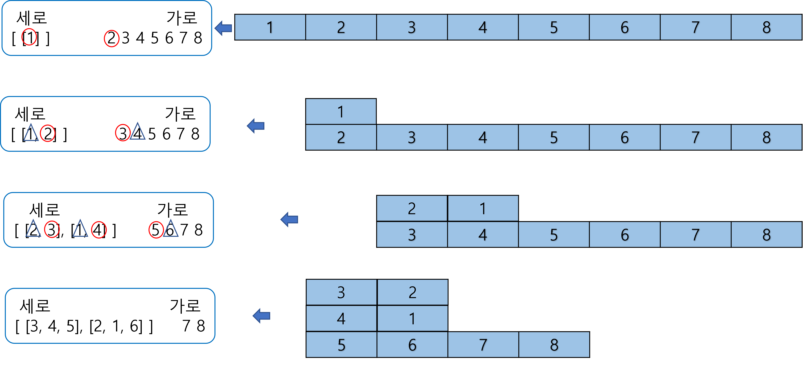
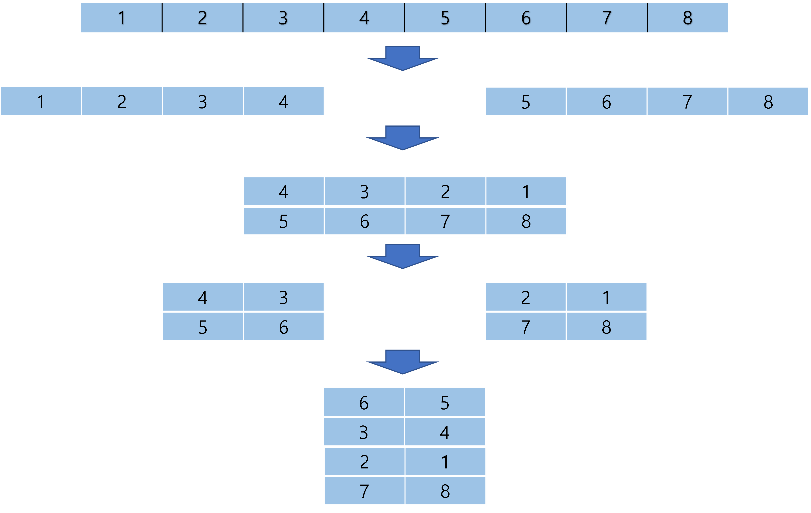

# BOJ 23291 - 어항정리 <span style = "color:#00FFCC" >Platinum Ⅴ</span>

<br><br>
[BOJ 23291 - 어항정리](https://www.acmicpc.net/problem/23291)
<br><br>

## 💥 Rule

<br><br>

### 1. 물고기 추가 - add_fish()

<br>

**가장 적은 수의 물고기가 담긴 모든 어항에 물고기 한 마리씩 추가한다.**
<Br>

배열을 순회하면서 min 값을 갖는 인덱스를 모두 저장해둔다.
<br>

해당 인덱스에 해당하는 어항에 물고기 한 마리씩 추가한다.  
<br>

### ✨ **Python Code**

```python
def add_fish(fishbowl):
    min_value = float("INF")
    index = []
    for i in range(len(fishbowl)):
        if min_value > fishbowl[i]:
            min_value = fishbowl[i]
            index = [i]
        elif min_value == fishbowl[i]:
            index.append(i)

    for idx in index:
        fishbowl[idx] += 1

    return fishbowl
```

<br><br>

### 2. 어항 쌓기 - stack_bowl()

<br>

세로 배열과 가로 배열로 구분해서 관리할 것이다.
<br>

**모든 세로 배열의 끝에서부터의 원소들과 가로 배열의 첫 번째부터의 원소들이 짝을 이뤄 새로운 하나의 세로 배열을 생성하게 된다.**
<br>

세로 배열 하나의 길이가 가로 배열의 길이보다 커질때까지 어항을 쌓을 수 있다.  
<br>
이해를 위해 그림을 추가한다.



<br>
세로 배열의 뒷 원소들부터, 가로 배열의 앞 원소 끼리 짝지어준다.
<br>

### ✨ **Python Code**

```python
def stack_bowl(fishbowl):
    vertical = [] ## 세로 어항
    horizontal = fishbowl ## 가로 어항

    ## Init
    vertical.append([horizontal.pop(0)])

    ## 어항 쌓기 시작
    while len(vertical[0]) <= len(horizontal):
        temp = [] ## 임시 vertical 배열
        for i in range(len(vertical[0])-1, -1, -1):
            vert = [] ## 임시 한 줄
            for j in range(len(vertical)):
                vert.append(vertical[j][i])
            vert.append(horizontal.pop(0))

            temp.append(vert)
        vertical = temp

    new_bowl = [[-1] * (len(vertical)+len(horizontal)) for _ in range(len(vertical[0]))]

    for i in range(len(vertical)):
        for j in range(len(vertical[0])):
            new_bowl[j][i] = vertical[i][j]
    if len(horizontal) > 0:
        for i in range(len(vertical), len(vertical) + len(horizontal)):
            new_bowl[len(vertical[0]) - 1][i] = horizontal[i-len(vertical)]

    return new_bowl
```

<br><br>

### 3. 물고기 조정하기 - balance()

<br>

각 어항들의 인접한 어항들간의 차이를 줄이는 과정이다.

인접한 어항들간의 차이를 diff 라 하고, diff를 5로 나눈 몫이 d 라고 한다.

d 가 0보다 크면 차이를 줄이기 위해 큰 쪽에서 작은 쪽으로 d 만큼 보낸다. 즉 물고기가 많은 어항은 d만큼 줄어들 것이고, 물고기가 적은 어항은 d만큼 늘어난다.  
<br>

🔥 **주의할 점! <span style="color:red">이 과정은 동시에 이루어 진다. 즉 임의의 배열에 각 어항의 증감량을 담아두고 한 번에 갱신해야한다.</span>**
<br>

### ✨ **Python Code**

```python
def balance(bowl):
    global d ## dx, dy 정보를 담은 배열

    temp = [[0] * len(bowl[0]) for _ in range(len(bowl))] ## 증감량 담을 배열

    for x in range(len(bowl)):
        for y in range(len(bowl[0])):
            if bowl[x][y] == -1: continue ## 탐색 불필요 지역은 건너뛴다.

            ## 4개의 방향
            for dd in d:
                dx, dy = dd
                nx, ny = x+dx, y+dy
                if 0<= nx < len(bowl) and 0<= ny < len(bowl[0]) and bowl[nx][ny] != -1: ## 유효한 범위이며 -1이 아닌 지역
                    diff = abs(bowl[x][y] - bowl[nx][ny]) // 5
                    if diff >0:
                        if bowl[x][y] > bowl[nx][ny]: ## x,y -> nx,ny 로 이동
                            temp[x][y] -= diff
                            temp[nx][ny] += diff
    ## 갱신 작업
    for x in range(len(bowl)):
        for y in range(len(bowl[0])):
            bowl[x][y] += temp[x][y]

    return bowl
```

<br><br>

### 4. 어항 일렬로 정렬 - one_row()

<br>
쌓은 어항들을 다시 일렬로 정렬한다.
<br>

### ✨ **Python Code**

```python
def one_row(bowl):
    temp = []

    for y in range(len(bowl[0])):
        for x in range(len(bowl)-1, -1, -1):
            if bowl[x][y] != -1:
                temp.append(bowl[x][y])

    return temp
```

<br><br>

### 5. 180도 회전시키며 어항 재배치 - rotate_half()

<br>
절반 나누고 180도 회전시켜 쌓고 다시 절반 나누고 180도 회전시켜 쌓는다. 이 과정은 규칙이 있다.

- 0 ~ 25% 구간 : 아래에서 두 번째 층에 순서가 역전되어 쌓인다.
- 25% ~ 50% 구간 : 아래에서 세 번째 층에 순서대로 쌓인다.
- 50% ~ 75% 구간 : 맨 위층에 순서가 역전되어 쌓인다.
- 75% ~ 100% 구간 : 맨 아래층에 순서대로 쌓인다.  
  <br>
  마찬가지로 이해를 위해 그림과 함께 보자.


<br>

### ✨ **Python Code**

```python
def rotate_half(bowl):
    temp = []
    st, nd, rd, th = len(bowl)//4, len(bowl)//4*2, len(bowl)//4 * 3, len(bowl)
    a, b, c, d = bowl[:st], bowl[st:nd], bowl[nd:rd], bowl[rd:th]
    temp.append(c[::-1])
    temp.append(b)
    temp.append(a[::-1])
    temp.append(d)

    return temp
```

<br><br>

### 6. 3번과 4번을 다시 진행한다.

<br><br>

### 7. 최소 물고기 수와 최대 물고기 수의 차이가 K 이하인지 확인하고 아니라면 다시 1~6번 과정을 반복한다.

<br><br>

### 최종 코드

### ✨ **Python Code**

```python
def add_fish(fishbowl):
    min_value = float("INF")
    index = []
    for i in range(len(fishbowl)):
        if min_value > fishbowl[i]:
            min_value = fishbowl[i]
            index = [i]
        elif min_value == fishbowl[i]:
            index.append(i)

    for idx in index:
        fishbowl[idx] += 1

    return fishbowl

def stack_bowl(fishbowl):
    vertical = [] ## 세로 어항
    horizontal = fishbowl ## 가로 어항

    ## Init
    vertical.append([horizontal.pop(0)])

    ## 어항 쌓기 시작
    while len(vertical[0]) <= len(horizontal):
        temp = [] ## 임시 vertical 배열
        for i in range(len(vertical[0])-1, -1, -1):
            vert = [] ## 임시 한 줄
            for j in range(len(vertical)):
                vert.append(vertical[j][i])
            vert.append(horizontal.pop(0))

            temp.append(vert)
        vertical = temp

    new_bowl = [[-1] * (len(vertical)+len(horizontal)) for _ in range(len(vertical[0]))]

    for i in range(len(vertical)):
        for j in range(len(vertical[0])):
            new_bowl[j][i] = vertical[i][j]
    if len(horizontal) > 0:
        for i in range(len(vertical), len(vertical) + len(horizontal)):
            new_bowl[len(vertical[0]) - 1][i] = horizontal[i-len(vertical)]

    return new_bowl

def balance(bowl):
    global d

    temp = [[0] * len(bowl[0]) for _ in range(len(bowl))]

    for x in range(len(bowl)):
        for y in range(len(bowl[0])):
            if bowl[x][y] == -1: continue ## 탐색 불필요 지역은 건너뛴다.

            ## 4개의 방향
            for dd in d:
                dx, dy = dd
                nx, ny = x+dx, y+dy
                if 0<= nx < len(bowl) and 0<= ny < len(bowl[0]) and bowl[nx][ny] != -1:
                    diff = abs(bowl[x][y] - bowl[nx][ny]) // 5
                    if diff >0:
                        if bowl[x][y] > bowl[nx][ny]: ## x,y -> nx,ny 로 이동
                            temp[x][y] -= diff
                            temp[nx][ny] += diff

    for x in range(len(bowl)):
        for y in range(len(bowl[0])):
            bowl[x][y] += temp[x][y]

    return bowl

def one_row(bowl):
    temp = []

    for y in range(len(bowl[0])):
        for x in range(len(bowl)-1, -1, -1):
            if bowl[x][y] != -1:
                temp.append(bowl[x][y])

    return temp

def rotate_half(bowl):
    temp = []
    st, nd, rd, th = len(bowl)//4, len(bowl)//4*2, len(bowl)//4 * 3, len(bowl)
    a, b, c, d = bowl[:st], bowl[st:nd], bowl[nd:rd], bowl[rd:th]
    temp.append(c[::-1])
    temp.append(b)
    temp.append(a[::-1])
    temp.append(d)

    return temp

N, K = map(int, input().split())
d = [[0,1],[1,0],[0,-1],[-1,0]]
fishbowl = list(map(int, input().split()))
cnt = 0
diff = float("INF")
while True:
    if diff <= K:
        print(cnt)
        break
    fishbowl = add_fish(fishbowl)
    temp_bowl = stack_bowl(fishbowl)
    temp_bowl = balance(temp_bowl)
    temp_bowl = one_row(temp_bowl)
    temp_bowl = rotate_half(temp_bowl)
    temp_bowl = balance(temp_bowl)
    temp_bowl = one_row(temp_bowl)
    diff = max(temp_bowl) - min(temp_bowl)
    fishbowl = temp_bowl
    cnt += 1

```

## 💥끝!!

<br>

✨ 잘못된 부분은 많은 조언 및 지적 부탁드립니다. - JunHyxxn

<br>

```toc

```
