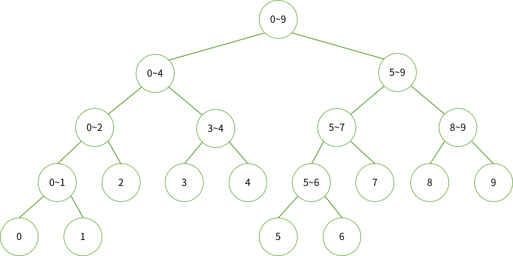

# BOJ 2632 - 피자 판매 <span style = "color:gold" >Gold Ⅱ</span>

<br><br>

[BOJ 2632 - 피자 판매](https://www.acmicpc.net/problem/2632)

<br><br>

## 문제

<br><br>

고객이 두 종류의 피자 A와 B를 취급하는 피자가게에서 피자를 주문하고자 한다.  
<그림 1>과 같이 각 종류의 피자는 다양한 크기의 여러 개의 피자조각으로 나누어져 있다.  
각 조각에 쓰여진 숫자는 피자조각의 크기를 나타낸다.

<br>

<center><그림 1></center>


<br>

고객이 원하는 피자의 크기를 이야기하면, 피자가게에서는 한 종류의 피자를 2 조각 이상 판매할 때는 반드시 연속된 조각들을 잘라서 판매한다.  
이때 판매한 피자조각의 크기 합이 주문한 크기가 되어야 한다. 판매한 피자조각은 모두 A종류이거나, 모두 B종류이거나, 또는 A와 B 종류가 혼합될 수 있다.  
예를 들어서, <그림 1> 과 같이 잘라진 피자가 있을 때, 손님이 전체 크기가 7 인 피자를 주문하면, 피자 가게에서는 <그림2>와 같이 5 가지 방법으로 피자를 판매할 수 있다.

<br>

<center><그림 2></center>


<br>

피자가게에서 손님이 원하는 크기의 피자를 판매하는 모든 방법의 가지 수를 계산하는 프로그램을 작성하시오

<br><br>

---

<br><br>

## 입력

<br><br>

첫 번째 줄에는 손님이 구매하고자 하는 피자크기를 나타내는 2,000,000 이하의 자연수가 주어진다. <br>
두 번째 줄에는 A, B 피자의 피자조각의 개수를 나타내 는 정수 m, n 이 차례로 주어진다 (3 ≤ m, n ≤ 1000). <br>
세 번째 줄부터 차례로 m 개의 줄에는 피자 A의 미리 잘라진 피자조각의 크기를 나타내는 정수가 주어진다. <br>
그 다음 n 개의 줄에는 차례로 피자B의 미리 잘라진 피자조각의 크기를 나타내는 정수가 주어진다. <br>
각 종류의 피자조각의 크기는 시계방향으로 차례로 주어지며, 각 피자 조각의 크기는 1000 이하의 자연수이다.

<br><br>

---

<br><br>

## 출력

<br><br>

첫째 줄에는 피자를 판매하는 방법의 가지 수를 나타내는 정수를 출력한다. 피자를 판매하는 방법이 없는 경우에는 숫자 0을 출력한다.

<br><br>

---

<br><br>

## 🍺 How to Solve?

<br><br>

#### 예제와 같이 피자A는 5조각으로 2, 2, 1, 7, 2 로 이루어져있다고 한다.

<br>


<br>

이 피자에서 사용 가능한 조각의 조합은 1조각, 2조각, 3조각, 4조각, 5조각 인 경우이다.  
피자가 반드시 이어져야 하기 때문에 어느 피자 조각에서 시작하느냐에 따라 다른 값이다.

<br>
즉, 1번조각, 2번조각을 사용하면 {2, 2} 이고, 5번조각, 1번조각을 사용해도 {2, 2} 지만 서로 다른 값이다.

<br><br>

피자를 조금 확장해서 생각해본다. <br>

1️⃣ 조각인 경우 : {2}, {2}, {1}, {7}, {2}
<br>
2️⃣ 조각인 경우 : {2, 2}, {2, 1}, {1, 7}, {7, 2}, {2, 2}
<br>
3️⃣ 조각인 경우 : {2, 2, 1}, {2, 1, 7}, {1, 7, 2}, {7, 2, 2}, {2, 2, 2}
<br>
4️⃣ 조각인 경우 : {2, 2, 1, 7}, {2, 1, 7, 2}, {1, 7, 2, 2}, {7, 2, 2, 2}, {2, 2, 2, 1}
<br>
5️⃣ 조각인 경우 : {2, 2, 1, 7, 2} 🟥 => 5조각은 어느 위치에서 시작해도 상관없이 똑같다.
<br>

위와 같은 결과가 나온다.

<br><br>

위 결과들은 어느 위치에서 시작해 몇 번 조각까지인지에 해당하는 누적합으로 구할 수 있다.  
누적합은 DP와 Segment Tree로 구현할 수 있는데, 사실 이 문제는 값이 변경되지 않기 때문에 DP로 구현하는 것이 훨씬 쉽다.  
하지만, 학습을 위해 Segment Tree로 구현했습니다.

<br><br>

<details>
<summary>Segment Tree</summary>
<div markdown="1">

[Segment Tree 자세히 보기](https://junhyxxn.github.io/boj-2042-%EA%B5%AC%EA%B0%84%ED%95%A9%EA%B5%AC%ED%95%98%EA%B8%B0/)

</div>
</details>

<br>


<br>
2, 2, 1, 7, 2 까지이지만 5번조각 이후에 다시 1번조각으로 돌아오기 때문에 편의를 위해 이 5조각을 붙여 10조각으로 설정하고 Segment Tree를 설정합니다.
<br>

Segment Tree의 특성 상 Leaf Node가 N이라면 Internal Node는 항상 N-1 이 됩니다.  
다만 우린 5조각이 아닌 그 2배 10조각을 사용했기 때문에, $$Leaf Node = 2*N$$ , $$Internal Node = 2*N - 1$$ 이 된다. <br>
총 node의 수는 $$4*N - 1$$ 개 이다.

<br>

#### 🎯 Segment Tree의 높이

<br>

h = $\lceil$log_2{4\*N - 1}$\rceil$

<br><br>

#### ✨ Java - Binary logarithm

<br>
Java 에서는 이진 로그 함수가 존재하지 않습니다.  
<br>
따라서, 직접 구현해줘야 합니다. 이는 log 함수를 통해 쉽게 구현할 수 있습니다. <br>

$$log_{2}{x} = log_{10}{x} / log_{10}{2}$$
<br>

아래 코드는 본 소스 코드에서 사용한 코드입니다. 높이를 구하기 위해서는 올림이 필요해 해당 로직까지 적용했습니다. <br>

```java
static int base2log(int n) {
		return (int)Math.ceil(Math.log10(n) / Math.log10(2));
}
```

---

<br><br>

### 🔥 Key Idea

<br><br>

Segment Tree를 이용해 구간합 데이터를 만들었다면, 각 피자로 만들 수 있는 크기에 대해 총 몇가지 경우의 수가 나오는지 저장하는 배열을 생성합니다.<br>
이는 1조각일 경우부터 N-1 조각일 때 까지 -> {1}, {2}, .... , {1,2,...,N-1}, {N,1,2,...N-2} 까지 구간합들을 조회해 가능한 크기별 가능 횟수를 저장합니다.

<br><br>

문제의 Test Case에 적용한다면  
Pizza A 는 2,2,1,7,2 => 0\~14 크기만큼 가능하다.<br>
Pizza B 는 6, 8, 3 => 0\~17 크기만큼 가능하다.  
<br>
주의할 점은 두 피자 모두 0인 경우가 1개씩 존재하고, 모두 사용하는 최대 크기의 경우는 1개 존재한다.

<br>

<p style="color:red">
피자 A와 피자 B의 크기에 대한 가능한 조각의 개수 배열은 길이가 서로 다르고<br> 
우리가 구하고자 하는 피자의 크기(P)를 구하기 위해서는 피자 A에서 i만큼 가져온다면 피자 B에서는 P-i 만큼 가져오면 된다.  
</p>
<br>

이를 잘 고려해서 계산한다면 정답을 구할 수 있습니다. <br>

#### 🔑 Time Complexity

<br>

Segment Tree를 만들기 위해서 $$O(NlogN + MlogM)$$ <br>
크기별 가능한 조각 조합 개수 배열 구하기 위해 $$O(N^2 + M^2)$$ <br>
피자 크기 P를 만들기 위해 $$O(P/2)$$<br>
<br>
총 약 $$O(N^2)$$ 만큼 소요된다.

<br><br>

### ✨ **Java Code**

```java
public class BOJ_2632_피자판매 {
	static int order, N, A, B, M;
	static int[] nums, tree;
	public static void main(String[] args) throws IOException{
		BufferedReader br= new BufferedReader(new InputStreamReader(System.in));
		StringTokenizer st;
		order = Integer.parseInt(br.readLine());

		st = new StringTokenizer(br.readLine());
		A = Integer.parseInt(st.nextToken());
		B = Integer.parseInt(st.nextToken());

		nums = new int[A];
		M = A;
		N = 1<<base2log(4*A-1);
		tree = new int[N];
		int totalA = 0;
		for (int i = 0; i < A; i++) {
			nums[i] = Integer.parseInt(br.readLine());
			totalA += nums[i];
		}
		initSegmentTree(1, 0, 2*A-1);

		int[] posA = new int[totalA+1];
		posA[0] = 1;
		posA[totalA] = 1;
		for (int i = 0; i < A-1; i++) {
			for (int j = 0; j < A; j++) {
				int sum = find(0, 2*A-1, j, j+i, 1);
				posA[sum]+=1;
			}
		}

		nums = new int[B];
		M = B;
		N = 1<<base2log(4*B-1);
		tree = new int[N];
		int totalB = 0;
		for (int i = 0; i < B; i++) {
			nums[i] = Integer.parseInt(br.readLine());
			totalB += nums[i];
		}
		initSegmentTree(1, 0, 2*B-1);
		int[] posB = new int[totalB+1];
		posB[0] = 1;
		posB[totalB] = 1;
		for (int i = 0; i < B-1; i++) {
			for (int j = 0; j < B; j++) {
				int sum = find(0, 2*B-1, j, j+i, 1);
				posB[sum]+=1;
			}
		}

		int cnt = 0;
		for (int i = 0; i <= order/2; i++) {
			if(isRange(i, posA.length) && isRange(order-i, posB.length)) {
				cnt += posA[i]*posB[order-i];
			}
			if(isRange(order-i, posA.length) && isRange(i, posB.length)) {
				if(i == order-i) continue;
				cnt += posA[order-i]*posB[i];
			}
		}
		System.out.println(cnt);
	}
	static boolean isRange(int x, int R) {
		return !(x<0 || x>=R);
	}
	static int base2log(int n) {
		return (int)Math.ceil(Math.log10(n) / Math.log10(2));
	}

	static int initSegmentTree(int node, int start, int end) {
		if(start == end) {
			tree[node] = nums[start >= M ? start-M : start];
			return nums[start >= M ? start-M : start];
		}
		int mid = (start+end)/2;
		int l_sum = initSegmentTree(node*2, start, mid);
		int r_sum = initSegmentTree(node*2+1, mid+1, end);
		return tree[node] = l_sum+r_sum;
	}
	static int find(int start, int end, int left, int right, int node) {
		if(end < left || right < start) return 0;
		if(left<= start && end <= right) return tree[node];

		int mid = (start+end)/2;
		int l_sum = find(start, mid, left, right, node*2);
		int r_sum = find(mid+1, end, left, right, node*2+1);
		return l_sum+r_sum;
	}
}

```

## 💥 끝!!

<br>

✨ 잘못된 부분은 많은 조언 및 지적 부탁드립니다. - JunHyxxn

<br>
