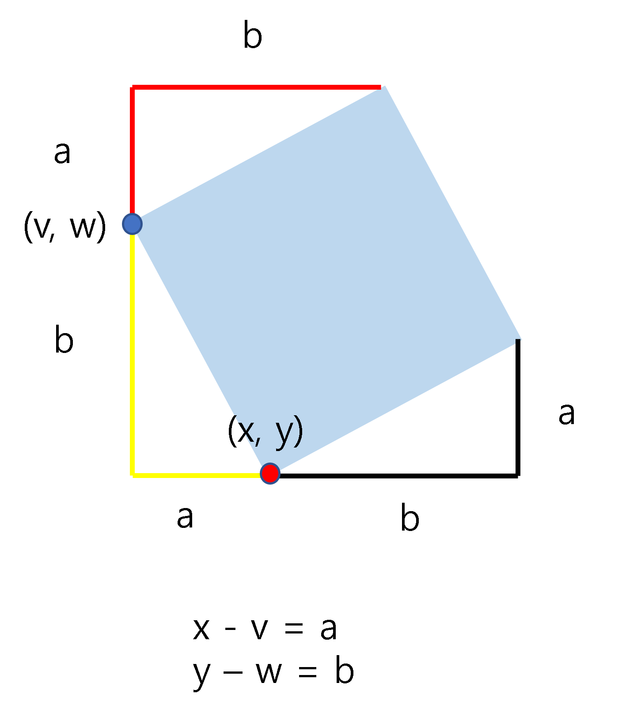

# BOJ 9015 - 정사각형 <span style = "color:gold" >Gold Ⅰ</span>

<br><br>
[BOJ 9015 - 정사각형](https://www.acmicpc.net/problem/9015)
<br><br>

## 문제

<br><br>

평면 위에 N개의 점이 주어졌을 때, 가장 큰 정사각형의 넓이를 구하여라.
<br><br>


<br><br>

---

<br><br>

## 입력

<br><br>
첫째 줄에 테스트케이스의 개수 T가 주어진다.

각 테스트케이스의 첫째 줄에는 점의 개수 N(4 ≤ n ≤ 3,000)이 주어지고, 이어서 N개의 줄에는 점의 x좌표와 y좌표가 주어진다.  
모든 좌표는 -10000 이상 +10000이하의 정수이다. 같은 위치의 점이 여러 번 주어지는 경우는 없다.

<br><br>

---

<br><br>

## 출력

<br><br>
각 테스트 케이스마다 가장 큰 정사각형의 넓이를 한 줄에 하나씩 출력한다.  
단, 정사각형이 없는 경우 0을 출력한다.

<br><br>

---

<br><br>

## How to Solve?

<br><br>

점 4개를 선택해 정사각형 여부 확인하는 방법은
$$3000\choose 4$$
로 불가능하다.  
<br>

그래서 처음 생각했던 방법은 대각선 두 개를 선택해 두 대각선의 길이가 같고,  
두 대각선의 기울기를 a1, a2라 했을 때, $$a1 * a2 = -1$$ 즉 직교한다는 성질을 이용해 해결하려고 했다. 하지만 이 또한, 최대한 줄여도 $$O(N^3)$$ 시간 복잡도가 필요해 불가능했다.

<br>

### 💥 그렇다면 어떻게 줄일 수 있을까?

<br>

정사각형의 네 변의 길이가 같고 모든 각이 직각인 성질을 활용할 수 있는 방법을 생각해본다.  
<br>회전되어 있는 정사각형이라고 생각하고 각 꼭짓점을 기준으로 큰 정사각형을 만든다면 4개의 합동 직각삼각형을 확인할 수 있다. 이 삼각형들을 활용해 두 개의 점만 알더라도 나머지 두 개의 점을 유추할 수 있다.  
<br>
이해를 위해 그림으로 다시 확인해보자.  
<br><br>



<br><br>

- 🔴 : (x, y)
- 🔵 : (v, w)

노란색 짧은 변의 길이를 $$x - v = a$$ 긴 변의 길이를 $$y - w = b$$ 로 표현할 수 있다.  
빨간색 삼각형과 노란색 삼각형, 검은색 삼각형이 모두 합동임을 알 수 있다.  
그렇다면 우리는 (x, y), (v, w) 를 이용해서 나머지 두 개의 점을 쉽게 알 수 있다.  
<br>
나머지 두 개의 점은 다음과 같아진다.

- 🟡 : $$(x + b, y - a)$$
- 🟢 : $$(v + b, w - a)$$

<br><br>

이렇게 두 개의 점을 구하면 이 두 점이 주어진 좌표 목록에 있는지 확인하면 된다.  
<br>
이 때, 포함 여부를 판단하기 위해 자료구조 Set을 이용한다.  
<br>

**List를 이용할 경우 O(N) Time이 소요되어 TLE가 발생하지만,** Python의 경우 **Set이 Hash Table** 로 구현되어 있어 Average Time Complexity 가 $$O(1)$$ 이다.  
<br>
물론 Hash Table에 따라 Worst Case인 경우는 O(N) Time 이지만, set의 내장함수 **contains**를 사용하게 될 경우 일반적으로 O(1) 안에 해결이 가능하다.

<br><br>

### ✨ **Python Code**

```python
import sys
input = sys.stdin.readline
T = int(input())
for _ in range(T):
    n = int(input())
    points = set()
    for _ in range(n):
        a, b = map(int, input().split())
        points.add((a,b))
    pos_line = list(points)
    pos_square = set()
    ## 선분 하나 선택 - O(N^2)
    for i in range(n):
        for j in range(i+1, n):
            x1, y1 = pos_line[i]
            x2, y2 = pos_line[j]
            a =  x2-x1
            b =  y2-y1


            x3, x4 = x1 + b, x2 + b
            y3, y4 = y1 - a, y2 - a
            if abs(x3) > 10000 or abs(x4) > 10000 or abs(y3) > 10000 or abs(y4) > 10000:
                continue

            if points.__contains__((x3,y3)) and points.__contains__((x4, y4)):
                pos_square.add(((x2-x1)**2 + (y2-y1)**2))
    if pos_square:
        print(max(pos_square))
    else:
        print(0)
```

## 💥 끝!!

<br>

✨ 잘못된 부분은 많은 조언 및 지적 부탁드립니다. - JunHyxxn

<br>
