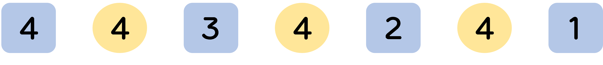
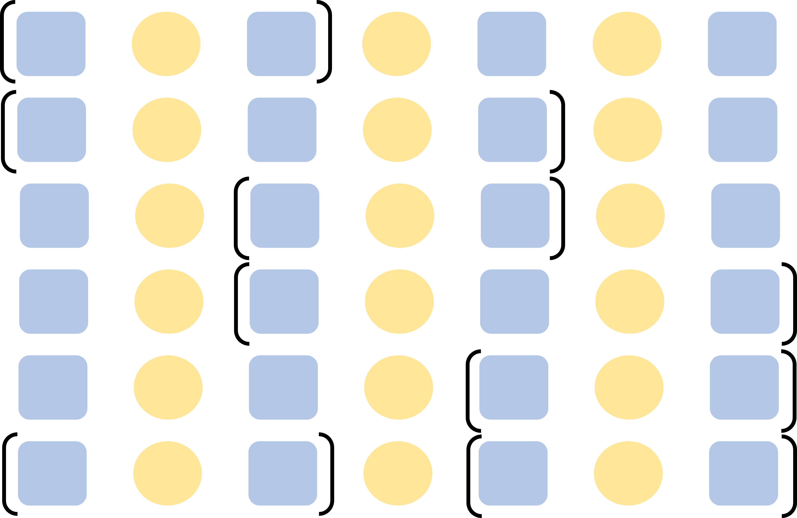

# BOJ 9320 - 금고열기 <span style = "color:gold" >Gold Ⅲ</span>

<br><br>

[BOJ 9320 - 금고열기](https://www.acmicpc.net/problem/9320)

<br><br>

## 문제

<br>

비밀 요원 상근이는 시리아의 화학 무기에 대한 정보를 보관하고 있는 금고를 열려고 한다. 금고를 열려면 금고에 암호를 입력해야 한다. 암호는 숫자 네 개로 이루어져 있다.

상근이는 시도해야 하는 암호의 목록을 가지고 있다. 목록에는 매우 많은 암호가 적혀있기 때문에, 암호가 될 수 없는 것을 미리 지우려고 한다.

올바른 암호는 24 조건을 만족한다. 암호를 이루는 수 네 개 사이에 덧셈, 뺄셈, 곱셈, 나눗셈, 괄호를 적절히 삽입해서 24를 만들 수 있을 때, 그 암호를 24 조건을 만족한다고 한다.

예를 들어, (4, 7, 8, 8)은 (7-8/8)\*4 = 24이기 때문에, 24 조건을 만족한다. 하지만, (1, 1, 2, 4)나 (1, 1, 1, 1)과 같은 암호는 24 조건을 만족하지 않는다. 따라서, 이러한 암호는 시도해볼 필요가 없다.

가능한 암호가 모두 주어졌을 때, 24 조건을 만족하는지 안 하는지를 구하는 프로그램을 작성하시오.

---

<br><br>

## 입력

<br>
첫째 줄에 테스트 케이스의 개수가 주어진다. 테스트 케이스의 개수는 100개를 넘지 않는다. 각 테스트 케이스는 한 줄로 이루어져 있고, 가능한 암호를 나타내는 네 정수 a, b, c, d (1 ≤ a, b, c, d ≤ 9)가 주어진다.
<br><br>

---

<br><br>

## 출력

<br>
각 테스트 케이스 마다, 입력으로 주어진 암호가 24 조건을 만족하면 "YES"를, 만족하지 않으면 "NO"를 출력한다.

<br><br>

---

<br><br>

## How To Solve?

<br>

- 🟦 : Operand (피연산자)
  - ex) [1, 3, 4, 6] 이라면 첫 번째 네모에는 1,3,4,6 모두 올 수 있고, 두 번째 네모에는 첫 번째 네모에 들어간 수를 제외한 수가 들어갈 수 있다.
- 🟡 : Operator (연산자)
  - 연산자는 + - \* / 총 네 가지가 각 위치에 모두 올 수 있다.
    <br>

아래 그림은 피연산자에 올 수 있는 경우의 수와 연산자에 올 수 있는 경우의 수이다.



즉, $$4^4 * 3 * 2 == 1536$$ 의 경우의 수가 발생한다.
<br>

식이 만들어졌다면 아래 그림과 같이 괄호를 적용할 수 있다.



<br>
각 식마다 괄호를 생성하는 방법이 총 6가지가 있다.  
따라서 $$1536 * 6 = 9216$$ 가지 경우의 수가 만들어 진다.  
이 과정이 최대 100번 이루어진다. 즉 **921600번** 이루어지기 때문에 <b style = "color:red">Brute-Force</b>로 충분히 탐색 가능하다.  
<br><br>

---

<br><br>

## 🔥 주의할 점!

<br>

**/** 의 경우 일반적인 / 기호를 사용할 경우 float 타입으로 계산되고 소수점 이하 부분으로 인해 오차가 발생한다.

예를 들어, **3, 8, 3, 8** 이 주어진다면 $$8 / ( 3 - 8 / 3 ) = 24$$ 가 되어야 하지만 8/3의 값이 2.666666667 값으로 계산되기 때문에 제대로 된 결과가 나오지 않게 된다.  
<br>
💥 이를 해결하기 위해 fractions 모듈의 Fraction 클래스를 이용한다.
<br>
fractions는 Python 2.6 부터 추가된 모듈로 Fraction 클래스와 GCD 구하는 함수를 제공한다.  
Fraction은 1/3 과 같이 소수점으로 표기하면 오차가 발생하는 것을 분수 형태로 나타낼 수 있도록 하여 오차를 없앨 수 있다. 사용법은 매우 간단하게 Fraction(분자, 분모) 로 이용하면 된다.
<br><br>

## 1. 식 완성하기 - Solve()

<br>

재귀 함수를 통해 식을 완성한다.  
<br>

수식을 담을 expression 리스트를 생성하고 현재 길이가 짝수인지 홀수인지에 따라 Operand, Operator를 넣는다.  
<br>

재귀를 마치면 들어갔던 인자를 제거해 모든 경우의 수를 고려하도록 한다.  
expression 리스트의 길이가 7이 된다면 피연산자 4개와 연산자 3개가 모두 들어갔기 때문에 식이 완성된다.  
<br>

### ✨ **Python Code**

```python
def Solve(exp, visited, operator, operand):
    global result
    if result: return
    if len(exp) == 7:
        result = bracket(exp)
        return

    if len(exp)%2 ==0: ## operand
        for i in range(4):
            if visited[i]: continue
            exp.append(operand[i])
            visited[i] = True
            Solve(exp, visited, operator, operand)
            exp.pop()
            visited[i] = False

    elif len(exp)%2 ==1: ## operator
        for i in range(4):
            exp.append(operator[i])
            Solve(exp, visited, operator, operand)
            exp.pop()
```

<br><br>

## 2. 괄호 생성 - bracket()

<br>
완성된 식에 괄호 표현 6가지를 적용해 결과를 확인한다.  
<br>

### ✨ **Python Code**

```python
def bracket(exp):
    """
    O : operand
    _ : operator
    """
    flag = False

    ## 1. (O _ O) _ O _ O
    res = calc(exp[:3])
    res = calc([res]+exp[3:])
    if res == 24.0:
        flag = True
        return flag

    ## 2. (O _ O _ O) _ O
    res = calc(exp[:5])
    res = calc([res] + exp[5:])
    if res == 24.0:
        flag = True
        return flag
    ## 3. O _ (O _ O) _ O
    res = calc(exp[2:5])
    res = calc(exp[:2] + [res] + exp[5:])
    if res == 24.0:
        flag = True
        return flag

    ## 4. O _ (O _ O _ O)
    res = calc(exp[2:])
    res = calc(exp[:2] + [res])
    if res == 24.0:
        flag = True
        return flag

    ## 5. O _ O _ (O _ O)
    res = calc(exp[4:])
    res = calc(exp[:4] + [res])
    if res == 24.0:
        flag = True
        return flag

    ## 6. (O _ O) _ (O _ O)
    res1 = calc(exp[:3])
    res2 = calc(exp[4:])
    res = calc([res1, exp[3], res2])
    if res == 24.0:
        flag = True
        return flag

    return flag
```

<br><br>

## 3. 식 계산하기 - calc()

<br>

표현식을 FIFO 형태로 pop하며 피연산자라면 nums 스택에 담아두고 연산자라면 opers 스택에 담아둔다.  
✔ 이 때, 연산자가 곱셈 혹은 나눗셈일 경우 사칙연산 규칙에 따라 opers 스택에 담지 않고 바로 계산한다.  
nums 스택에 마지막으로 들어간 수(x)와 해당 연산자와 expression에서 다음으로 나올 피연산자(y) 를 이용해 계산한다.  
✔ $$/$$ 의 경우 앞서 언급했듯이, 단순히 $$x / y$$ 를 하게 되면 소수점으로 인해 오차가 발생한다. 따라서 Fraction(x, y) 로 진행하면 된다.  
<br>

### ✨ **Python Code**

```python
def calc(expression):
    expression = deque(expression)
    nums = []
    opers = []
    while expression:
        elem = expression.popleft()
        if type(elem) == int or type(elem) == Fraction:
            nums.append(elem)
        elif type(elem) == str:
            if elem == '*' or elem == '/':
                x = nums.pop()
                y = expression.popleft()
                if elem == '*':
                    nums.append(x*y)
                elif elem == '/':
                    if y == 0: return -1
                    nums.append(Fraction(x,y))
            else:
                opers.append(elem)

    x = nums[0]
    for i in range(len(opers)):
        if opers[i] == '+':
            x = x + nums[i+1]
        elif opers[i] == '-':
            x = x - nums[i+1]

    return x
```

<br><br>

---

<br><br>

## 💥 전체 코드

```python
from fractions import Fraction
from collections import deque
def calc(expression):
    expression = deque(expression)
    nums = []
    opers = []
    while expression:
        elem = expression.popleft()
        if type(elem) == int or type(elem) == Fraction:
            nums.append(elem)
        elif type(elem) == str:
            if elem == '*' or elem == '/':
                x = nums.pop()
                y = expression.popleft()
                if elem == '*':
                    nums.append(x*y)
                elif elem == '/':
                    if y == 0: return -1
                    nums.append(Fraction(x,y))
            else:
                opers.append(elem)

    x = nums[0]
    for i in range(len(opers)):
        if opers[i] == '+':
            x = x + nums[i+1]
        elif opers[i] == '-':
            x = x - nums[i+1]

    return x

def bracket(exp):
    """
    O : operand
    _ : operator
    """
    flag = False

    ## 1. (O _ O) _ O _ O
    res = calc(exp[:3])
    res = calc([res]+exp[3:])
    if res == 24.0:
        flag = True
        return flag

    ## 2. (O _ O _ O) _ O
    res = calc(exp[:5])
    res = calc([res] + exp[5:])
    if res == 24.0:
        flag = True
        return flag
    ## 3. O _ (O _ O) _ O
    res = calc(exp[2:5])
    res = calc(exp[:2] + [res] + exp[5:])
    if res == 24.0:
        flag = True
        return flag

    ## 4. O _ (O _ O _ O)
    res = calc(exp[2:])
    res = calc(exp[:2] + [res])
    if res == 24.0:
        flag = True
        return flag

    ## 5. O _ O _ (O _ O)
    res = calc(exp[4:])
    res = calc(exp[:4] + [res])
    if res == 24.0:
        flag = True
        return flag

    ## 6. (O _ O) _ (O _ O)
    res1 = calc(exp[:3])
    res2 = calc(exp[4:])
    res = calc([res1, exp[3], res2])
    if res == 24.0:
        flag = True
        return flag

    return flag

def Solve(exp, visited, operator, operand):
    global result
    if result: return
    if len(exp) == 7:
        result = bracket(exp)
        return

    if len(exp)%2 ==0: ## operand
        for i in range(4):
            if visited[i]: continue
            exp.append(operand[i])
            visited[i] = True
            Solve(exp, visited, operator, operand)
            exp.pop()
            visited[i] = False

    elif len(exp)%2 ==1: ## operator
        for i in range(4):
            exp.append(operator[i])
            Solve(exp, visited, operator, operand)
            exp.pop()

t = int(input())
for _ in range(t):
    operator = ['+','-','*','/']
    operand = list(map(int, input().split()))
    visited = [False]* 4
    result = False
    exp = []
    Solve(exp, visited, operator, operand)
    print('YES' if result else 'NO')

```

<br><br>

### 💥 Brute Force로 구현해 3 8 3 8 와 같이 같은 수들이 들어있는 경우 중복된 식들이 발생한다. 중복된 식을 탐색하지 않도록 BackTracking 구현을 한다면 조금 더 시간 단축을 할 수 있을 것으로 예상된다.

<br>

✨ 잘못된 부분은 많은 조언 및 지적 부탁드립니다. - JunHyxxn

<br>
