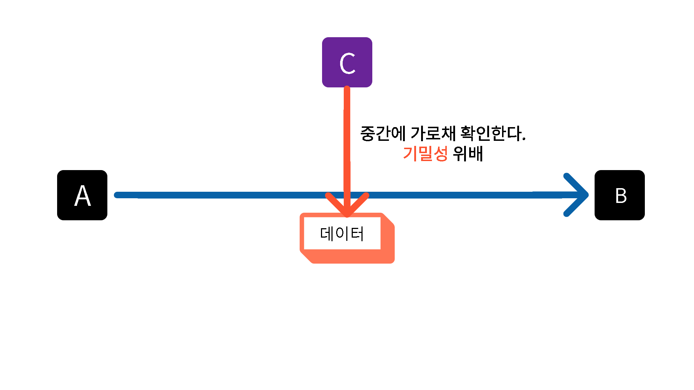
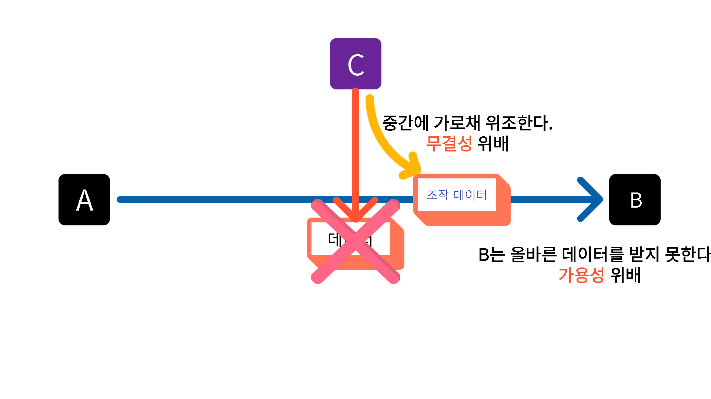
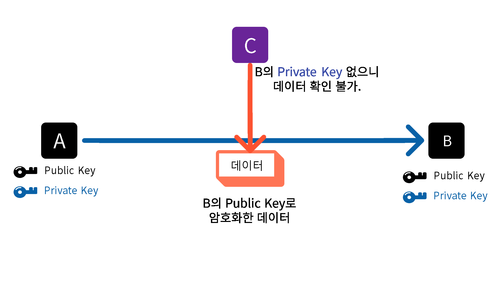
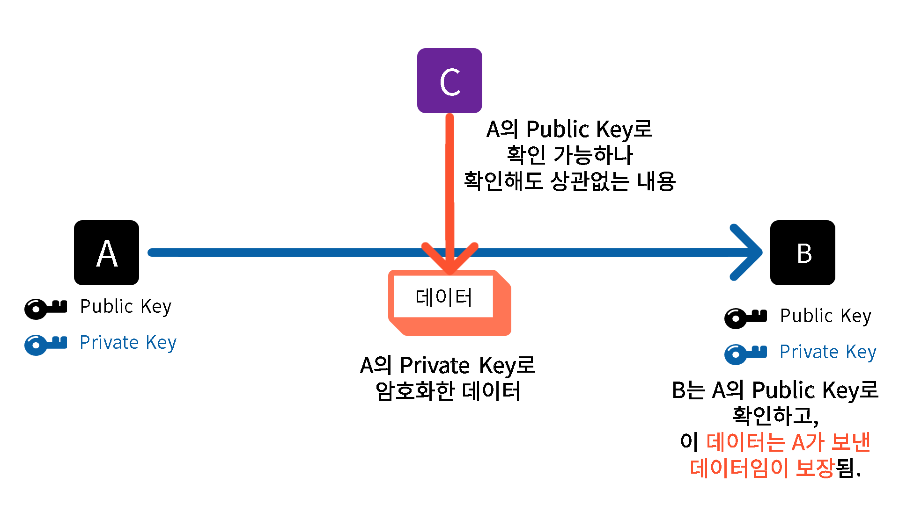

# 보안의 3요소 CIA와 RSA

<br><br>

해당 내용은 [메타코딩 - 스프링부트 시큐리티](https://www.youtube.com/watch?v=d9huoyT_Z5g&list=PL93mKxaRDidERCyMaobSLkvSPzYtIk0Ah&index=15) 강의를 들으며 정리한 내용입니다.

<br>

TCP 통신이 갖고 있는 보안상의 문제점에 대해 살펴보고 RSA 인증 방법을 살펴본다.  
Web은 TCP 프로토콜을 이용하기 때문에 어떠한 보안상의 문제가 있고, 이를 해결하기 위해 어떤 방식을 사용할 수 있는지는 중요한 내용이다.

<br><br>

## 보안의 3요소 - CIA

<br>
CIA - [Confidentiality Integrity Available] : 기밀성, 무결성, 가용성을 의미한다.  
하나씩 살펴보자.  
<br>

### 💥 Confidentiality - 기밀성

<br>



<br><br>
C를 해커라 했을 때, 해커가 중간에 데이터를 가로챌 수 있다. - 기밀성이 깨진다.

<br>

### 💥 Integrity & Available - 무결성 & 가용성

<br>



<br><br>
C가 가로채 위조 데이터를 전송하게 되면 데이터의 무결성이 꺠지고, B는 제대로 된 데이터를 받지 못해 가용성이 깨진다.

<br><br>

<h2> CIA을 보장하기 위해 문서를 암호화, 보안을 적용해 전송할 필요가 있다.</h2>

<br>

1️⃣ : Key를 뺏기면 **기밀성 위배**<br>

2️⃣ : Key를 뺏기면 **무결성 위배**<br>

3️⃣ : 수신자가 Key가 없다면 **가용성 위배**<br>

⚒ Key를 수신자가 가지고 있어야 하기 때문에, 열쇠 전달의 문제도 발생한다.

🔥 여전히 C가 중간에 가로채 위조한 데이터를 B가 받았는지, A로부터 데이터를 제대로 받았는지 모른다. 누구로부터 데이터를 받았는지 안다면 위조 여부를 알 수 있다.  
<br>

<h3> 즉, 열쇠 전달의 문제 & 누구로부터 받은 데이터인지 알 수 있다면 CIA를 만족할 수 있다.</h3>

<br>
이를 위해서 RSA를 사용할 수 있다. 이는 JWT 토큰의 Signature에 쓰이는 알고리즘 중 하나이기도 하다. 다만 주로 HMAC(Keyed-Hash Message Authentication Code)가 주로 쓰인다고 한다.

<br><br>

## RSA - 공개 키 암호 알고리즘

<br>
앞서 보안 3요소 CIA를 만족하기 위해서는 두 가지 문제점을 해결하면 된다고 알아봤다.    <Br>
1️⃣ : 열쇠 전달의 문제  <br>
2️⃣ : 누구로부터 받은 데이터인지 확인<br>
<br>
RSA는 2가지 키를 갖는다.

- Public Key : 공개 키 - 암호화 하는데 사용된다.
- Privata Key : 개인 키 - 서명(Signature)에 사용된다.

여기에서 서명이란 보낸 사람을 인증하는 것이라고 생각하면 된다.

<br>

### Encryption - 암호화

<br>



<br><br>

### Signature - 서명

<br>



<br><br>

이렇게 RSA - 공개 키 암호 알고리즘을 통해서 CIA를 보장할 수 있게 된다.

<br><br>

다음으로는 JWT의 구조에 대해 알아보고자 한다.

### 끝 !!

<br>

✨ 잘못된 부분은 많은 조언 및 지적 부탁드립니다. - JunHyxxn

<br>

```toc

```
