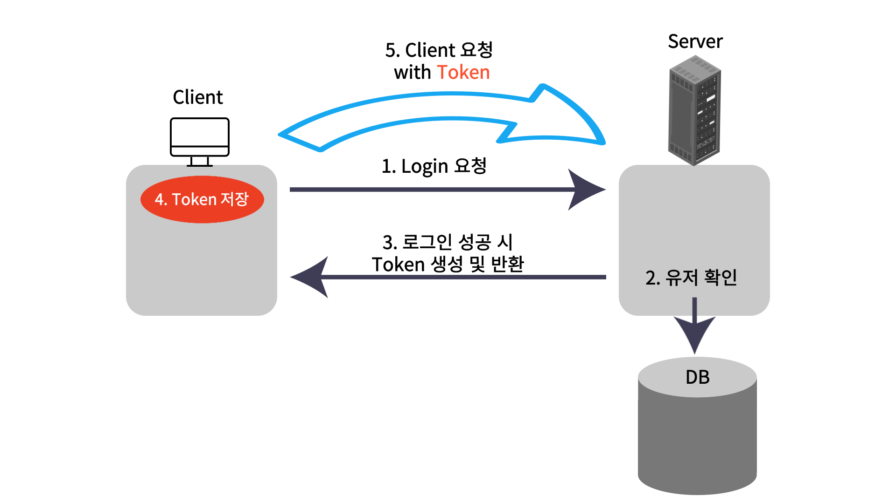

# JWT - Json Web Token

<br><br>

해당 내용은 [메타코딩 - 스프링부트 시큐리티](https://www.youtube.com/watch?v=JY6qEnGRXic&list=PL93mKxaRDidERCyMaobSLkvSPzYtIk0Ah&index=18) 강의를 들으며 정리한 내용입니다.

<br>

JWT는 Json Web Token으로 Web에서 Json 객체로 정보를 안전하게 전송하기 위한 개방형 표준(RFC 7519)이다.

⚒ 여기에서 RFC란 여러 내부망들이 서로 연결할 때, 서로 약속된 규칙으라고 생각하면 된다.  
<br>

### JWT는 언제 사용할까?

<br>
1️⃣ : 권한 부여  
로그인하면 JWT를 부여하고 후속 요쳥에는 JWT가 포함되어 사용자가 해당 토큰으로 인증을 받는 방식이다.   
<br>
2️⃣ : 정보 교환  
JWT는 정보를 안전하게 전송하는 좋은 방법이다. RSA 방식을 사용하여 JWT에 서명할 수 있기 때문에 발신자가 누구인지 알 수 있고, Header와 Payload를 사용해 Signature를 만들기 때문에 위조 여부도 판단할 수 있다.

<br><br>

## JWT 구조

<br>
설명에 앞서 Claim은 정보를 담는 조각 단위로 생각하면 된다.  
<br>

<span style="color:blue">xxxxx</span>.<span style="color:green">yyyyy</span>.<span style="color:red">zzzzz</span>

<span style="color:blue">xxxxx : Header</span>  
<span style="color:greeb">yyyyy : Payload</span>  
<span style="color:red">zzzzz : Signature</span>

<br>

### 💥 Header : 토큰 유형, 서명 알고리즘

<br>
ex)  
{ "alg" : "HS256", "typ" : "JWT" }

<br><br>

### 💥 Payload : 엔티티(사용자) 및 추가 데이터에 대한 설명

<br>
세 가지 종류의 Claim이 존재한다.  
<br>
1️⃣ Registered : 이미 정의된 클레임으로 권장되는 정보들이 해당된다. ex) sub(제목), aud(대상자), exp(만료시간) etc...  [3글자이다]  
2️⃣ Public : 마음대로 정의할 수 있지만, 충돌 방지된 이름 필수  
3️⃣ Private : 정보를 공유하기 위한 사용자 지정 Claim이다.  ex) "username" : "testId"

<br><br>

### 💥 Payload : 엔티티(사용자) 및 추가 데이터에 대한 설명

<br>
Encoding된 Header와 Encoding된 Payload 그리고 Secret Key, 서명 알고리즘(HMAC, RSA)를 이용해 구성한다.  
아래와 같다.  
<br>
```
HMACSHA256(
  base64UrlEncode(header) + "." +
  base64UrlEncode(payload),
  secret)
```

<br><br>

Header, Payload, Signature 를 종합해 보면 다음과 같다.

<br>

<br>

header부분은 header에 해당하는 값이 인코딩 된 값이고,  
Payload는 Payload에 해당하는 값이 인코딩 된 값이며,  
Signature는 모두 종합한 값을 해쉬한 값을 인코딩한 값이 된다.  
아래 그림과 같다.
<br>


<br>

### JWT 작동

<br>
JWT는 Bearer 스키마를 사용해 헤더의 Authorization에서 보내야 한다.
```
Authorization: Bearer <token>
```

<br><br>

## 🌟 JWT 로그인 방식

<br>


<br><br>

### JWT 로그인 장점

<br>

[Session Login 단점](https://junhyxxn.github.io/2022/05/12/session-login.html)을 극복할 수 있다.

#### 1️⃣ 더이상 Client-Server 간 상태 정보가 존재하지 않는다 - <span style="color:red">Stateless</span>

#### 2️⃣ Stateless로 인해 서버 확장에 용이해진다

#### 3️⃣ 다른 어플리케이션으로 인증 정보 전달 가능하다 - 멀티 디바이스 가능, Open API를 통해 로그인 연동 가능

#### 4️⃣ 세션 관리하지 않아 효율적이다

<br><br>

#### 참고 자료

<br>

[JWT 공식문서](https://jwt.io/introduction)

[메타코딩 - 스프링부트 시큐리티](https://www.youtube.com/watch?v=JY6qEnGRXic&list=PL93mKxaRDidERCyMaobSLkvSPzYtIk0Ah&index=18)

<br><br>

## 💥끝!!

<br>

✨ 잘못된 부분은 많은 조언 및 지적 부탁드립니다. - JunHyxxn

<br>
