# <div style='background-color: #f5f0ff'>👩‍💻 OS - Memory Management (1)</div>

---

# <div style='background-color: #f5f0ff'>Preview</div>

<br>

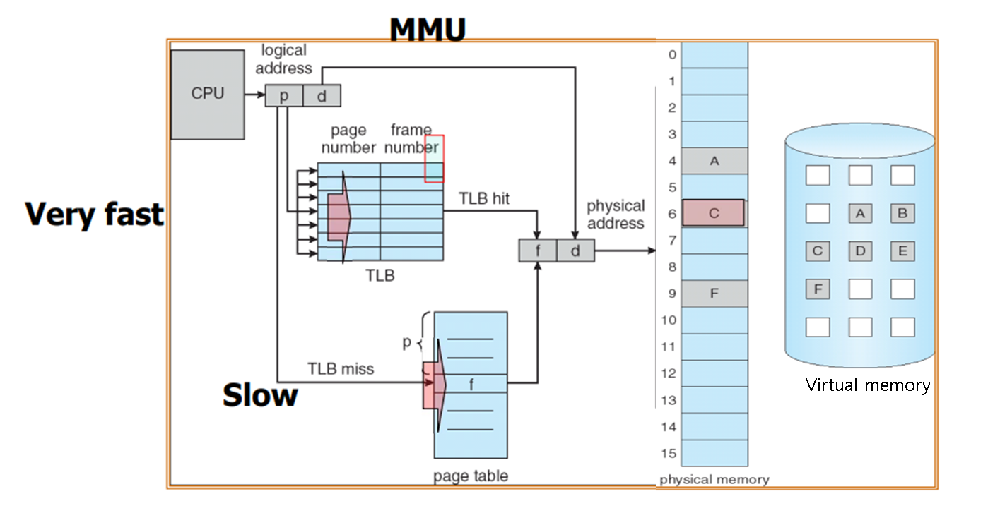

**1️⃣ Background - Memory Mapping & Protection, MMU, Virtual Memory, Swapping**
<br>

**2️⃣ Contiguous Memory Allocation - Block**

<br>

**3️⃣ NonContiguous Memory Allocation - Paging, Segment**

<br><r>

---

# <div style='background-color: #f5f0ff'>1️⃣ Background</div>

<br>

## <div style='background-color: #ddffe4'>🛡️Memory Mapping & Protection</div>

<br>

- **logical 주소를 physical 주소로 mapping 하고**
- **Out Of Memory 관리 [ 메모리 접근 범위 관리 ]**

<br>

### <div style='background-color: #f1f8ff'>®️ Base Register & Limit Register</div>

<br>

- Base Register : Physical Address(RAM)의 시작 주소
  (Relocation Register)
- Limit Register : 현 프로그램이 사용할 수 있는 register의 마지막 주소

<br>

**위 두 Register를 통해 Logical Addess↔ Physical Address Mapping 이 가능하다. ⇒ Mapping**

**또한, Limit Register를 통해 접근 가능한 Memory 범위를 벗어난다면 Trap( 내부 Interrupt) 발생 ⇒ Protection**

**Simple example Memory Protection**

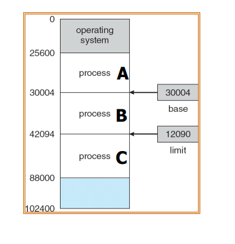

- $Base Register_B$ : 30004
- $Limit Register_B$ : 12090

**Rrocess B에 대한 시작 주소는 30004 가 되고 이 프로세스의 범위는 42094까지가 됩니다.**

**만약 Process B 에 대해 42096 주소를 수행하고자 한다면 Process B가 아닌 C의 영역이기 때문에 out of memory가 발생해 trap이 발생됩니다.**

<br><br>

## <div style='background-color: #ddffe4'>💱 Address Binding</div>

<br>

- 주소를 바인딩 하는 시점에 따라 compile time, load time, execution time 으로 나뉜다
- 컴파일 시 binding 하면 주소가 고정되어 메모리 상 빈 공간이 많을 수 있고,
- 로딩 시 binding 하면 프로세스 내에서 메모리를 참조하는 명령어들이 많아 이들을 전부 변환하려면 로딩 시 오랜 시간이 소요됩니다.

**⚡ 따라서, 주로 Run Time(Execution) 시에 Address Binding을 수행합니다.**

> Runtime 시 주소 변환은 MMU라는 하드웨어 장치를 이용해 logical ⏩ physical 주소 변환합니다.

<br>

## <div style='background-color: #ddffe4'>MMU</div>

<br>

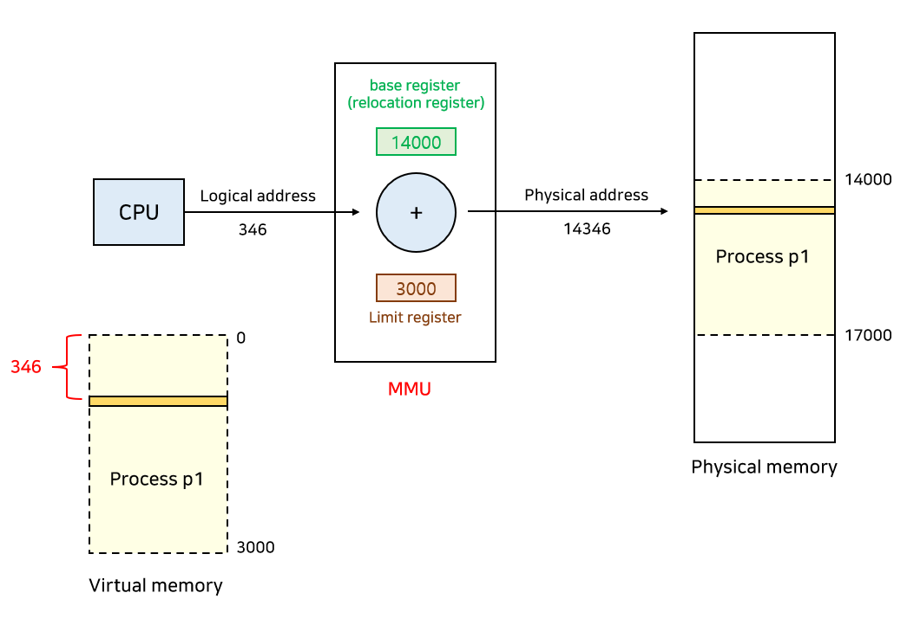

> 출처 : https://rebro.kr/178

<br>

## <div style='background-color: #ddffe4'>Virtual Memory</div>

<br>

### <div style='background-color: #f1f8ff'>Physical Memory</div>

<br>

- 실제 메모리 즉, main memory ( RAM )을 의미한다고 생각하면 됩니다.

### <div style='background-color: #f1f8ff'>🌟 Virtual Memory</div>

<br>

#### <div style='background-color: #fff5b1'>왜 필요??</div>

<br>
Process들이 메모리를 요청하면 물리 메모리에서 할당해주다 보면  
점차 물리 메모리가 부족하게 됩니다. 특히 프로그램의 크기가 커지면서 RAM만으로는 부담되게 됩니다.  
<br>

이런 경우 가상 메모리를 활용할 수 있습니다.  
가상 메모리란 SSD(하드 디스크)와 같은 공간에 SWAP 영역을 설정해 마치 물리 메모리인것처럼 동작하도록 만드는 것입니다.

> Virtual Memory = RAM(physical memory) + Disk

<br>

#### <div style='background-color: #fff5b1'>즉, 가상 메모리란 물리 메모리 부족 시 디스크 영역 일부를 SWAP으로 만들어 좀 더 빠르게 동작할 수 있도록 만든 공간입니다.</div>

<br>

## <div style='background-color: #ddffe4'>Swapping</div>

<br>

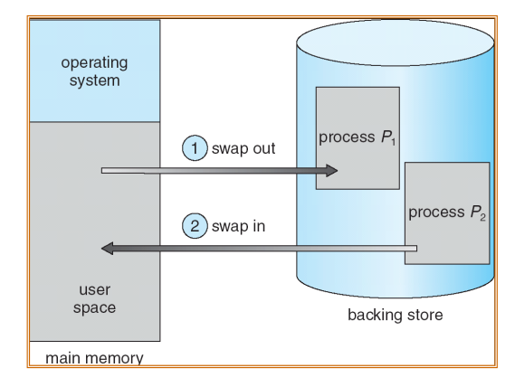

- backing store : Virtual Memory

💣 Swapping 이란?

- 물리 메모리가 부족하면 SWAP영역으로 메모리 영역을 확장하고
- 불필요한 메모리 공간을 swap out해서 SWAP 영역으로 내쫓고
- 필요한 영역을 물리 메모리로 swap ing 하는 것이다.

<br>

### <div style='background-color: #f1f8ff'>Context Switching VS Swapping VS Paging</div>

<br>

#### <div style='background-color: #fff5b1'>Context Switching</div>

<br>

- CPU Register에서 일어나는 과정이다.
- 현 프로세스의 Context를 PCB에 저장
- 다음 프로세스가 사용하던 memory, register 값을 load해 사용하는 과정
- <span style='background-color: #ffa59e'>즉, context switching은 Main Memory에서 일어나느 것이 아닌 CPU Register 단위에서 실행</span>

<br>

#### <div style='background-color: #fff5b1'>Swapping</div>

<br>

- Physical Memory 공간 부족 시 SWAP(가상 메모리) 영역과 process를 swapping 하는 과정을 의미한다.
- Context Switching에 비해 당연히 오래 걸린다.
- 프로세스 전체를 swapping하는 것 같다!! (정확하지 X)

<br>

#### <div style='background-color: #fff5b1'>Paging</div>

<br>

- process를 page 단위로 관리하면서 이 page를 교체하는 과정
- page in & page out 으로 수행된다.

---

# <div style='background-color: #f5f0ff'>2️⃣ Contiguous Memory Allocation</div>

<br>

- **<span style='background-color: #ffa59e'>사용 가능한 process를 연속적으로 할당한다.</span>**
- 각 단위를 block이라 칭하고 free blocks = HOLE이라 한다.
- block의 크기를 고정해두고 할당하는 고정 분할 방식
  - 이 경우 사용 가능한 프로세스가 block 크기로 제한되어 쓰이지 않는다.
- block의 크기가 가변적인 가변 분할 방식

<br>

### <div style='background-color: #f1f8ff'>Example</div>

<br>

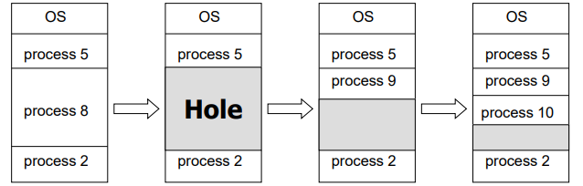

<br>

### <div style='background-color: #f1f8ff'>HOLE</div>

<br>

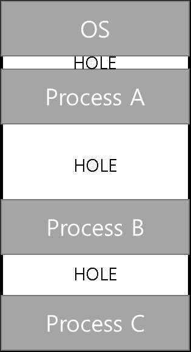

<br><br>

## <div style='background-color: #ddffe4'>HOLE</div>

<br>

- Process를 할당, 해제하다보면 위와 같이 메모리가 부분적으로 구멍(HOLE)이 생길 수 있습니다.
- 따라서 이 HOLE을 최대한 효율적으로 관리하는 것이 매우 중요합니다.
- 그 방법으로는 3가지 방법이 있습니다.
  - First Fit
  - Best Fit
  - Worst Fit

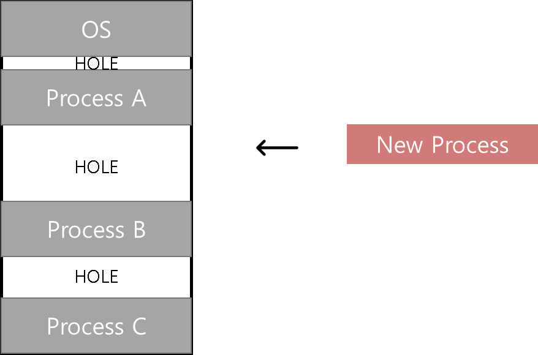

<br><br>

### <div style='background-color: #f1f8ff'>First Fit</div>

<br>

- 할당 가능한 첫 번째 HOLE에 할당합니다.

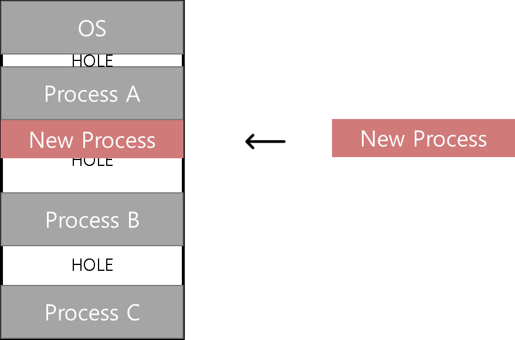

### <div style='background-color: #f1f8ff'>Best Fit</div>

<br>

- 할당 가능한 HOLE 중 구멍의 크기가 가장 작은 HOLE에 할당합니다.
- Internal Fragment가 가장 적은 HOLE에 할당하게 됩니다.

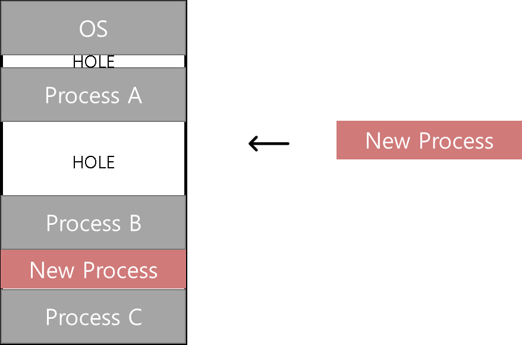

### <div style='background-color: #f1f8ff'>Worst Fit</div>

<br>

- 할당 가능한 HOLE 중 구멍의 크기가 가장 큰 HOLe에 할당합니다.
- 구멍의 크기가 가장 크다면 할당해주고 또 다시 남게 되는 HOLE을 다시 사용할 수 있다는 기대를 갖고 할당하는 방법입니다.


<br><br>

## <div style='background-color: #ddffe4'>Fragment - 메모리 할당 문제점</div>

<br>

**<span style='background-color: #ffa59e'>Fragment</span>** <br>

- **프로세스들이 메모리에 적재되고 제거되는 일이 반복되면 프로세스들이 차지하는 메모리 틈 사이에 사용하지 못할 만큼의 작은 공간들이 늘어나게 되는 현상**

<br>

### External Fragment

- 외부 단편화
- 총 공간은 여유롭지만, HOLE들이 떨어져 있어 할당이 불가능할 때

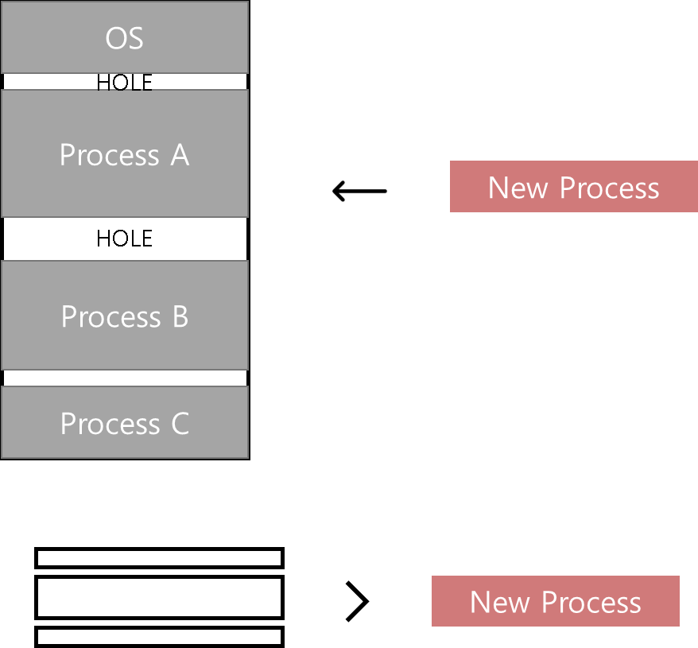

### Internal Fragment

- 내부 단편화
- 프로세스가 사용하는 메모리 공간보다 더 많은 공간이 할당되어 사용하지 않는 공간을 의미한다

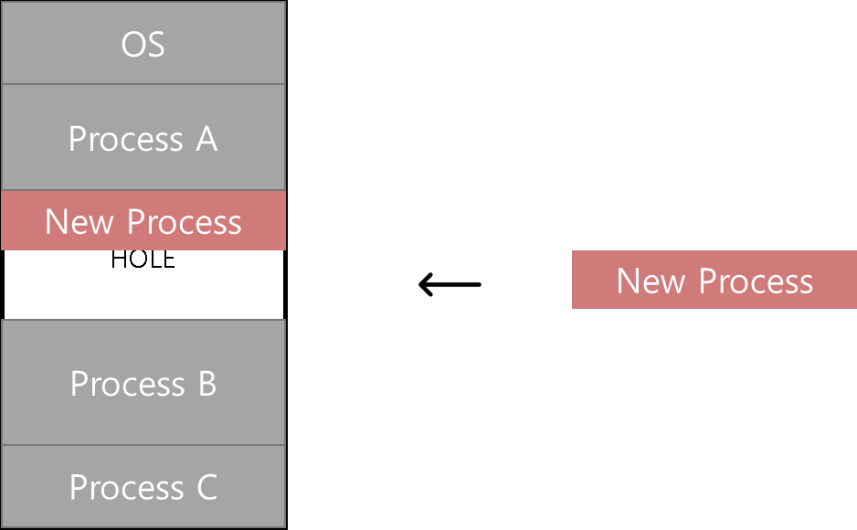

<br>

### <div style='background-color: #f1f8ff'>Solution</div>

<br>

- 고정 분할 방식은 External, Internal Fragment 모두 발생 가능하다.
- 가변 분할 방식은 Process의 크기만큼 할당하기 때문에 Internal은 발생하지 않는다.

🔥 외부 단편화를 해결할 수 있는 방법은 Compact(압축)이 있다.  
흔히 사용하는 디스크 조각 모음 정리라고 생각하면 된다.

<br><br>

## 💥 다음번에 계속

<br>

✨ 잘못된 부분은 많은 조언 및 지적 부탁드립니다. - JunHyxxn

<br>

```toc

```
