# <div style='background-color: #f5f0ff'>👩‍💻 OS - Memory Management (2) [Paging]</div>

---

# <div style='background-color: #f5f0ff'>3️⃣ NonContiguous Memory Allocation - Paging, Segment</div>

<br>

앞서 봤던 Contiguous Allocation은 외부 단편화 문제를 해결하기 위한 방법으로 NonContiguous Memory Allocation 방법들이 있습니다.

그 중 Paging과 Segment를 알아보겠습니다.

<br>

## <div style='background-color: #ddffe4'>Paging</div>

<br>

- Paging 은 NonContiguous Allocation 방식이다.
- 고정된 크기로 메모리는 Frame, 프로세스는 Page로 분할하여 관리한다.
- 한 프로새스는 여러 Page로 나뉘고 main memory에서 필요한 page를 순서 관계없이 Frame에 mapping해준다.

<br>
그림으로 확인해보자

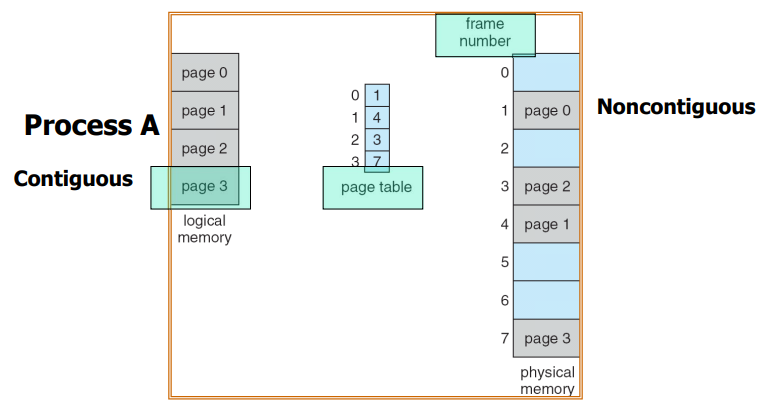

<br>

### <div style='background-color: #f1f8ff'>Paging 장점 & 단점</div>

<br>

#### <div style='background-color: #fff5b1'>장점</div>

<br>

- Physical memory를 frame 단위로 분할해 사용하기 때문에 External Fragment 발생할 일이 없다.
- 할당/해제 가 빠르다
- Shared Page를 통해 자원을 쉽게 공유할 수 있다 ( pure code 라면 쉽게 가능, swap out 시 변경되면 이를 고려하고 swap out해야함 )

#### <div style='background-color: #fff5b1'>단점</div>

<br>

- 결국 process의 page 자체가 internal fragment 발생한다면 여전히 메모리의 frame도 internal fragment발생한다.
- Page Table 을 저장하기 위한 메모리가 추가로 필요하다
- Page Table 접근 + 실제 메모리 접근 = 총 두 번의 메모리 접근으로 Overhead 발생한다.

#### <div style='background-color: #fff5b1'>⚡주의</div>

<br>

- Internal Fragment 없애려면 어떻게 하면 될까??
  - Page 크기를 작게 한다면 Internal Fragment를 줄일 수 있을 것이다.
  - 🔥 하지만, 오히려 Page Table이 커져서 OverHead가 더 커진다
- 일반적으로 Page 크기는 4KB ~ 8KB 가 적당하다고 알려져 있다.

<br><br>

## <div style='background-color: #ddffe4'>Page Address Translation</div>

<br>

- page number : frame number와 mapping
- page offset : frame 내에서 몇 번째 주소

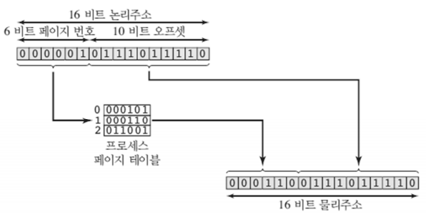

> 출처[https://steady-coding.tistory.com/524](https://steady-coding.tistory.com/524)

#### <div style='background-color: #fff5b1'>page number, page offset 설정 방법</div>

<br>

- Logical Address Space 가 $2^m$ byte 라고 한다면?
- Frame, Page의 크기는 $2^n$ byte라고 한다면??

**💡 offset = $log(page의 크기)$ = n**

**💡 page no = m - n**

<br>

### <div style='background-color: #f1f8ff'>Address Translation</div>

<br>

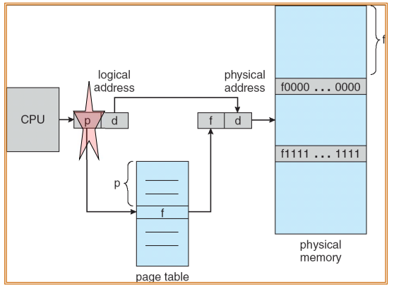

<br>

- Page Number는 Page Table에서 Frame Number와 mapping 되는 역할이다.
- Page Offset은 실제 물리 메모리의 Frame에서 몇 번째에 있는지를 나타낸다.

#### <div style='background-color: #fff5b1'>page table은??</div>

<br>

- page table은 항상 메인 메모리에 상주하고 있어야 합니다.
- 모든 프로세스는 page table 존재한다.
- 그렇다면 어떻게 page table은 가져올 수 있을까?? → **<span style='background-color: #ffa59e'>Hardware의 support가 있다!!</span>**
  - **PTBR(Page-Table-Base-Register) : PT 시작위치**
  - **PTLR(Page-Table-Limit-Register) : PT의 길이**

<br>

#### <div style='background-color: #fff5b1'>Quiz</div>

<br>

- cpu에서 logical address = 9 이다. 이를 의미하는 바는?

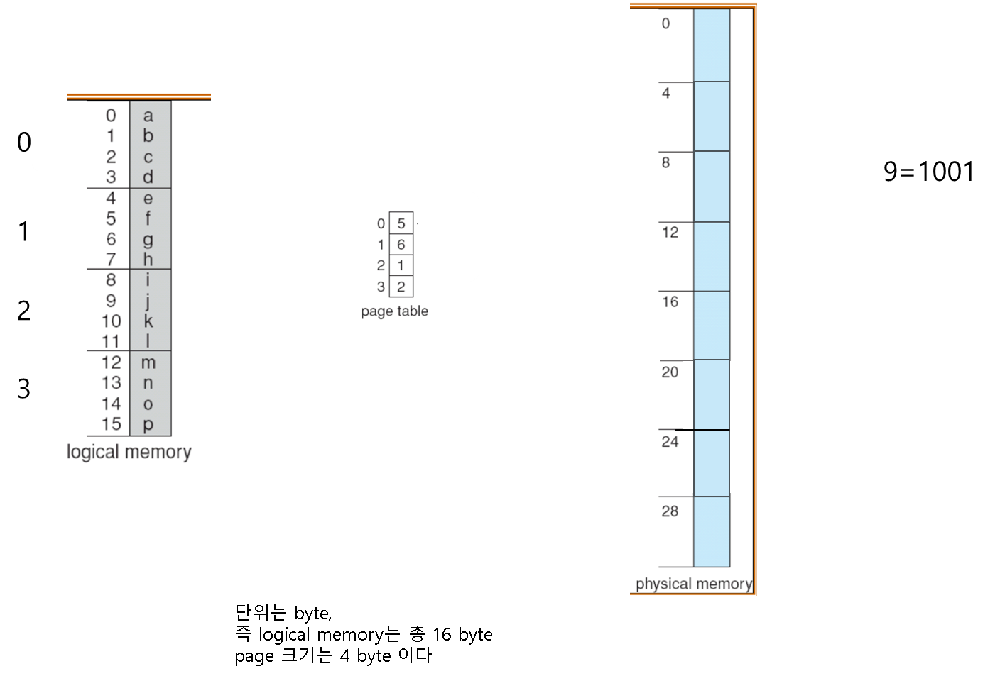

<details>
<summary>정답</summary>
<div markdown="1">
page의 크기는 $2^2$ → 따라서, offset bit의 크기는 2bit<br>
자동적으로 page no bit의 크기는 2bit<br>
따라서, page no = 2 offset = 1<br>
page table 에서 page no(2) 와 mapping되는 frame no = 1<br>
Physical memory의 1번 frame은 4byte부터 시작하는 frame이다.<br>

**4 byte로부터 1만큼 간 5byte 위치에 j 가 위치하게 된다!!**

</div>
</details>

---

## <div style='background-color: #ddffe4'>🛡️ Page Protection</div>

<br>

- 앞서 Memory Protection으로 Limit Register를 이용한다고 했습니다.
- 메모리 할당이 Contiguous 하다면 Limit Register만으로도 충분하지만,
- Paging은 Protection을 위해 추가적인 작업들이 필요합니다.

### <div style='background-color: #f1f8ff'>Protection Bit</div>

<br>

- main memory를 NonContiguous 하게 관리를 하기 때문에 건들여서는 안될 OS와 같은 영역을 쓰기 권한으로 접근해서는 안됩니다.
- 따라서 page table에 읽기/쓰기 권한에 해당하는 Permission bit를 추가해 프레임을 보호할 수 있습니다.

### <div style='background-color: #f1f8ff'>Valid-Invalid Bit</div>

<br>

- 유효하지 않는 페이지를 사용하지 않도록 valid-invalid bit 를 통해 검사해줍니다.
- invalid : 해당 페이지는 프로세스의 논리 주소 공간에 해당되지 않음을 의미합니다.

- 14 bit 주소 공간을 갖는 시스템 & Page size = 2KB 라면?

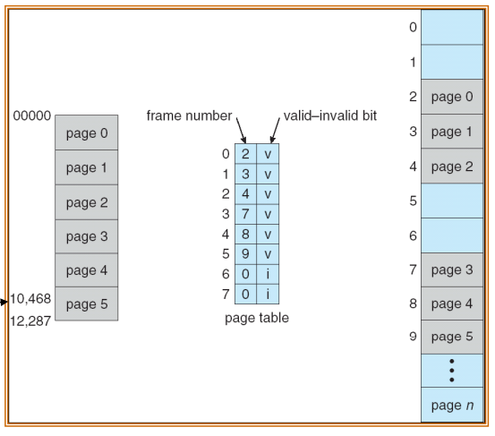

- logical address space를 보면 page5 까지 존재합니다.
- 그렇기 때문에 page table의 page no 6, 7 는 논리 공간에 존재하지 않기 때문에
- invalid로 체크된 것을 볼 수 있습니다.

#### <div style='background-color: #fff5b1'>⚡ 추가로, Page 5는 Page Size = 2KB = 2000 byte</div>

<br>

따라서, Page 5 는 시작 주소가 10469 이고, Limit 를 이용해 12287 까지만 사용할 수 있습니다

<br><br>

---

## <div style='background-color: #ddffe4'>TLB(Translation Look-aside Buffer)</div>

<br>

앞서 Page Table은 메인 메모리에 상주하기 때문에 2번의 메모리 접근을 필요로 하는 Overhead가 발생한다고 했습니다.

#### <div style='background-color: #fff5b1'>🔥 이를 개선하기 위해 TLB가 있습니다.</div>

<br>

TLB란?

- special fast-lookup hardware cache
- 메모리 주소 변환을 위한 별도의 캐시 메모리
- **<span style='background-color: #ffa59e'>Page Table에서 자주 참조되는 일부 엔트리를 caching 한다</span>**

<br>

- 기본 구조는 page table과 똑같다 ⇒ page no, frame no 구조이다.

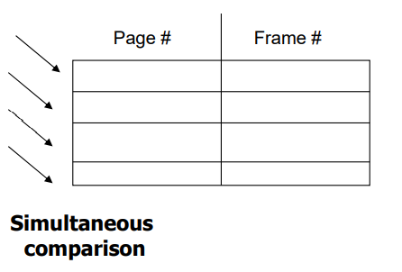

- TLB는 Parallel Search 를 수행해 빠르게 찾을 수 있습니다.

### <div style='background-color: #f1f8ff'>TLB 포함된 Address Translation 흐름</div>

<br>

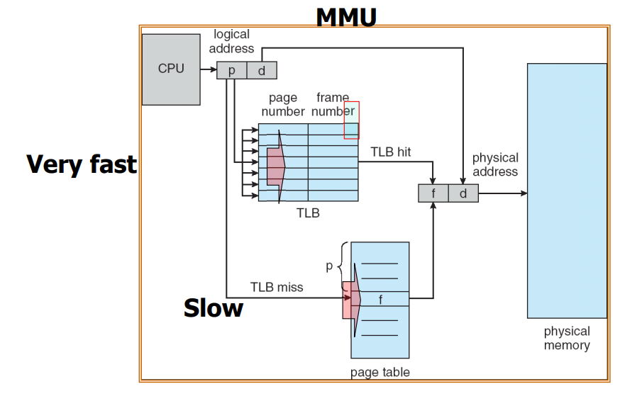

1️⃣ TLB 에서 빠르게 mapping 되는 frame이 있는지 탐색

2️⃣ - 1️⃣ TLB Hit ( TLB 내에서 탐색 성공 경우 ) 바로 frame에 접근 가능

2️⃣ - 2️⃣ TLB Miss ( TLB 내에 없을 경우 ) page table에서 frame 탐색

#### <div style='background-color: #fff5b1'>⚡ TLB 적용한 Memory 접근 횟수의 기댓값</div>

<br>

- TLB Hit Ratio : a TLB search time : e(입실론 : 매우 작은 값)
- $EAT(Effective Access Time) = (1+e) * a + (2+e)(1-a) = 2 + e - a$

일반적으로 e는 매우 짧은 시간이기 때문에 EAT를 줄이기 위해선 **<span style='background-color: #ffa59e'>Hit Ratio 를 늘리는 것이 중요하다</span>**

<br>

#### <div style='background-color: #fff5b1'>⚡ASID</div>

<br>

따라서 전역에 있는 TLB는 프로세스를 구분할 캐시 데이터도 가지고 있어야한다.

이러한 이유로 TLB에는 단순히 page no만이 아닌 asid를 같이 저장하게 된다.

- asid 는 pid와 유사한데 8bit로 줄어든 id이고, 동일한 asid는 같은 TLB를 공유해 overhead를 줄인다.

<br>

## <div style='background-color: #ddffe4'>Page Structure</div>

<br>

32 bit 주소를 사용한다는 가정하에 $2^{32} = 4GB$ 주소 공간을 사용하게 됩니다. <br>

이 때 page의 크기가 4KB 라면 $4GB/4KM = 1M$ 약 100만 개의 page table entry가 필요합니다.<br>

각 entry는 4Byte의 공간이 필요하기 때문에

**<span style='background-color: #ffa59e'>총 4MB 만큼의 page table공간이 필요합니다.</span>**

**<span style='background-color: #ffa59e'>💣 page table은 모든 프로세스가 가져야 하기 때문에 모든 프로세스 마다 4MB 만큼 공간을 낭비하는 것은 비효율적입니다.</span>**

**page table을 효율적으로 관리해야할 이유입니다.**

- Hierarchical Paging
- Hashed page table
- Inverted page table

### <div style='background-color: #f1f8ff'>Hierarchical Paging - 계층적 구조 [ Multi-level paging ]</div>

<br>

- 논리 주소 공간을 여러 단계의 page table로 분할하여 page의 page table을 사용하는 기법입니다.
- 간단한 예로 Two-Level Paging을 살펴보겠습니다.

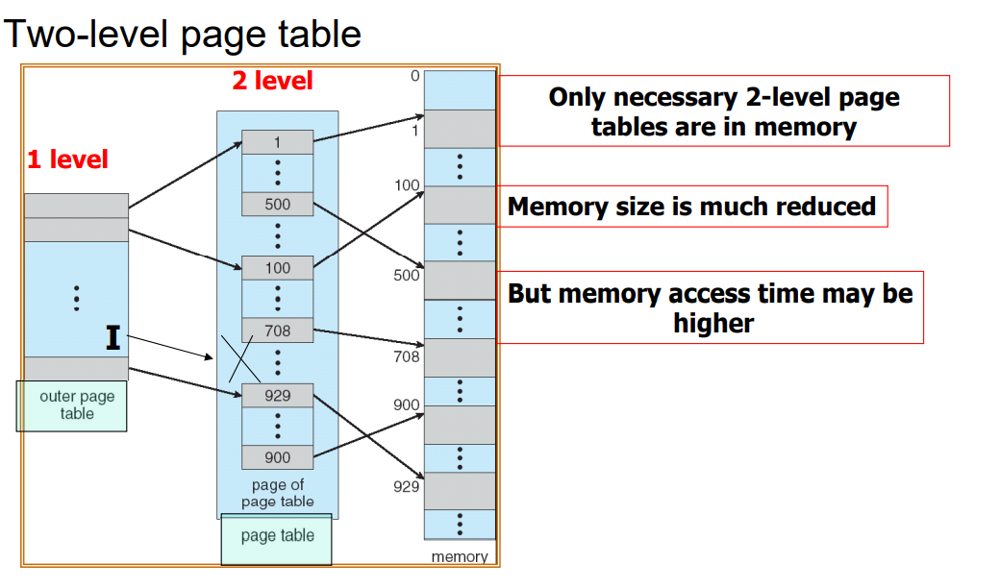

- 32 bit logical address space
- page size = 4KB = $2^{12}$
- offset = 12 bit
- page no = 20 bit

<br>

#### <div style='background-color: #fff5b1'>page no에 해당하는 20 bit 를 이용해서 inner page table을 다시 만들게 된다.</div>

- inner page no = 10 bit
- inner page offset = 10 bit 를 사용하게 된다.

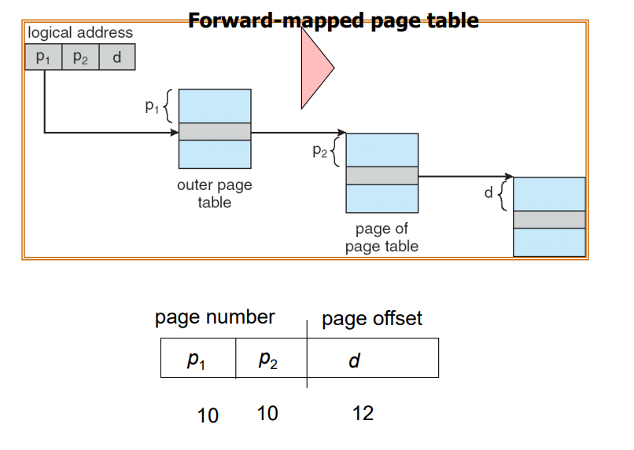

<details>
<summary>64bit에서는?? 3-Level Paging에서는??</summary>
<div markdown='1'>

#### <div style='background-color: #fff5b1'>64 bit</div>

<br>
64bit Logical Address Space & Page Size = 4KB<br>
outer page offset = 12 bit<br>
outer page no = 52 bit ⇒ inner page no + inner page offset으로 사용된다.<br>
마찬가지로 inner page offset = 10 bit 라면 42bit는 inner page no로 사용된다.<br>

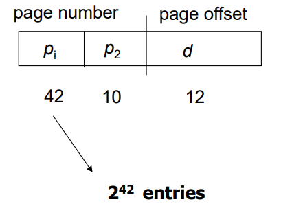
<br>

#### <div style='background-color: #fff5b1'>64bit에서의 3-Level Paging은</div>

<br>

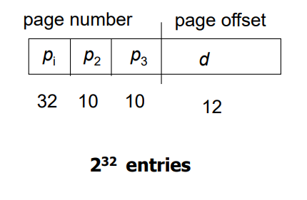

</div>
</details>
<br>
💡 Multi-Level을 깊게 할수록 page table이 작아져서 TLB에 모두 담을 수 있게 된다.

하지만 마찬가지로 여러번 access가 필요하기 때문에 overhead를 고려해야한다.

<br><br>

### <div style='background-color: #f1f8ff'>Hashed Page Table</div>

- Hashed Page Table은 Hash 형 page table을 갖는다
- logical address의 page no값을 이용해 나온 hash function 값으로 mapping값을 찾아갑니다
- hash page table의 각 entry는 linked list를 가져 collision을 충돌을 해결합니다

#### <div style='background-color: #fff5b1'>그림</div>

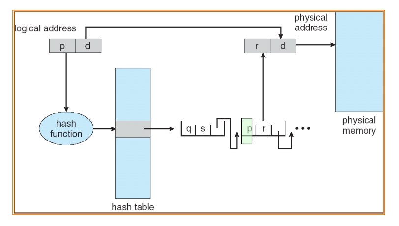

<br>

**<span style='background-color: #ffa59e'>⚡Hashed Page Table을 만들고 hash function으로 access 횟수를 많이 줄일 수 있다.</span>**

<br>

**<span style='background-color: #ffa59e'>64bit에서는 해시 알고리즘을 약간 변경하여 클러스터형 페이지 테이블 사용하기도 한다</span>**

<br><br>

### <div style='background-color: #f1f8ff'>Inverted Page Table</div>

<br>

- 역 페이지 테이블
- 각 프로세스는 모두 page table을 가지고 있어야한다
- 이로 인해 실제로는 다른 프로세스가 메모리에 접근중이라도 모두 page table을 갖고 있어야하는 문제 발생 → page table 크기 증가 → 메모리 낭비

#### <div style='background-color: #fff5b1'>의미 그대로 역으로 프로세스 당 페이지 테이블이 아닌 main memory 입장에서 만드는 page table!!</div>

<br>

- Frame을 기준으로 테이블은 각 프레임은 어떤 프로세스와 대응되는지 정보를 담는다
- 프레임을 기준으로 하기 때문에 어떤 프로세스와 대응되는지 알 수 있으려면 pid를 필요로 합니다

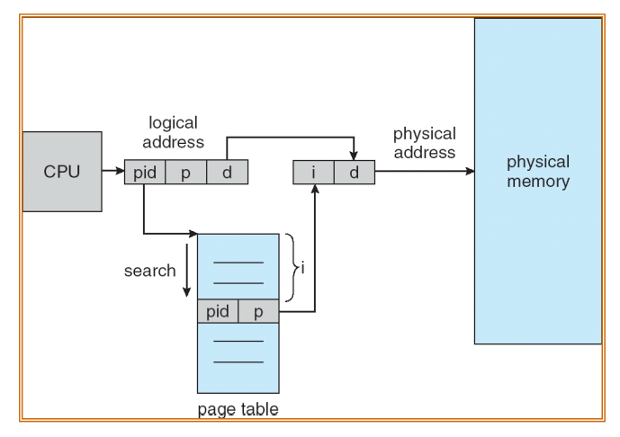

**<span style='background-color: #ffa59e'>physical memory를 기준으로 page table을 만들기 때문에
프로세스 당 하나씩 갖는 것이 아닌 전체적으로 page table을 하나만 갖고 있어도 되는 장점이 있습니다.</span>**

**<span style='background-color: #ffa59e'>단점</span>**

- 역 페이지 테이블은 주소 변환 시간이 더 오래 걸릴 수 있으며 프레임에 따라 저장되어있어 탐색은 비효율적이다.
  - TLB로 빠르게 수행하도록 개선 가능
- 역 페이지 테이블을 사용하는 시스템에서 메모리의 공유는 어렵다
  - 역 페이지 테이블에서는 frame에 할당된 가상 주소가 하나이기 때문에 여러 가상 주소에서 공유하기 어려움 존재

<br><br>

## 💥 다음번에 계속

<br>

✨ 잘못된 부분은 많은 조언 및 지적 부탁드립니다. - JunHyxxn

<br>

```toc

```
