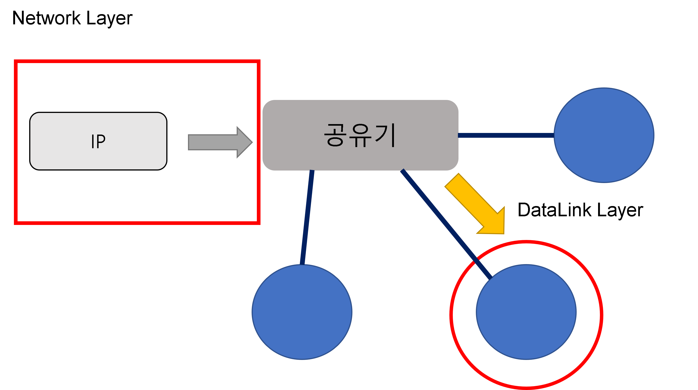

# Open Systems Interconnection 7 Layer

<br><br>

## OSI 7계층이란?

<br>

네트워크에서 통신이 일어나는 과정을 7단계로 나눈 개방형 시스템 상호 연결 모델의 표준이다.

<br><br>

## OSI 7계층 분리 이유

<br>

모든 시스템들의 상호 연결에 있어 문제 없도록 표준을 정함.  
계층을 나눠 통신이 일어나는 과정을 단계별로 확인할 수 있음.  
**장점** : 7계층 중 특정 Layer에 이상이 생기면 다른 장비 및 SW는 유지하고 해당 Layer 장비만 교체하면 된다.

<br><br>

## OSI 7계층 구조

<br><br>


<br><br>

응용 프로그램에서 다른 응용 프로그램으로의 통신을 위해 빨간색 화살표를 따라 통신이 이루어진다.  
송신자의 관점으로 설명을 진행한다.  
<br><br>

### 💥 7계층 : Application Layer - 응용 계층

<br>

**<span style="color:red">응용 프로세서 간의 정보 교환을 담당한다. </span>**<br>
여기에서 중요한 점은 응용 계층은 응용 프로그램이 아니다. HTTP와 같은 프로토콜이 여기에 해당한다.  
<br>
⚒ 대표적으로 HTTP (HyperText Transfer Protocol)가 있다.  
처음에는 WWW(World Wide Web)상의 하이퍼텍스트 형태의 문서를 전달하는데 주로 이용했으나 현재는 이미지, 비디오, 음성 등 모든 형식의 데이터 전송이 가능하다.  
<br><br>

### 💥 6계층 : Presentation Layer - 표현 계층

<br>

데이터를 어떻게 표현할지 정하는 계층이다.  
**<span style="color:red">데이터를 암호화, 압축, 부호화, 인코딩 등의 동작이 해당 계층에서 이루어진다.</span>**

<br><br>

### 💥 5계층 : Session Layer - 세션 계층

<br>

통신 장치 간 상호작용 및 동기화를 제공하고,  
**<span style="color:red">상대 장치와 인증 체크(접근 가능)을 진행한다. </span>**<br>
세션 설정, 유지, 종료, 전송 중단 및 에러 시 복구 등의 기능이 있다.

<br><br>

### 💥 4계층 : Transport Layer - 전송 계층

<br>

통신을 활성화하기 위한 계층이다.  
**<span style="color:red">TCP/UDP 프로토콜을 이용해 응용 프로그램들이 전송을 할 수 있도록 한다. </span>**<br>
데이터 전송을 위해서 Port 번호를 사용한다.  
<br>

**⚒ Web에서는 신뢰성이 중요하기 떄문에 TCP 통신을 사용한다.** <br>
TCP와 UDP의 차이에 대해서는 따로 포스팅 할 예정이다.

<br><br>

### 💥 3계층 : Network Layer - 네트워크 계층

<br>

**데이터를 목적지까지 가장 안전하고 빠르게 전달하는 기능(라우팅)** 을 담당한다.  
쉽게 이해하려면 IP주소가 바로 네트워크 계층 헤더에 속한다고 이해하면 된다.  
네트워크 계층에서 데이터 단위는 Packet이다.
<br>

- IP : 주소 부여
- Route : 경로 설정

<br><br>

### 💥 2계층 : DataLink Layer - 데이터링크 계층

<br>

물리 계층을 통해 송수신되는 정보의 오류와 흐름을 관리.  
즉 정보의 전달을 수행할 수 있도록 도와주는 역할.  
이 계층에서는 MAC 주소를 가지고 통신한다.  
대표적인 장비로는 브리지, 스위치 등이 있다.

<br><br>

<h4> Network - DataLink 이해</h4>

<br><br>

Network와 DataLink의 쉬운 이해를 위해 비유하는 예시를 든다.

<br><br>



<br><br>

### 💥 1계층 : Physical Layer - 물리 계층

<br>

물리적 전송, 전달을 담당하는 계층이다.  
케이블, 허브와 같은 장비에 해당 계층에 포함된다.  
<br><br>

## OSI 7계층 정리

<br>

위와 같은 순서로 송신 응용 프로그램으로부터 통신이 시작되고 반대의 순서(1-7)로 수신 응용 프로그램은 데이터를 전달받게 된다.

<br><br>

### 참고 자료 및 출처

[effortDev](https://shlee0882.tistory.com/110)

[cgotjh.log](https://velog.io/@cgotjh/%EB%84%A4%ED%8A%B8%EC%9B%8C%ED%81%AC-OSI-7-%EA%B3%84%EC%B8%B5-OSI-7-LAYER-%EA%B8%B0%EB%B3%B8-%EA%B0%9C%EB%85%90-%EA%B0%81-%EA%B3%84%EC%B8%B5-%EC%84%A4%EB%AA%85)

[메타코딩 - 스프링부트 시큐리티 13강](https://www.youtube.com/watch?v=IRh6Eh3pWEY&list=PL93mKxaRDidERCyMaobSLkvSPzYtIk0Ah&index=19)

## 끝 !!

<br>

✨ 잘못된 부분은 많은 조언 및 지적 부탁드립니다. - JunHyxxn

<br>

```toc

```
