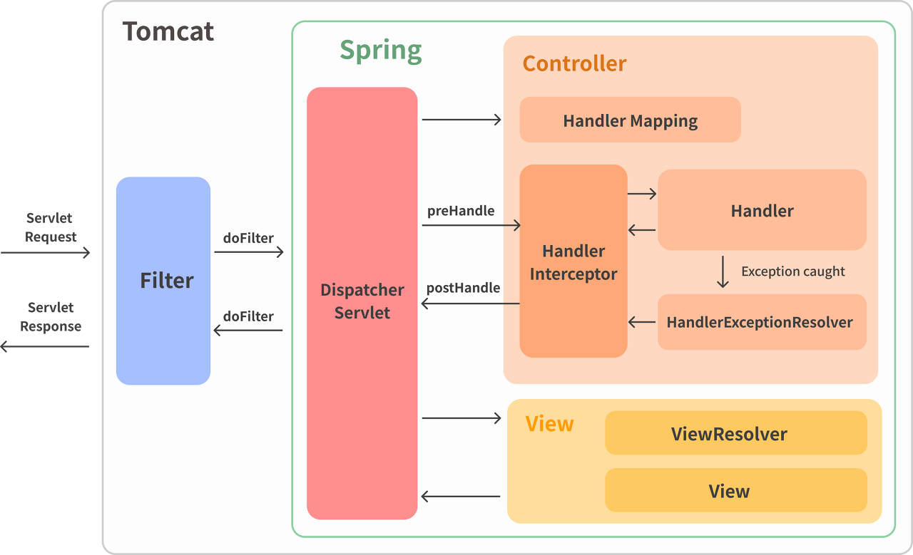
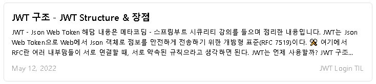

# <span style="background-color: #f5f0ff">SecurityJwtLogin - 0</span>

# <span style="background-color: #f5f0ff">[개요 - Spring Security Framework]</span>

<br><br>

Spring Security를 적용한 Jwt 기반 로그인 프로젝트 - 0

<br>

프로젝트 시작 전 가볍게 스프링 시큐리티와 JWT 로그인 방식을 알아보고 시작하겠습니다.

<br><br>

---

## <span style="background-color: #ddffe4">🔒 Spring Security Framework</span>

<br><br>

Spring Security는 Spring 기반의 Application의 보안을 담당하는 Framework 이다.  
인증(Authentication)과 인가(Authorization)에 대한 처리를 Filter 기반으로 처리를 해주며 많은 Filter가 제공되어 많은 보안 관련 옵션들을 개발자가 하나씩 작성하지 않고 쉽게 처리할 수 있는 장점이 있습니다.

<br><br>

---

### <span style="background-color: #f1f8ff">Authentication & Authorization</span>

<br><br>

1️⃣ Authentication - 인증

- 접속하려는 사용자가 본인인지 확인하는 인증 절차

2️⃣ Authorization - 인가 / 권한

- 인증된 사용자가 요청한 자원에 접근 가능한지를 결정하는 절차
- 주로 권한을 통해 접근 가능 여부를 판단한다

<br><br>

> Spring Security에서는 이러한 인증과 인가를 위해 Principal을 아이디로, Credential을 비밀번호로 사용하는 Credential 기반의 인증 방식을 사용한다.
>
> - Principal(접근 주체): 보호받는 Resource에 접근하는 대상
> - Credential(비밀번호): Resource에 접근하는 대상의 비밀번호

<br><br>

---

### <span style="background-color: #f1f8ff">Filter 기반의 Spring Security</span>

<br><br>

Spring Security Framework는 Filter 기반이기 때문에 Interceptor와는 다음과 같은 차이도 존재합니다.

#### <span style='background-color: #fff5b1'>Spring Framework의 전반적인 흐름</span>



위 그림과 같이

- Interceptor의 경우,
- **<span style='color: #FF0000'>Dispatcher Servlet이 Controller를 호출하기 전/후로</span>** preHandler(), postHandler() 를 통해
- 전처리, 후처리 작업을 수행한다

- Filter의 경우는,
- **<span style='color: #FF0000'>Dispatcher Servlet에 요청이 들어가기 전</span>**, 응답을 만든 후 Filter 로직이 수행된다

<br><br>

#### <span style='background-color: #fff5b1'>Filter 기반의 Spring Security Architecture</span>

<br><br>


<br>

- Security의 Architecture는 위 그림과 같은데,
- 위 과정이 Dispatcher Servlet 으로 들어가기 전에 주로 처리된다고 보면 됩니다.

<br><br>

### <span style='background-color: #f1f8ff'>그 외 주요 개념</span>

<br><br>

#### <span style='background-color: #fff5b1'>SecurityContextHolder</span>

- SecurityContextHolder는 보안 주체의 세부 정보를 포함하여 응용프래그램의 현재 보안 컨텍스트에 대한 세부 정보가 저장됩니다.
- SecurityContext를 가져올 수 있습니다.

#### <span style='background-color: #fff5b1'>SecurityContext</span>

- Authentication 을 저장하는 역할을 하며, 역으로 SecurityContext에서 현재 접근중인 사용자 객체(Authentication)를 가져올 수 있습니다.

#### <span style='background-color: #fff5b1'>Authentication</span>

- Authentication은 현재 접근하는 사용자의 정보, 권한등을 담은 정보를 담은 Interface입니다.  

#### <span style='background-color: #fff5b1'>UsernamePasswordAuthenticationToken</span>

- Authentication을 implements한 AbstractAuthenticationToken의 하위 클래스로, User의 ID가 Principal 역할을 하고, Password가 Credential의 역할을 합니다.

#### <span style='background-color: #fff5b1'>UserDetails</span>

- 인증에 성공하여 생성된 UserDetails 객체는 Authentication 객체를 구현한 UsernamePasswordAuthenticationToken을 생성하기 위해 사용됩니다.
- Authentication 객체 안에는 User 정보가 필요하기 때문에 주로 UserDetails를 implements해 필요한 정보를 담은 User 객체를 만들어 사용합니다.  

#### <span style='background-color: #fff5b1'>UserDetailsService</span>

- loadUserByUsername() 메소드를 통해 DB에서 User 정보를 가져오고 이를 UserDetails에 알맞은 정보들을 담아 UserDetails 객체를 반환해줍니다.

#### <span style='background-color: #fff5b1'>PasswordEncoding</span>

- Password를 암호화할 Encoding을 구현체를 통해 지정할 수 있습니다.

#### <span style='background-color: #fff5b1'>GrantedAuthority</span>

- 현재 사용자가 가진 권한을 의미합니다.

<br><br>

즉, SecurityContextHolder.getContext() 를 통해 SecurityContext를 가져오고 SecurityContext에서 getter, setter 를 이용해 Authentication을 접근할 수 있습니다.

<br><br>

### <span style='background-color: #f1f8ff'>JWT 로그인</span>

JWT 방식의 로그인에 대해서는 아래 포스팅을 통해 확인할 수 있습니다.

[](https://junhyxxn.github.io/jwt-structure/)

<br><br>

**이제 본격적으로 Spring Security를 적용한 Jwt 기반의 로그인을 구현해보겠습니다.**

<br><br>

```toc

```
