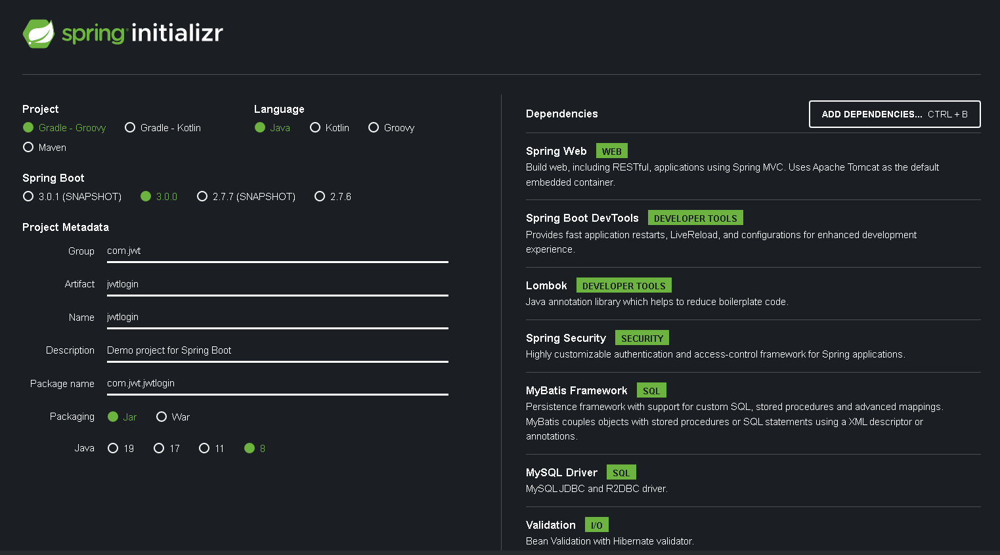
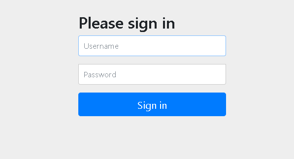
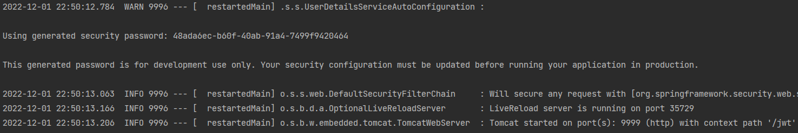

# <span style="background-color: #f5f0ff">SecurityJwtLogin - 1</span>

# <span style="background-color: #f5f0ff">[초기 프로젝트 설정]</span>

---

<br><br>

## <span style='background-color: #ddffe4'>Dependencies and Version</span>

<br>



- spring boot 의 경우 3.0.0 은 에러가 발생합니다. 따라서 2.7.6을 선택해줍니다. (되도록 SNAPSHOT은 피합니다.)

<br><br>

### <span style='background-color: #f1f8ff'>기본 설정</span>

<br>

Dependency 를 추가할 때 설명이 적혀있지만 한 번 가볍게 살펴보겠습니다.

- Spring Web : Web 관련 Dependency
- Spring Boot DevTools : LiveReload 기능 제공
- Lombok : Annotation 을 통해 Getter, Setter, Constructor 등을 사용가능 하도록 제공
- Spring Security : 인증, 인가 등의 보안을 처리하기에 편리하도록 제공하는 Framework
- MyBatis Framework : Persistence Framework로 DB에 접근할 Connection Pool 등을 담당하고 SQL을 준비할 프레임워크
- MySQL Driver : MySQL 연결할 Driver
- Validation : 유효성 검사 기능 -> 해당 프로젝트에서 사용하지 않을수도 있습니다.

<br><br>

### <span style='background-color: #f1f8ff'>추가 Dependencies</span>

<br>

start.spring.io 에서 권장하는 dependency 외에 추가로 dependency들을 추가해줍니다.

- commons-dbcp2 : DataBase Connection Pool 관련 설정
- jjwt-api & jjwt-impl & jjwt-jackson : JWT 관련 설정

<br>

최종적으로 아래와 같은 build.gradle 이 만들어집니다.

```gradle
    implementation 'org.springframework.boot:spring-boot-starter-security'
    implementation 'org.springframework.boot:spring-boot-starter-validation'
    implementation 'org.springframework.boot:spring-boot-starter-web'
    implementation 'org.mybatis.spring.boot:mybatis-spring-boot-starter:2.3.0'

    compileOnly 'org.projectlombok:lombok'
    developmentOnly 'org.springframework.boot:spring-boot-devtools'
    runtimeOnly 'com.mysql:mysql-connector-j'
    annotationProcessor 'org.projectlombok:lombok'
    // DataSource Dependency
    // https://mvnrepository.com/artifact/org.apache.commons/commons-dbcp2
    implementation group: 'org.apache.commons', name: 'commons-dbcp2', version: '2.7.0'
    // Jwt Dependency
    // https://mvnrepository.com/artifact/io.jsonwebtoken/jjwt-api
    implementation group: 'io.jsonwebtoken', name: 'jjwt-api', version: '0.11.2'
    // https://mvnrepository.com/artifact/io.jsonwebtoken/jjwt-impl
    runtimeOnly group: 'io.jsonwebtoken', name: 'jjwt-impl', version: '0.11.2'
    // https://mvnrepository.com/artifact/io.jsonwebtoken/jjwt-jackson
    runtimeOnly group: 'io.jsonwebtoken', name: 'jjwt-jackson', version: '0.11.2'


    testImplementation 'org.springframework.boot:spring-boot-starter-test'
    testImplementation 'org.springframework.security:spring-security-test'
```

<br><br>

## <span style='background-color: #ddffe4'>Application 설정</span>

<br>

실행에 앞서 application 설정을 진행합니다.  
<span style='color: #FF0000'>application.yml</span> 에 들어갈 정보

- port : 9999
- context-root : /jwt
- DataBase 설정 및 MySQL Driver
- MyBatis 설정 : alias, mapper 위치
- logging 설정

<br>

```yml
server:
  port: 9999
  # context-root
  servlet:
    context-path: /jwt

# DataBase Settings
spring:
  datasource:
    hikari:
      maximum-pool-size: 10
      connection-timeout: 5000
      connection-init-sql: SELECT 1
      validation-timeout: 2000
      minimum-idle: 10
      idle-timeout: 600000
      max-lifetime: 1800000
      auto-commit: true
    # MySQL Setting
    driver-class-name: com.mysql.cj.jdbc.Driver
    url: jdbc:mysql://localhost:3306/security?serverTimezone=UTC&useUniCode=yes&characterEncoding=UTF-8
    username: junhyxxn
    password: 9999
    # DataSource
    type: org.apache.commons.dbcp2.BasicDataSource

#MyBatis Setting
mybatis:
  type-aliases-package: com.home.vo.**
  mapper-locations: classpath:/mapper/*.xml

#log level Setting
logging.root: info
logging.level.com.jwt: debug
```

<br><br>

## <span style='background-color: #ddffe4'>실행</span>

<br>

- 초기 화면



- 위와 같이 왠지 모를 로그인 창이 보이는 것을 알 수 있다.



- 로그를 확인해보면
- Spring Security 의 자동설정 관련된 UserDetailsServiceAutoConfiguration 으로 인해 발생된 페이지임을 알 수 있다.
- Username 에는 user, password에는 로그에 기록된 값을 입력하게 되면 / 페이지로 이동하게 된다.(현재는 기본 페이지가 없으니 당연히 404 Page 로 간다)

💥 여기까지 정상적으로 실행됐다면, Security가 제대로 적용된 것입니다.

<br><br>

### <span style='background-color: #f1f8ff'>Configuration</span>

<br>

매번 로그를 확인해 비밀번호 입력하기 싫으니 설정을 추가로 진행해줍니다.

잠시 위에서 확인했던 UserDetailsServiceAutoConfiguration은 Spring Boot의 Security 설정 파일인 <br>
<span style='color: #FF0000'>SpringBootWebSecurityConfiguration</span> 클래스에서 설정이 진행되는데, <br>
<span style='color: #FF0000'>SpringBootWebSecurityConfiguration</span> 는 <span style='color: #0000FF'>WebSecurityConfigurerAdapter</span> 가 있다면 그 설정 값을 그대로 쓰게 됩니다. <br>
⭐ 즉, <span style='color: #0000FF'>WebSecurityConfigurerAdapter</span>를 상속받아 설정을 작성하면 Custom Configuration을 이용할 수 있습니다. <br>

<br><br>

#### <span style='background-color: #fff5b1'>SecurityConfig</span>

<br>

- 기본적인 설정만 진행하고 우선 편의상 모든 request의 접근 제한을 해제한다.
- @EnableWebSecurity : @Configuration + 추가 설정
- @EnableGlobalMethodSecurity : @PreAuthorize, @PostAuthorize 사용을 위해 설정합니다.

```java
import org.springframework.http.HttpMethod;
import org.springframework.security.config.annotation.method.configuration.EnableGlobalMethodSecurity;
import org.springframework.security.config.annotation.web.builders.HttpSecurity;
import org.springframework.security.config.annotation.web.builders.WebSecurity;
import org.springframework.security.config.annotation.web.configuration.EnableWebSecurity;
import org.springframework.security.config.annotation.web.configuration.WebSecurityConfigurerAdapter;
import org.springframework.security.config.http.SessionCreationPolicy;

@EnableWebSecurity // @Configuration + 추가 몇몇 설정
@EnableGlobalMethodSecurity(prePostEnabled = true) // Method 단위로 @PreAuthorize, @PostAuthorize 사용 가능하도록 설정
public class SecurityConfig extends WebSecurityConfigurerAdapter {

    // web 설정
    @Override
    public void configure(WebSecurity web) throws Exception {
        web.ignoring()
                .antMatchers(HttpMethod.OPTIONS, "/**")
                .antMatchers("/favicon.ico");
    }

    @Override
    protected void configure(HttpSecurity http) throws Exception {
        http
                // CORS, CSRF 설정
                .cors()
                .and()
                .csrf().disable()

                // Session 설정 -> JWT 방식 로그인 구현 -> StateLess
                .sessionManagement().sessionCreationPolicy(SessionCreationPolicy.STATELESS)

                // request의 resource 접근 제한 설정
                .and()
                .authorizeHttpRequests()
                .antMatchers("/**").permitAll();
    }
}

```

🎯 설정이 정상적으로 성공했다면 아까와 달리 login 화면이 보이지 않습니다.  
<br>

🌈 이것으로 기본 설정은 끝났습니다. 이제 본격적으로 Security + JWT 로그인을 구현해보겠습니다.

```toc

```
