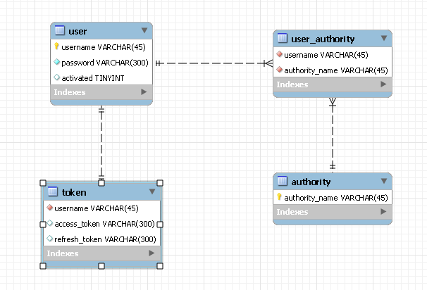

# <span style="background-color: #f5f0ff">SecurityJwtLogin - 2</span>

# <span style="background-color: #f5f0ff">[DB 설계]</span>

---

<br><br>

## <span style='background-color: #ddffe4'>MySQL DB 설계</span>

<br>

### <span style='background-color: #f1f8ff'>ERD</span>

<br>



<br>

- 단순한 프로젝트의 경우 User Table에 Authority 를 포함시키는 편이 더 간단합니다.
- 하지만, 복잡한 프로젝트의 경우 한 user가 여러 autority를 가질 수 있습니다.
- 예를 든다면, 강사가 존재하고 그 직속으로 조교라는 개념이 존재한다면
- 강사는 조교의 권한과 강사의 권한을 모두 갖게 됩니다.

<br>

⭐ 따라서, 위와 같이 한 유저가 여러 권한을 가질 수 있도록 ERD를 구성했습니다.  
<br>

일반적으로 사용자별 권한 관리 방식과 그룹별 권한 관리 방식이 존재한다고 합니다.

```toc

```
