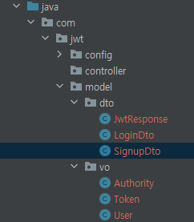

# <span style="background-color: #f5f0ff">SecurityJwtLogin - 3</span>

# <span style="background-color: #f5f0ff">[기본 Model 생성]</span>

---

<br><br>

## <span style='background-color: #ddffe4'>VO & DTO</span>

<br>



- User : 사용자 Entity
- Token : Token Entity
- Authority : 권한 정보
- JwtResponseDto : 응답 DTO

<br><br>

### <span style='background-color: #f1f8ff'>User</span>

<br>

```java
@Data
@NoArgsConstructor
@AllArgsConstructor
@Builder
public class User {
    // 아이디
    private String username;
    // 패스워드
    private String password;
    // 유효한 유저
    private boolean activated;
    // 권한 리스트
    private List<Authority> roles;
}

```

- 권한의 경우 여러 권한을 가질 수 있으니 위와 같이 Collection으로 관리합니다.

<br><br>

### <span style='background-color: #f1f8ff'>JwtResponse</span>

<br>

```java
@Data
@AllArgsConstructor
@NoArgsConstructor
public class JwtResponse {
    private String accessToken;
    private String type="Bearer";
    private String refreshToken;
    private String username;
    private List<String> roles;
    // AccessToken + RefreshToken 발급 [ 최초 발급 시 ]
    public JwtResponse(String accessToken, String refreshToken, String username, List<String> roles) {
        this.accessToken = accessToken;
        this.refreshToken = refreshToken;
        this.username = username;
        this.roles = roles;
    }

    // AccessToken 재발급 시
    public JwtResponse(String accessToken, String refreshToken) {
        this.accessToken = accessToken;
        this.refreshToken = refreshToken;
    }
}
```

- 최초 발급 시 access token, refresh token 모두 발급해주고, 유저 아이디와 권한 정보를 함께 보내줬습니다.
- 토큰 외의 정보는 어떤 정보를 보내줄 것인가에 따라서 설정하면 됩니다.
- access token 재발급 시 토큰만 재발급해줬습니다.

```toc

```
