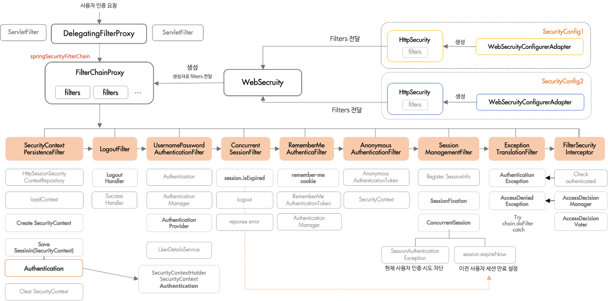

# <span style="background-color: #f5f0ff">SecurityJwtLogin - 5</span>

# <span style="background-color: #f5f0ff">[JWT Filter & ExceptionHandler]</span>

---

<br><br>

## <span style='background-color: #ddffe4'>Spring Security Filter</span>

<br>

- Spring-Security 는 <span style='color: #FF0000'>Filter</span> 기반으로 동작합니다.
- 큰 그림을 보면 아래 그림과 같습니다.

<br>



<br>

> 출처 : [gngsn님 블로그](https://gngsn.tistory.com/160)

- 큰 흐름은 위와 같고, 이를 모두 이해하기엔 어려움이 있어 우선 당장 사용하는 기능들에 필요한 부분만 이용하겠습니다.

<br>

### <span style='background-color: #f1f8ff'>UsernamePasswordAuthenticationFilter</span>

<br>

🔥 기본적으로 Authentication(인증)을 담당하는 필터는 <span style='color: #FF0000'>AbstractAuthenticationProcessingFilter</span>이다.

- <span style='color: #FF0000'>AbstractAuthenticationProcessingFilter</span>는 추상 클래스로 <span style='color: #0000FF'>SecurityFilterChain</span>에 직접 들어갈 수 없습니다.
- <span style='color: #FF0000'>UsernamePasswordAuthenticationFilter</span>는 이를 상속받은 클래스이다.

---

- <span style='color: #FF0000'>UsernamePasswordAuthenticationFilter</span> 구동 과정

<br>


<br>

- 기본적으로 AbstractAuthenticationProcessingFilter 에 username, password를 받는 로직과 UsernamePasswordAuthenticationToken 발급하는 로직이 추가된 구조입니다.

- 그림을 통해 확인할 수 있듯, RememberMeAuthenticationFilter 를 통해 이 기능도 사용할 수 있습니다.
- 여기에서 <span style='color: #ffd700'>SessionAuthenticationStrategy</span>는 인증 후 후속 처리로 동시에 처리하게 됩니다.
  > - SessionManagementFilter에서 처리하는데, <span style='color: #FF0000'>동시 접속, 세션 고정 문제 해결 등</span>을 처리하게 됩니다.

<br>

<h4><span style='background-color: #fff5b1'>💥 우리는 JWT 기반 로그인을 수행할 것이기 때문에 Custom한 Authentication 과정을 UsernamePasswordAuthenticationFilter 이전에 등록해주면 됩니다.</span></h4>

<br>

---

<br>

## <span style='background-color: #ddffe4'>JwtFilter</span>

<br>

```java
import com.jwt.security.jwt.TokenProvider;
import lombok.RequiredArgsConstructor;
import org.slf4j.Logger;
import org.slf4j.LoggerFactory;
import org.springframework.security.core.Authentication;
import org.springframework.security.core.context.SecurityContextHolder;
import org.springframework.util.StringUtils;
import org.springframework.web.filter.OncePerRequestFilter;

import javax.servlet.FilterChain;
import javax.servlet.ServletException;
import javax.servlet.http.HttpServletRequest;
import javax.servlet.http.HttpServletResponse;
import java.io.IOException;

@RequiredArgsConstructor
public class JwtFilter extends OncePerRequestFilter{
    private static final Logger logger = LoggerFactory.getLogger(JwtFilter.class);

    public static final String AUTHORIZATION_HEADER = "Authorization";
    private final TokenProvider tokenProvider;

    @Override
    protected void doFilterInternal(HttpServletRequest request, HttpServletResponse response, FilterChain filterChain) throws ServletException, IOException {
        String jwt = resolveToken(request);
        String requestURI = request.getRequestURI();

        // jwt 존재하고 && 유효하다면
        if(jwt != null && tokenProvider.validateToken(jwt)) {
            logger.info("JwtFilter with token : ", jwt);

            // Authentication 가져오기
            Authentication authentication = tokenProvider.getAuthentication(jwt);
            // Context에 Authentication 저장
            SecurityContextHolder.getContext().setAuthentication(authentication);
            logger.debug("SecurityContext에 '{}' 인증 정보를 저장했습니다, uri : {}", authentication, requestURI);
        }
        // Do Next Filter
        filterChain.doFilter(request, response);
    }

    // Header 에서 토큰 꺼내기
    private String resolveToken(HttpServletRequest request) {
        String bearerToken = request.getHeader(AUTHORIZATION_HEADER);
        if(StringUtils.hasText(bearerToken) && bearerToken.startsWith("Bearer ")) {
            return bearerToken.substring(7, bearerToken.length());
        }
        return null;
    }
}
```

<br>

### <span style='background-color: #f1f8ff'>GenericFilterBean VS OncePerRequestFilter</span>

<br>

#### <span style='background-color: #fff5b1'>GenericFilterBean</span>

<br>

- Spring 에 등록하기 위한 Filter 인터페이스를 조금 더 확장하여 스프리에서 제공하는 필터 추상 클래스이다.
- 스프링에서 제공하는 필터로 스프링의 설정 정보를 가져올 수 있다.
- 🔥 <span style='color: #FF0000'>요청의 흐름에 따라 이 필터는 2번 호출될 수 도 있습니다.</span>

<br>

#### <span style='background-color: #fff5b1'>OncePerRequestFilter</span>

<br>

- <span style='color: #FF0000'>OncePerRequestFilter</span>는 위와 같은 여러 번 호출을 방지하기 위해 GenericFilterBean을 상속받아 만들어진 클래스이다.
- 💥 <span style='color: #0000FF'>한 번의 요청에서 반드시 한 번만 수행되는 Filter이다.</span>

🌟 따라서, JwtFilter는 요청 당 한 번만 수행하기 위해 OncePerRequestFilter를 상속받아 구현했습니다.

<br>

---

<br>

## <span style='background-color: #ddffe4'>ExceptionHandler</span>

<br>

- Spring Security Flow를 보면 ExceptionTranslationFilter AuthenticationException과 AccessDeniedException을 처리하는 것을 확인할 수 있습니다.
- 이번엔 이 두 Exception을 처리할 Handler를 만들겠습니다.

<br><br>

### <span style='background-color: #f1f8ff'>AuthenticationEntryPoint</span>

<br>

📌 AuthenticationEntryPoint 구현체 JwtAuthenticationEntryPoint 구현

<br>

```java
import org.slf4j.Logger;
import org.slf4j.LoggerFactory;
import org.springframework.security.core.AuthenticationException;
import org.springframework.security.web.AuthenticationEntryPoint;
import org.springframework.stereotype.Component;

import javax.servlet.ServletException;
import javax.servlet.http.HttpServletRequest;
import javax.servlet.http.HttpServletResponse;
import java.io.IOException;

@Component
public class JwtAuthenticationEntryPoint implements AuthenticationEntryPoint {
    private static final Logger logger = LoggerFactory.getLogger(JwtAuthenticationEntryPoint.class);

    @Override
    public void commence(HttpServletRequest request, HttpServletResponse response, AuthenticationException authException) throws IOException, ServletException {
        logger.error("UnAuthorized Error : {}", authException.getMessage());

        response.setStatus(HttpServletResponse.SC_UNAUTHORIZED);
        response.sendError(HttpServletResponse.SC_UNAUTHORIZED, "인증 실패");
    }
}
```

<br><br>

### <span style='background-color: #f1f8ff'>AccessDeniedHandler</span>

<br>

📌 AccessDeniedHandler 구현체 JwtAccessDeniedHandler 구현

<br>

```java
import org.slf4j.Logger;
import org.slf4j.LoggerFactory;
import org.springframework.security.access.AccessDeniedException;
import org.springframework.security.web.access.AccessDeniedHandler;
import org.springframework.stereotype.Component;

import javax.servlet.ServletException;
import javax.servlet.http.HttpServletRequest;
import javax.servlet.http.HttpServletResponse;
import java.io.IOException;

@Component
public class JwtAccessDeniedHandler implements AccessDeniedHandler {
    private static final Logger logger = LoggerFactory.getLogger(JwtAccessDeniedHandler.class);

    @Override
    public void handle(HttpServletRequest request, HttpServletResponse response,
                       AccessDeniedException accessDeniedException) throws IOException, ServletException {
        logger.error("Forbidden Error : {}", accessDeniedException.getMessage());
        response.setStatus(HttpServletResponse.SC_FORBIDDEN);
        response.sendError(HttpServletResponse.SC_FORBIDDEN, "권한이 없습니다");
    }
}
```

<br>

---

## <span style='background-color: #ddffe4'>Configuration 등록</span>

<br>

🌟 이제 만든 TokenProvider, Filter, ExceptionHandler를 설정 파일에서 등록해주면 됩니다.

```java
@EnableWebSecurity // @Configuration + 추가 몇몇 설정
@EnableGlobalMethodSecurity(prePostEnabled = true) // Method 단위로 @PreAuthorize, @PostAuthorize 사용 가능하도록 설정
public class SecurityConfig extends WebSecurityConfigurerAdapter {

    private final TokenProvider tokenProvider;
    private final JwtAuthenticationEntryPoint jwtAuthenticationEntryPoint;
    private final JwtAccessDeniedHandler jwtAccessDeniedHandler;

    public SecurityConfig(TokenProvider tokenProvider,
                          JwtAuthenticationEntryPoint jwtAuthenticationEntryPoint,
                          JwtAccessDeniedHandler jwtAccessDeniedHandler) {
        this.tokenProvider = tokenProvider;
        this.jwtAuthenticationEntryPoint = jwtAuthenticationEntryPoint;
        this.jwtAccessDeniedHandler = jwtAccessDeniedHandler;
    }

    // PasswordEncoder 등록
    @Bean
    public PasswordEncoder passwordEncoder() {
        return new BCryptPasswordEncoder();
    }


    // web 설정
    @Override
    public void configure(WebSecurity web) throws Exception {
        web.ignoring()
            .antMatchers(HttpMethod.OPTIONS, "/**")
            .antMatchers("/favicon.ico");
    }

    @Override
    protected void configure(HttpSecurity http) throws Exception {
        http
            // CORS, CSRF 설정
            .cors()
            .and()
            .csrf().disable()

            // ExceptionHandler 등록
            .exceptionHandling()
            .authenticationEntryPoint(jwtAuthenticationEntryPoint)
            .accessDeniedHandler(jwtAccessDeniedHandler)

            // Session 설정 -> JWT 방식 로그인 구현 -> StateLess
            .and().sessionManagement().sessionCreationPolicy(SessionCreationPolicy.STATELESS)

            // request의 resource 접근 제한 설정
            .and()
            .authorizeHttpRequests()
            .antMatchers("/**").permitAll()

            // JwtFilter 등록 - tokenProvider 주입해서 등록한다.
            // 이 필터는 인증 필터인 UsernamePasswordAuthenticationFilter 전에 등록해줍니다.
            .and()
            .addFilterBefore(new JwtFilter(tokenProvider), UsernamePasswordAuthenticationFilter.class);
    }
}
```

<br>

- 구현한 TokenProvider, JwtFilter, ExceptionHandler들을 등록하고, PasswordEncoder 또한 빈으로 등록해줍니다.

<br><br>

🔥 다음 포스팅에서는 Controller에서부터 요청이 들어올 때 수행할 코드들을 작성하도록 하겠습니다.

🌈 모든 코드는 [junhyxxn GitHub](https://github.com/JunHyxxn/SecurityJwtLogin)에서 확인할 수 있습니다!!

<br>

```toc

```
