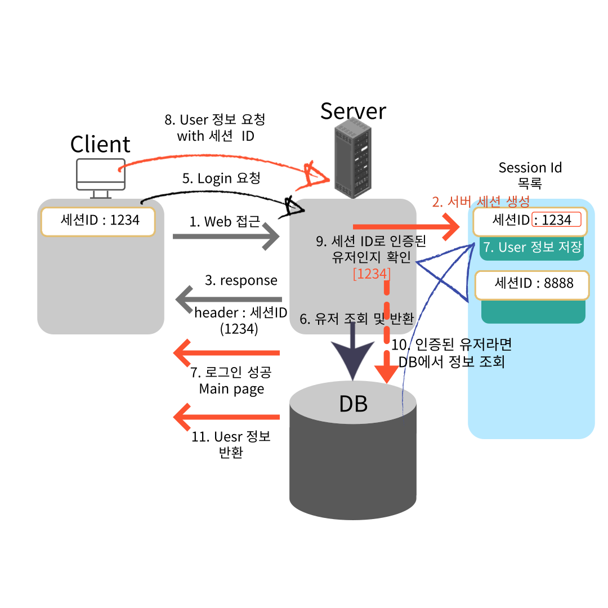
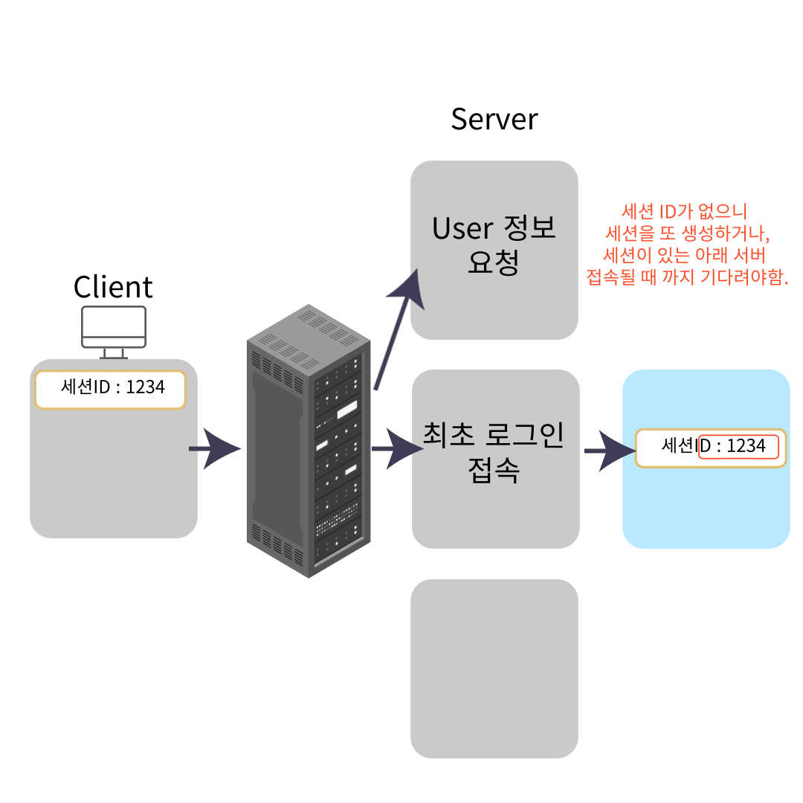

# Session Login

<br><br>

해당 내용은 [메타코딩 - 스프링부트 시큐리티](https://www.youtube.com/watch?v=cv6syIv-8eo&list=PL93mKxaRDidERCyMaobSLkvSPzYtIk0Ah&index=13) 강의를 들으며 정리한 내용입니다.
<br>

JWT(Json Web Token)을 살펴보기 전에 왜 JWT를 쓰고 어디에 사용되는지 확인하기 위해 먼저 Session Login을 알아보고 어떤 문제점들이 있는지 확인해보자.

우선 서버 Session은 Client가 최초 접근시 서버의 Session ID 목록을 관리하는 곳에 자동으로 해당 브라우저에 대한 세션 ID를 생성해 관리하게 된다.  
생성된 Session ID를 html 반환시 헤더(쿠키)에 담아 전달하고 이후 두 번째 접근부터는 이 세션 ID가 포함된 요청이 서버로 들어오게 된다.

<br>

## 💥 Session을 왜 사용할까?

<br>
Session은 주로 인증된 사용자에 대한 정보를 저장해 이후 접근부터는 또 인증하지 않고 이용할 수 있도록 하기 위한 방식 중 하나이다. <br>
Login에서 많이 사용되는 세션 기반 인증 방식이 대표적 예시이다.  <br>
세션은 같은 브라우저로부터 들어오는 요청들을 하나의 상태로 보고 그 상태를 일정하게 유지시키며 관리하는 것이다.<br>

이러한 특징을 **Stateful** 이라고 한다.

<br><br>

## Session 기반 Login

<br>

세션 기반 로그인을 그림을 통해 확인해 본다.  
<br>


<br><br>

<h4> 1️⃣-2️⃣ : 최초 접근 시 서버는 세션 ID를 생성해 세션 ID 목록을 관리하는 곳에 저장해둔다. <br><br>

3️⃣-4️⃣ : 생성된 세션 ID를 쿠키에 담아 클라이언트에게 전달하고 클라이언트는 이 세션 ID를 저장해둔다. <br><br>

5️⃣-7️⃣ : Login 요청 시 세션에 User 정보가 없으니 DB에서 조회하고 결과를 반환해준다. 이 떄, 로그인 성공한 User는 세션 ID에 알맞은 위치에 user 정보를 담아둔다. <br><br>

8️⃣ : 로그인된 유저가 어떤 요청을 할 떄, Session ID 값을 같이 포함해 요청한다. <br><br>

9️⃣-1️⃣1️⃣ : 세션 ID를 통해서 인증된 유저인지 아닌지 판단하고 아니라면 요청을 수행하지 않고, 인증된 유저라면 DB에서 조회해 결과를 반환해준다. <br><br>

</h4>
<br><br>

## 🔥 Session 기반 인증 방식의 단점

<br>

<h4> 1️⃣ : Client - 동접자가 매우 많다면 Server 부담이 매우 커진다. => 서버당 세션이 한정적이다.</h4>

<br>
사용자가 많아지는 경우 로드 밸런싱을 사용한 서버 확장을 해야 하는데, 이 때 세션 관리가 어려워진다.  
그림을 통해 좀 더 살펴보자.  
<br>


<br><br>

**서버 확장하더라도 최초 접속한 서버로만 접속하도록 하거나 기다려야하는 문제점들이 존재한다.**<br>  
이를 해결하기 위해서 여러 서버의 세션 값을 하나의 DB에 넣어서 관리 가능하다. 하지만 이 경우는 IO가 발생해 너무 오래 걸린다.  
이를 해결하기 위해서 <span style= "color:red">메모리 공유 서버</span>에 넣어 관리할 수 도 있다.

<br><br>

<h4> 2️⃣ : 멀티 디바이스(웹, 모바일)에서 로그인 시 중복 로그인 처리가 되지 않는 등의 처리 필요하다.</h4>

<br>

<h4> 3️⃣ : Stateful</h4>

<br>
Stateful 하기 때문에 클라이언트의 상태를 서버에서 계속 유지하고 이용하기 때문에 안전하지만, 모든 클라이언트의 정보를 유지하고 있어야하기 떄문에, 메모리, DB 등의 부하가 심하다.

<br><br>

이 다음 포스팅은 Stateless한 Token 방식에 대해 공부해보고자 JWT에 대한 설명으로 이어질 예정이다.

<br><br>

## 끝 !!

<br>

✨ 잘못된 부분은 많은 조언 및 지적 부탁드립니다. - JunHyxxn

<br>

```toc

```
