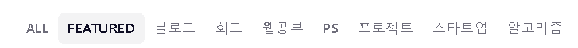
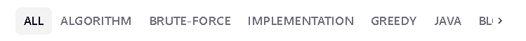

# 알고리즘 문제와 프로젝트를 진행하며 겪는 어려움들을 기록할 <b>블로그</b>.

기존의 Jekyll 블로그를 이용하다가
<br>
GraphQL 기반으로, 빠르게 동작하고 앞으로 Web 을 학습해 나갈 것이기 때문에, 스스로 Custom을 해보고 싶은 마음에 Gatsby 기반의 블로그로 이전하게 되었습니다.
<br>

---

<br>

## ✨ 이 블로그는 ZoomKoding 님의 블로그 테마를 사용했습니다.

<br>

[ZoomKoding](https://github.com/zoomKoding/zoomkoding.com)

<br>
<br>

---

<br><br>

# 💥 ZoomKoding Blog theme Custom

<br><br>

줌코딩님의 테마를 사용하며 약간의 수정을 하고 싶어 코드를 살짝 변경했습니다.  
react를 사용할 줄 모르기 때문에 간단한 변경이지만 완벽하게 수정하지 못했지만, custom 한 부분을 기록하고자 합니다.

<br><br>

## 1️⃣ Blog Custom - Category

<br><br>

기존 카테고리는 아래와 같은 형태였습니다.
<br>



<br>

여기에서 제가 변경하고 싶은 부분을 먼저 말씀드리겠습니다.
<br>
1️⃣ 처음 Focus되는 태그는 All 로 변경 <br>
2️⃣ 모든 태그 표기 <br>
3️⃣ 태그 사전 순 정렬이 아닌 많이 포스팅 된 태그 순서로 표기 <br>

위 세 가지를 변경하고자 합니다. React를 몰라서 완벽하게 구현하진 못했지만 변경에 성공한 부분이라도 기록하고자 합니다.
<br><br>

### 결과


<br>
All 에 초점이 맞춰져 있고, 태그 언급 순서에 따라 정렬되어 나오고 > 화살표를 통해 모든 태그를 확인할 수 있게 되었습니다.

<br><br>

### 1️⃣ Focus 되는 태그 All로 변경

<br>

```javascript
function HomePage({ data }) {
  const posts = data.allMarkdownRemark.edges.map(({ node }) => new Post(node));
  const { author, language } = data.site.siteMetadata;
  const categories = ['All', ...getUniqueCategories(posts)];
  const featuredTabIndex = categories.findIndex((category) => category === 'featured');
  // ... 생략
}
```

<br>
HomePage에서 featuredTabIndex가 focus를 맞출 카테고리를 정하는 코드입니다. 이 부분을 바로 위에서 추가한 'All' 로 변경해줍니다.

<br><br>

### 2️⃣ 모든 태그 표기

<br>

```javascript
function PostTabs({ tabIndex, onChange, tabs, posts, showMoreButton }) {
    const tabPosts = useMemo(() => {
    if (tabs[tabIndex] === 'All') return posts;
    return posts.filter((post) => post.categories.includes(tabs[tabIndex]));
    }, [posts, tabs, tabIndex]);

    return (
        <div className="post-tabs-wrapper">
            <div className="post-tabs">
                <Tabs
                className="mui-tabs"
                value={tabIndex}
                onChange={onChange}
                variant="scrollable"
                scrollButtons="desktop"
                >
                {tabs.map((title, index) => (<Tab label={title} key={index} />))}
                </Tabs>
{/_ ... 생략_/}
}
```

<br>

mui/material 의 공식 문서를 보면 Tabs 태그를 확인할 수 있습니다.<br>
Tabs 의 scrollButtons Prop의 description 은 다음과 같습니다.

<details>
<summary>펼쳐보기</summary>
<div markdown="1">       
Determine behavior of scroll buttons when tabs are set to scroll:
- auto will only present them when not all the items are visible. - true will always present them. - false will never present them.
By default the scroll buttons are hidden on mobile. This behavior can be disabled with allowScrollButtonsMobile.
</div>
</details>

따라서 scrollButtons="auto" 를 설정해주면 모든 카테고리를 보이도록 할 수 있습니다.

<br><br>

### 3️⃣ 태그 사전 순 정렬이 아닌 많이 포스팅 된 태그 순서로 표기

<br>

사실 이 부분에서 많이 헤맸습니다.  
차근차근 순서대로 따라가보겠습니다.  
Main Page를 담당하는 pages/index.js 에서 PostTabs 에 prop 인자로 categories 를 넘겨주는 것을 알 수 있습니다.  
이 categories는 utils/helpers 안에 정의되어 있는 getUniqueCategories 함수를 통해 categories를 받아오는 것을 확인할 수 있습니다.

<br>

이제 어디에서 categories가 나오는 지 확인했으니 이를 수정해줍니다.  
<br>

```javascript
export const getUniqueCategories = (posts) => {
  // Ver.Zoomkoding;
  //   const categorySet = new Set();
  //   posts.forEach(({ categories }) => categories.forEach((category) => categorySet.add(category)));
  //   return [...categorySet].sort((a, b) => {
  //     if (a === 'featured') return -1;
  //     if (b === 'featured') return 1;
  //     return 0;
  //   });

  // Ver. My
  const array = [];
  const categoryMap = new Map(array);
  posts.forEach(({ categories }) =>
    categories.forEach((category) => {
      if (categoryMap.has(category)) {
        categoryMap.set(category, categoryMap.get(category) + 1);
      } else {
        categoryMap.set(category, 1);
      }
    }),
  );
  const map2Arr = [...categoryMap].sort((a, b) => b[1] - a[1]);
  const categorySet = new Set();
  map2Arr.forEach((category) => categorySet.add(category[0]));

  return categorySet;
};
```

<br>

기존 줌코딩님의 코드에서는 모든 category를 Set 자료구조에 넣음으로써 중복을 제거하고 카테고리들을 저장한 후, 카테고리를 정렬해 반환해줍니다.  
이 때, featured 라면 최상위 순서로 오도록 해줍니다. <br>

하지만 저는 featured 카테고리를 사용하지 않을 예정이고, 모든 카테고리를 이용하고, 태그가 언급된 순서에 따라 정렬할 것입니다.  
<br>
따라서 {'category' : count} 형태로 저장하고 count를 기준으로 내림차순 정렬을 해줍니다.  
이 후 최대한 코드를 변경하지 않기 위해서 기존에 Set형태로 반환했던 것과 똑같이 Set 형태로 반환해줍니다. <br><br>

---

<br><br>

## 2️⃣ Blog Custom - Scroll Up Button

<br><br>

이 글과 같이 글이 길어지는 경우를 대비해서 페이지 상단으로 이동 버튼을 추가하고자 합니다.  
<br>

다크모드 전환에 따라 스크롤 버튼도 바로바로 변화되어야 합니다. <br>
처음에는 스크롤 버튼도 분리하여 component로 만들고, layout에서 버튼을 추가하고자 했습니다. <br>
하지만 실력이 부족해 다크모드로 전환되면 바로바로 스크롤 버튼도 변해야하는 데 그 부분이 제대로 적용되지 않아 어려움을 겪고 결국 다크모드 전환 코드가 있는 /components/theme-switch 에서 한 번에 해결했습니다.  
<br><br>

```javascript
import React, { useEffect, useState } from 'react';
import { IconButton } from '@mui/material';
import DarkModeIcon from '@mui/icons-material/DarkMode';
import LightModeIcon from '@mui/icons-material/LightMode';
import KeyboardDoubleArrowUpIcon from '@mui/icons-material/KeyboardDoubleArrowUp';
import { getValueFromLocalStorage, setValueToLocalStorage } from '../../utils/localStorage';
import './style.scss';

function ThemeSwitch() {
  const [isDarkMode, setIsDarkMode] = useState(getValueFromLocalStorage('isDarkMode'));
  const [ScrollY, setScrollY] = useState(0);
  const [BtnStatus, setBtnStatus] = useState(false); // 버튼 상태

  useEffect(() => {
    setValueToLocalStorage('isDarkMode', isDarkMode);
    document.documentElement.setAttribute('data-theme', isDarkMode ? 'dark' : 'light');
  }, [isDarkMode]);

  const handleFollow = () => {
    setScrollY(window.pageYOffset);
    if (ScrollY > 100) {
      // 100 이상이면 버튼이 보이게
      setBtnStatus(true);
    } else {
      // 100 이하면 버튼이 사라지게
      setBtnStatus(false);
    }
  };

  const handleTop = () => {
    // 클릭하면 스크롤이 위로 올라가는 함수
    window.scrollTo({
      top: 0,
      behavior: 'smooth',
    });
    setScrollY(0); // ScrollY 의 값을 초기화
    setBtnStatus(false); // BtnStatus의 값을 false로 바꿈 => 버튼 숨김
  };

  useEffect(() => {
    const watch = () => {
      window.addEventListener('scroll', handleFollow);
    };
    watch();
    return () => {
      window.removeEventListener('scroll', handleFollow);
    };
  });
  // window가 실행 전에 띄워지지 않아 에러가 발생할 수 있습니다.
  // const handleScroll = (e) => {
  //   if (!window.scrollY) {
  //     return;
  //   }
  //   // 현재 위치가 이미 최상단일 경우 return

  //   window.scrollTo({
  //     top: 0,
  //     behavior: 'smooth',
  //   });
  // };
  return (
    <div>
      <div className="scroll-up-button-wrapper">
        <IconButton className="scroll-up-button" onClick={handleTop}>
          {isDarkMode ? (
            <KeyboardDoubleArrowUpIcon
              className={BtnStatus ? 'dark-scroll-up-icon' : 'dark-scroll-up-icon-hidden'}
              fontSize="large"
            />
          ) : (
            <KeyboardDoubleArrowUpIcon
              className={BtnStatus ? 'light-scroll-up-icon' : 'light-scroll-up-icon-hidden'}
              fontSize="large"
            />
          )}
        </IconButton>
      </div>
      <div className="dark-mode-button-wrapper">
        <IconButton className="dark-mode-button" onClick={() => setIsDarkMode((isDark) => !isDark)}>
          {isDarkMode ? (
            <LightModeIcon className="dark-mode-icon" fontSize="large" />
          ) : (
            <DarkModeIcon className="dark-mode-icon" fontSize="large" />
          )}
        </IconButton>
      </div>
    </div>
  );
}

export default ThemeSwitch;
```

<br>

또한 아래에는 다크모드 전환 버튼이 있기 때문에 상단 이동 버튼은 좌측 상단에 배치했습니다.  
추가적으로 table-of-content(목차) 의 경우 상단 이동 버튼과 겹치지 않도록 좀 더 아래에 배치했습니다.

## 💥끝!!

<br>

✨ 잘못된 부분은 많은 조언 및 지적 부탁드립니다. - JunHyxxn

<br>

```toc

```
