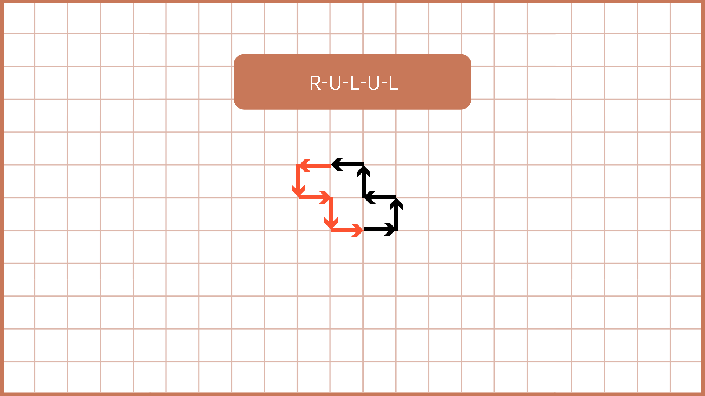
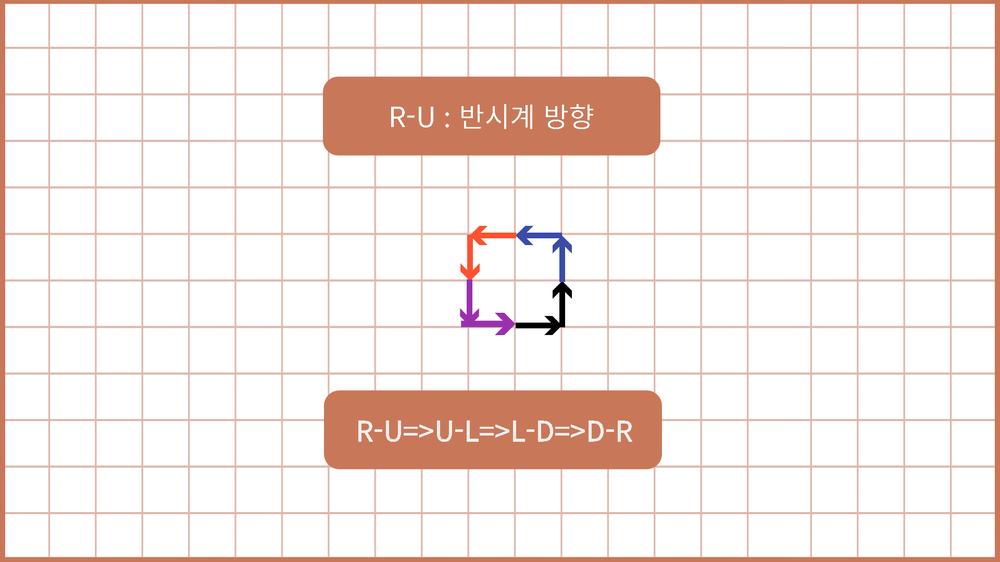
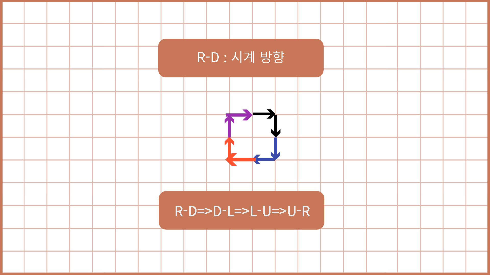

# SWEA 14362 - 무한 로봇 <span style='color:Gold'>D-Ⅳ</span>

<br><br>

**이 문제는 SWEA 문제입니다. 문제 출처 : [무한 로봇](https://swexpertacademy.com/main/code/problem/problemDetail.do?contestProbId=AYCne646vKQDFARx&categoryId=AYCne646vKQDFARx&categoryType=CODE&problemTitle=&orderBy=FIRST_REG_DATETIME&selectCodeLang=ALL&select-1=&pageSize=10&pageIndex=1)**

<br><br>

## 🔥 주의할 점

<br><br>

k번째로 명령을 수행한 직후의 위치를 $$P_{k}$$라고 할 때, $$P_{k}$$는 모든 좌표를 의미한다.  
로봇이 이동을 마치고 난 후의 점이 아닌 이동 중 마주한 모든 정수 좌표들을 의미한다.

<br><br>

## 💥 How to Solve?

<br><br>

결과부터 말하자면, 테스트 케이스는 125개, 최대 움직임은 2500회이다. <br>
내가 구현한 방법은 움직임이 Worst Case인 경우 총 4번을 반복해야하니 10000회 이루어지고, <br>
모든 TC가 10000회 이루어진다해도 125만회로 제한 시간 3초 이내에 해결할 수 있다고 판단해 단순 구현 방법으로 해결했다.<Br>

<br><br>

### ‼ Point ‼

<br><br>

우선 용어 몇 가지를 정의하고 시작한다.

| **➡** | **⬇** | **⬅** | **⬆** | **➡** |

<br>
오른쪽으로 회전한다면 배열에서 +1 만큼 되고, 왼쪽으로 회전한다면 배열에서 -1 만큼 되는 형태로 회전에 따른 방향을 정해둔다.

<br><br>
움직임 : 로봇이 움직인 방향을 기록한 데이터<br><br>
초기 방향 : Right<br><br>
시작 방향 : 첫 움직임 방향 - ex) RS 라고 한다면 맨 처음 Right에서 오른쪽으로 돌고 움직이기 때문에 Down이 된다. 즉 시작 방향은 Down이다.<br><br>
마지막 방향 : 로봇이 마지막으로 이동한 방향, 움직임에 마지막에 해당하는 값이다.  
<br>

로봇은 특정 움직임으로 반복하게 된다. 그 종류는 아래와 같다.

<br>

<h3>

1️⃣) 움직임이 없는 경우. ex) LLLLL  
<br>

2️⃣-1️⃣) **초기 방향(Right)과 마지막 진행 방향이 같고**, 마지막 위치가 원점이 아닌 경우 - 끝없이 뻗어나가게 된다.
ex) S, RSL  
<br>

2️⃣-2️⃣) **초기 방향(Right)과 마지막 진행 방향이 같고**, 마지막 위치가 원점인 경우 - 움직임을 계속 반복하기 때문에 다른 점들을 방문하진 않는다.  
<br>

3️⃣) **초기 방향(Right)과 마지막 진행 방향(Left)이 반대인 경우** - 움직임을 정확히 반대로 진행한다.
ex) 움직임이 Right, UP, Left, Up, Left 이라면 => Left, Down, Right, Down, Right 를 거쳐 **원점으로 돌아온다.**  
<br>

4️⃣) **초기 방향(Right)과 마지막 진행 방향(Up)인 경우** - 움직임을 **반 시계 방향(방향이 왼쪽으로 회전)**으로 돌면서 진행한다.
<br> ex) SLS -> 움직임 : Right, Up => Up, Left => Left, Down => Down, Right  
위와 같은 움직임을 거쳐 원점으로 돌아온다.

<br>

5️⃣) **초기 방향(Right)과 마지막 진행 방향(Down)인 경우** - 움직임을 **시계 방향(방향이 오른쪽으로 회전)**으로 돌면서 진행한다.
<br> ex) SRS -> 움직임 : Right, Down => Down, Left => Left, Up => Up, Right  
위와 같은 움직임을 거쳐 원점으로 돌아온다.

</h3>

<br>

글로는 이해가 어려우니 그림을 통해 이해해보자.

<br>



<br>



<br>



<br>

위와 같이 좌표를 이동하면서 가장 먼 좌표 값을 기억해두면 답을 구할 수 있다.
<br><br>

### ✨ Python Code

<br><br>

```python
"""
문제 출처 : https://swexpertacademy.com/main/code/problem/problemDetail.do?contestProbId=AYCne646vKQDFARx&categoryId=AYCne646vKQDFARx&categoryType=CODE&problemTitle=&orderBy=FIRST_REG_DATETIME&selectCodeLang=ALL&select-1=&pageSize=10&pageIndex=1
0 : right
1 : down
2 : left
3 : up
dir = [0,0,0,0]  : 각 방향에 대한 움직임 횟수 저장
index+1 => Right
index-1 => Left
"""
T = int(input())
dxdy = {0:[1,0], 1: [0, -1], 2: [-1,0], 3:[0,1]}
for t in range(1, T+1):
    move = input()
    direction = 0
    x, y = 0, 0
    max_value = 0
    path = []
    for m in move:
        if m == 'S':
            path.append(direction)
            dx, dy = dxdy[direction]
            x, y = x + dx, y + dy
            max_value = max_value if max_value > x**2+y**2 else x**2+y**2
        elif m == 'L':
            direction = (direction + 3) % 4
        elif m == 'R':
            direction = (direction+1)%4

    ## 1. 움직임이 없는 경우
    if len(path) == 0:
        print("#{} {}".format(t, max_value))
        continue

    last_dir = direction
    ## 2-1 초기 방향과 마지막 진행 방향이 같고, 원점 - 움직임 반복
    if x == 0 and y == 0:
        print("#{} {}".format(t, max_value))
        continue
    ## 2-2 초기 방향과 마지막 진행 방향 같고 원점 아닌 경우 - 끝없이 뻗어나간다.
    if last_dir == 0:
        print("#{} {}".format(t, "oo"))
        continue
    ## 3. 마지막 진행 방향이 Down인 경우 - 움직임 시계 방향으로 3번 반복 진행
    elif last_dir == 1:
        for i in range(1,4):
            for p in path:
                p = (p + i) % 4
                dx, dy = dxdy[p]
                x, y = x + dx, y + dy
                max_value = max_value if max_value > x ** 2 + y ** 2 else x ** 2 + y ** 2
    ## 4. 마지막 진행 방향이 Left인 경우 - 움직임 반대로 한 번 반복
    elif last_dir == 2:
        for p in path:
            p = (p+2)%4
            dx, dy = dxdy[p]
            x, y = x+dx, y+dy
            max_value = max_value if max_value > x**2+y**2 else x**2+y**2
    ## 5. 마지막 진행방향이 Right인 경우 - 움직임 반 시계 방향으로 3번 반복 진행
    elif last_dir == 3:
        for i in range(1,4):
            for p in path:
                p = (p + (4-i)) % 4
                dx, dy = dxdy[p]
                x, y = x + dx, y + dy
                max_value = max_value if max_value > x ** 2 + y ** 2 else x ** 2 + y ** 2
    print("#{} {}".format(t, max_value))
```

<br><br>

## 끝 !!

<br>

✨ 잘못된 부분은 많은 조언 및 지적 부탁드립니다. - JunHyxxn

<br>
