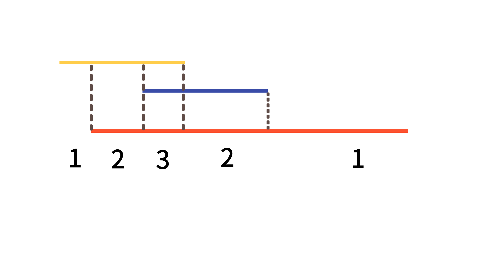

# SWEA 4408 - 자기 방으로 돌아가기 <span style='color:Gold'>D-Ⅳ</span>

<br><br>

**이 문제는 SWEA 문제입니다. 문제 출처 : [자기 방으로 돌아가기](https://swexpertacademy.com/main/code/problem/problemDetail.do?problemLevel=3&problemLevel=4&contestProbId=AWNcJ2sapZMDFAV8&categoryId=AWNcJ2sapZMDFAV8&categoryType=CODE&problemTitle=&orderBy=FIRST_REG_DATETIME&selectCodeLang=PYTHON&select-1=4&pageSize=10&pageIndex=10)**

<br><br>

## 💥 How to Solve?

<br><br>

| **1** | **3** | **5** | **7** | **..** | **..** | **..** | **..** | **397** | **399** |
| :---: | :---: | :---: | :---: | :----: | :----: | :----: | :----: | :-----: | :-----: |
| **2** | **4** | **6** | **8** | **..** | **..** | **..** | **..** | **398** | **400** |

<br>

1️⃣ 좌표 압축
<br>
이 문제는 1-2, 3-4, 5-6, ... 399-400 이 각자 한 쌍을 이룬다. <br>

즉 1번 방에서 3번 방으로 이동하고, 4번 방에서 8번방으로 이동한다면 3-4 복도에서 겹친다는 결과가 나온다. <br>

이를 이용해서 1-400의 좌표를 1-200 좌표로 압축했다. <br>

홀수는 (odd+1)//2, 짝수는 (even//2) 를 통해서 1,2 좌표를 1로 압축하는 작업을 수행한다.<br>

<br>

2️⃣ Line Sweeping

<br>

입력으로 들어온 구간에 이동하는 횟수를 기록한다. 즉, 입력으로 들어온 구간에 +1을 해준다. <Br>
이 문제는 같은 방이 중복으로 등장하지 않고, 들어갔다 다시 나오는 작업들이 없기 때문에, 이동 횟수를 +1 씩 해주면 각 구간에서 총 동선이 몇 번 겹치는지 알 수 있다.<br>
<br>



<br>

모든 구간에서 가장 동선이 많이 겹치는 횟수만큼의 시간이 필요할 것이다.
따라서 구간의 max값만 알면 답이 구해진다.

<br><br>

### ✨ Python Code

<br><br>

```python
T = int(input())
def compression(num):
    num = int(num)
    if num%2 == 1:
        return (num+1)//2
    elif num%2 ==0:
        return num//2

for t in range(1, T+1):
    N = int(input())
    line = [0] * 201
    for _ in range(N):
        a, b = map(compression, input().split())
        a, b = min(a, b), max(a, b)
        for i in range(a, b+1):
            line[i] += 1
    print("#{} {}".format(t, max(line)))
```

<br><br>

<br>
Segment Tree로 구현도 가능할 듯하다. 하지만 N이 200으로 작은 범위라서 간단하게 Line Sweeping으로 해결했다.

## 끝 !!

<br>

✨ 잘못된 부분은 많은 조언 및 지적 부탁드립니다. - JunHyxxn

<br>
