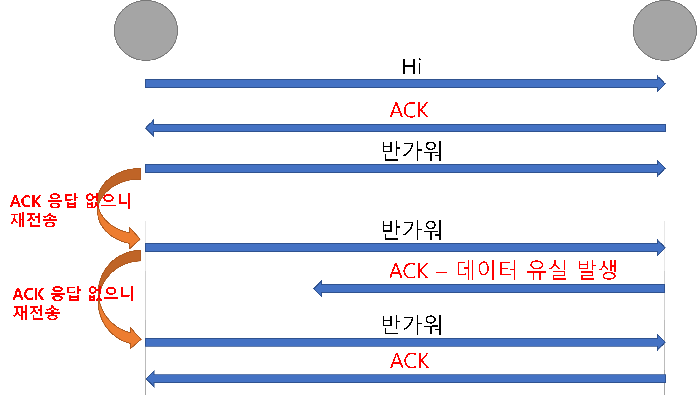
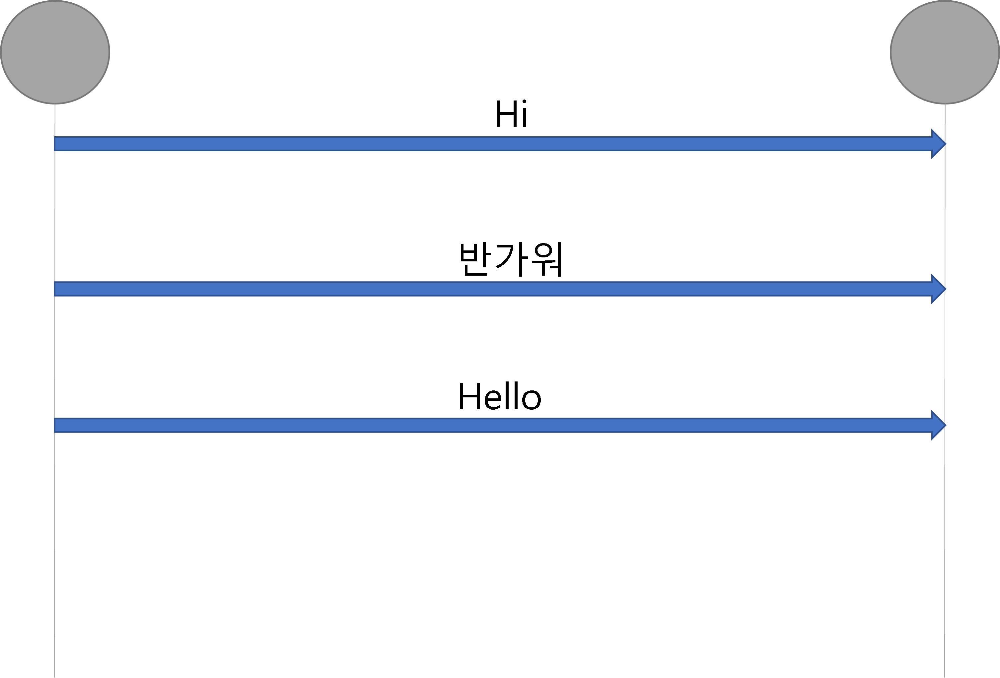

# TCP VS UDP

<br>
TCP와 UDP는 OSI 7계층 중 Transport Layer - 전송 계층 에서 사용되는 프로토콜이다. 패킷의 오류를 검사하고 재전송 요구 등의 제어를 담당하는 계층이다.  
TCP와 UDP의 특징들에 대해 알아보고자 한다.

<br><br>

## 💥 TCP - Transmission Control Protocol

<br>

우선 간단한 그림을 통해 TCP의 데이터 송신 과정을 살펴보자.
<br>



<br><br>

✔ ACK(확인 신호)를 응답받아야 다음 메세지를 전송하고 응답을 받지 못하면 재전송을 한다.  
이러한 특징때문에 **신뢰성** 이 높지만 속도가 비교적 **느리다.**

### TCP 특징

<br>

#### 1️⃣ : 연결형 서비스

<br>

3-Way Handshaking 과정을 통해 연결한다.  
4-Way Handshaking 과정을 통해 연결을 해제한다.

<br>

#### 3-Way Handshaking

<br>
양쪽 모두 데이터를 전송할 준비가 되었다는 것을 보장하도록 한다.  
SYN : Synchronize Sequence Numbers  
ACK : Acknowledgment

<br>


<br><br>

1️⃣ : Client가 서버에 접속을 요청하는 SYN 패킷을 전송한다.  
<br>
2️⃣ : 서버는 Client에게 SYN 요청을 받고 Client에게 요청을 수락하는 ACK 와 SYN flag가 설정된 패킷을 전송한다. Client가 다시 ACK을 응답하기를 기다린다.  
<br>
3️⃣ : Client는 서버에게 ACK 응답을 전송하고 연결이 서로 이루어진다. 이후 데이터가 오고 간다.
<br><br>

#### 4-Way Handshaking

<br>

4-Way Handshaking은 세션을 종료하기 위해 수행되는 과정이다.  
<br>


<br><br>

1️⃣ : Client가 연결 종료를 요청하는 FIN 플래그를 전송한다.  
<br>
2️⃣ : 서버는 FIN 플래그를 받고 ACK 응답을 보낸다. 그리고 종료 준비가 될 때까지 기다린다.  
<br>
3️⃣ : 서버는 연결 종료 준비가 되었다면, 종료를 알리는 FIN 플래그를 Client에게 전송한다.  
<br>
4️⃣ : Client는 연결 종료 준비가 완료되었다는 ACK 확인 메세지를 전송한다.  
<br><br>

#### 2️⃣ : 흐름 제어 가능

<br>
데이터 처리 속도를 조절하여 수신자의 버퍼 오버플로우를 방지한다.  
송신자가 너무 많은 데이터를 전송하게 되면 수신자의 부담이 커지기 때문에 Window Size를 통해서 수신량을 조절할 수 있다.

<br><br>

#### 3️⃣ : 신뢰성 높은 전송

<br>

ACK 값을 받아야 다음 전송이 이루어지기 때문에 비교적 신뢰성이 높은 전송 방식이다.  
주로 Web, Mail 등의 어플이케이션의 데이터 송수신에서 이용되기 적합한 특징이다.

<br><br>

#### 4️⃣ : UDP에 비해 느린 속도

<br>

UDP는 일방적인 방식이기 때문에 이에 비해 비교적 느린 속도이다.

<br><br>

## 💥 UDP - User Datagram Protocol

<br>

마찬가지로 UDP도 우선 간단한 그림을 통해 데이터 송신 과정을 살펴보자.
<br>



<br><br>

### UDP 특징

<br>

#### 일방적 -> 빠름 - But, 신뢰성이 보장되지 않는다.

<br>
UDP 통신은 수신자가 데이터를 받았는지는 관심이 없기 때문에, 일방적이라 표현할 수 있다.  
이러한 방식으로 UDP는 신뢰성을 보장하진 않지만 속도가 비교적 빠른 것이 특징이다.  
일반적으로 실시간 스트리밍이 중요한 Streaming Service 같은 서비스에 적합하다.

<br><br>

마지막으로 TCP와 UDP의 차이에 대해 설명하는 간단한 그림을 살펴보자.  
<br><br>


### 참고 자료 및 출처

[메타코딩 - 스프링부트 시큐리티 13강](https://www.youtube.com/watch?v=IRh6Eh3pWEY&list=PL93mKxaRDidERCyMaobSLkvSPzYtIk0Ah&index=19)

[hidaehyunlee - velog](https://velog.io/@hidaehyunlee/TCP-%EC%99%80-UDP-%EC%9D%98-%EC%B0%A8%EC%9D%B4#%EA%B7%B8%EB%A6%BC%EC%9C%BC%EB%A1%9C-%EB%B9%84%EA%B5%90%ED%95%98%EB%8A%94-tcp-vs-udp)

[방구의 개발냄새](https://bangu4.tistory.com/74?category=904489)

## 끝 !!

<br>

✨ 잘못된 부분은 많은 조언 및 지적 부탁드립니다. - JunHyxxn

<br>

```toc

```
